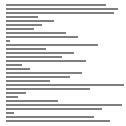
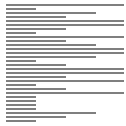

# 힙정렬(Heap sort)

## Random

 
 

## Nearly Sorted

 
 

## Reversed

 
 

## Few Unique

 
 

## 힙정렬이란?

-   참고 : 8. 우선순위 큐(Priority Queue)
-   최대 힙 트리(내림차순) 또는 최소 힙 트리(오름차순)를 구성해서 정렬하는 방법
-   정렬해야 할 n개의 요소들로 최대 힙(내림차순)을 만든다.
-   그 다음으로 한 번에 하나씩 원소(최댓값)를 꺼내서 배열에 저장한다.
-   최대 힙 트리는 값이 감소되는 순서로 재구성된다.

 
 

## 특징

-   힙 정렬이 가장 유용한 경우는 전체 자료를 정렬하는 것이 아니라 가장 큰 값 몇개만 필요한 경우이다.
-   시간복잡도 : T(n) = O(n log n)
