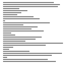
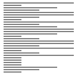

# 병렬정렬(Merge sort)

## Random

 
 

## Nearly Sorted

 
 

## Reversed

 
 

## Few Unique

 
 

## 병렬정렬이란?

-   배열의 길이가 0 또는 1이면 이미 정렬된 것으로 본다.
-   그렇지 않은 경우, 배열를 절반으로 잘라서 두 부분의 배열로 나눈다.
-   각 부분의 배열에 대해서 위의 정렬을 반복한다.
-   정렬된 부분 배열들을 하나의 배열에 합병한다.
-   실제로 정렬이 이루어지는 시점은 2개의 리스트를 합병할 때 이다.

 
 

## 특징

-   분할 정복 알고리즘: 문제를 작은 2개의 문제로 분리하고 각각을 해결한 다음, 결과를 모아서 원래의 문제을 해결한다.

-   분할(Divide)
-   정복(Conquer)
-   결합(Combine)

-   배열(Array)인 경우, 임시 배열이 필요하고 이동 횟수가 많아서 시간적 낭비를 초래한다.
-   연결 배열(Linked List)인 경우, 링크 인덱스만 변경되므로 데이터의 이동이 작다.
-   따라서 크기가 큰 연결 배열의 정렬의 경우, 퀵 정렬을 포함한 다른 어떤 정렬 방법보다 효율적이다.
-   시간복잡도 : T(n) = n log n(비교) + 2n log n(이동) = 3n log n = O(n log n)

## 예제

-   배열(21, 10, 12, 20, 25, 13, 15, 22), 오름차순 정렬

