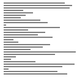
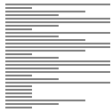
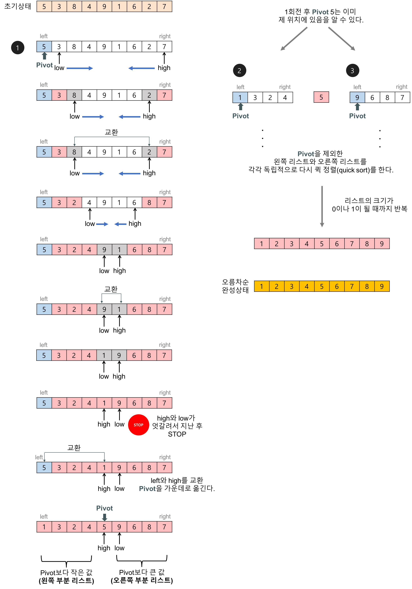

# 퀵정렬(Quick sort)

## Random

 
 

## Nearly Sorted

 
 

## Reversed

 
 

## Few Unique

 
 

## 퀵정렬이란?

- 배열의 길이가 0 또는 1이면 이미 정렬된 것으로 본다.
- 임의의 pivot을 선정하여 pivot을 기준으로 pivot보다 작은(큰) 값은 왼쪽, pivot보다 큰(작은) 값은 오른쪽으로 재배치한다.
- pivot 좌우의 각 부분의 배열에 대해서 위의 정렬을 반복한다. (더 이상 분할이 불가능한, 크기가 0 or 1이 될 때까지)

 
 

## 특징

- 배열 안에서 기준으로 사용할 한 항목를 선택한다. 이렇게 선택한 항목를 **피벗(pivot)** 이라고 한다.
- 분할 정복 알고리즘

문제를 작은 2개의 문제로 분리하고 각각을 해결한 다음, 결과를 모아서 원래의 문제을 해결한다.

- 최선의 경우(피벗을 기준으로 반으로 나누어지는 경우) : O(n log n)

최악의 경우(피벗을 기준으로 0과 n - 1개로 나누어지는 경우, 역순으로 정렬된 경우) : O(n^2)

 
 

 
 

## 예제

- 배열(5, 3, 8, 4, 9, 1, 6, 2, 7), 오름차순 정렬

