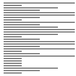

# 선택정렬(Selection sort)

## Random

 
 

## Nearly Sorted

 
 

## Reversed

 
 

## Few Unique

 
 

## 선택정렬이란?

-   첫번째 항목을 두번째 항목부터 마지막 항목까지 차례대로 비교하여 가장 작은(큰) 값과 **교환**한다.
-   1회전을 수행하고 나면 가장 작은 값의 항목이 맨 앞에 오게 되므로 그 다음 회전에서는 두번째 항목을 가지고 비교한다.
-   마찬가지로 3회전에서는 세번째 항목을 가지고 정렬한다.
-   n - 1회 반복한다.

 
 

## 특징

-   버블정렬처럼 비교하여 바로 교환하지 않고 끝까지 비교하여 첫번째, 두번째 ... 항목을 채운다.
-   1회전(외부루프)에 비교 작업이 n - 1회 일어나고, 교환 작업이 1회 일어난다.
-   시간복잡도 : T(n) = (n-1) + (n-2) + … + 2 + 1 = n(n-1)/2 = O(n^2)
