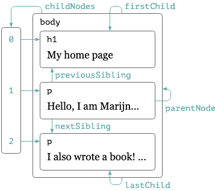
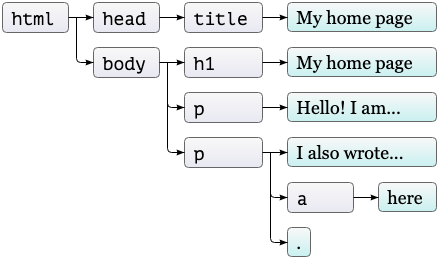
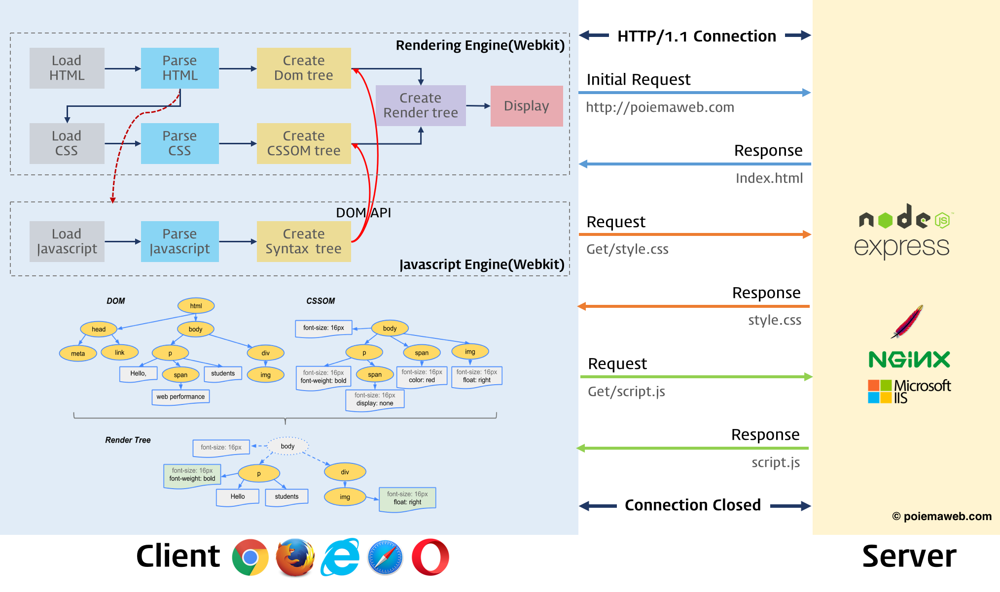
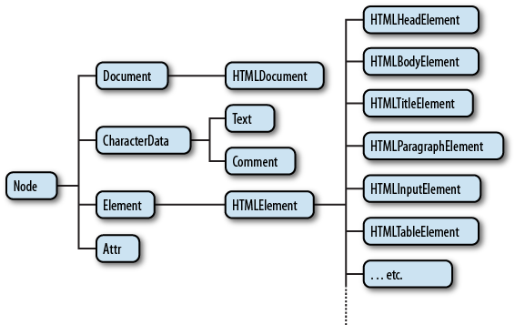

# BOM / DOM 조작

## DOM

텍스트 파일로 만들어져 있는 웹 문서를 브라우저에 렌더링하려면 웹 문서를 브라우저가 이해할 수 있는 구조로 메모리에 올려야 한다. 브라우저의 렌더링 엔진은 웹 문서를 로드한 후, 파싱하여 웹 문서를 브라우저가 이해할 수 있는 구조로 구성하여 메모리에 적재하는데 이를 DOM이라 한다. 즉 모든 요소와 요소의 어트리뷰트, 텍스트를 각각의 객체로 만들고 이들 객체를 부자 관계를 표현할 수 있는 트리 구조로 구성한 것이 DOM이다. 이 DOM은 자바스크립트를 통해 동적으로 변경할 수 있으며 변경된 DOM은 렌더링에 반영된다.

## Dom 구조







- HTML 문서에 대한 모델 구성

  브라우저는 HTML 문서를 로드한 후 해당 문서에 대한 모델을 메모리에 생성한다. 이때 모델은 객체의 트리로 구성되는데 이것을 DOM tree라 한다.

- HTML 문서 내의 각 요소에 접근 / 수정

  DOM은 모델 내의 각 객체에 접근하고 수정할 수 있는 프로퍼티와 메소드를 제공한다. DOM이 수정되면 브라우저를 통해 사용자가 보게 될 내용 또한 변경된다.

<br /><br />

---

<br /><br />

## Dom 생성(Client side 한정)

- HTML 문서 로드로 인한 render

```html
<!DOCTYPE html>
<html>
  <head>
    <title>Sample</title>
  </head>
  <body>
    <div id="bodyDiv" style="background-color:red;width:500px;height:500px"></div>
  </body>
</html>
```

<br /><br />

- JavaScript의 DOM 조작으로 인한 생성

```html
<!DOCTYPE html>
<html>
  <head>
    <title>Sample</title>
  </head>
  <body>
    <script>
      var $div = document.createElement("div");
      $div.style.backgroundColor = "red";
      $div.style.width = "500px";
      $div.style.height = "500px";
      document.body.append($div);
    </script>
  </body>
</html>
```


- 문서 노드(Document Node)

트리의 최상위에 존재하며 각각 요소, 어트리뷰트, 텍스트 노드에 접근하려면 문서 노드를 통해야 한다. 즉, DOM tree에 접근하기 위한 시작점(entry point)이다.

- 요소 노드(Element Node)

요소 노드는 HTML 요소를 표현한다. HTML 요소는 중첩에 의해 부자 관계를 가지며 이 부자 관계를 통해 정보를 구조화한다. 따라서 요소 노드는 문서의 구조를 서술한다고 말 할 수 있다. 어트리뷰트, 텍스트 노드에 접근하려면 먼저 요소 노드를 찾아 접근해야 한다. 모든 요소 노드는 요소별 특성을 표현하기 위해 HTMLElement 객체를 상속한 객체로 구성된다. (그림: DOM tree의 객체 구성 참고)

- 어트리뷰트 노드(Attribute Node)

어트리뷰트 노드는 HTML 요소의 어트리뷰트를 표현한다. 어트리뷰트 노드는 해당 어트리뷰트가 지정된 요소의 자식이 아니라 해당 요소의 일부로 표현된다. 따라서 해당 요소 노드를 찾아 접근하면 어트리뷰트를 참조, 수정할 수 있다.

- 텍스트 노드(Text Node)

텍스트 노드는 HTML 요소의 텍스트를 표현한다. 텍스트 노드는 요소 노드의 자식이며 자신의 자식 노드를 가질 수 없다. 즉, 텍스트 노드는 DOM tree의 최종단이다.



<br /><br />

---

<br /><br />

## DOM 조작

- Property 와 Attribute
  - Property : 객체로서 다뤄지는 DOM 자체에 속한 속성
  - Attribute: 화면에 랜더된 HTML 태그에 쓰여진 속성
- Element Selecting
  - document.getElementById
  - document.getElementsByClassName
  - document.getElementsByTagName
  - document.querySelectorAll()
    - CSS 선택자 사용.
  - document.all[]
    - ES3 시절 스펙. 사용하지 않을것을 권장.

## EventHandler

- Dom에 eventListener 붙이기
  - dom["on"+eventName]
  - attachEvent("on"+eventName, callback)
    - IE9 이전에만 사용. 사용하지 않을 것을 권장.
  - dom.addEventListener("eventType", callback, useCapture);
  - dom.removeEventListener("eventType", callback, useCapture)

## 이벤트의 확산

- EventBubbling
  - 이벤트가 일어난 객체에서부터 상위 객체로 확산됨
- EventCapturing
  - 이벤트가 일어난 객체로부터 하위 객체로 확산됨.
