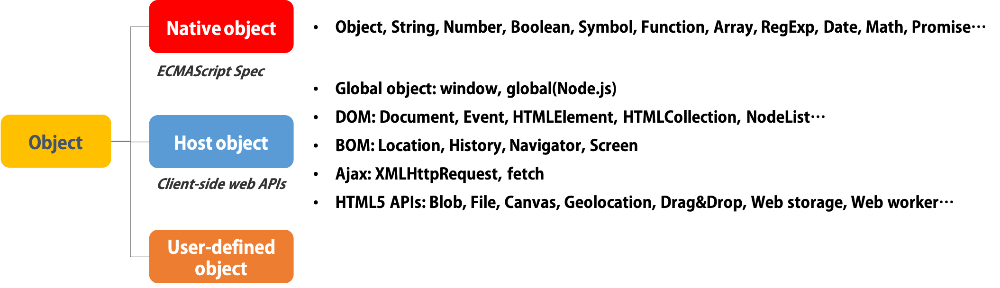

# Built-in Object

-   [참고 자료(poiemaweb)](https://poiemaweb.com/js-built-in-object)

  

---

  

## 네이티브 객체

네이티브 객체(Native objects or Built-in objects or Global Objects)는 ECMAScript 명세에 정의된 객체를 말하며 애플리케이션 전역의 공통 기능을 제공한다. 네이티브 객체는 애플리케이션의 환경과 관계없이 언제나 사용할 수 있다.

Object, String, Number, Function, Array, RegExp, Date, Math와 같은 객체 생성에 관계가 있는 함수 객체와 메소드로 구성된다.

네이티브 객체를 Global Objects라고 부르기도 하는데 이것은 전역 객체(Global Object)와 다른 의미로 사용되므로 혼동에 주의하여야 한다.

전역 객체(Global Object)는 모든 객체의 최상위 객체를 의미하며 일반적으로 Browser-side에서는 window, Server-side(Node.js)에서는 global 객체를 의미한다.

-   Object: 객체를 생성. 만약 생성자 인수값이 null이거나 undefined이면 빈 객체를 반환.
-   Function: 모든 함수는 Function 객체. 다른 모든 객체들처럼 Function 객체는 new 연산자를 사용해 생성 가능.
-   Boolean: 원시 타입 boolean을 위한 레퍼(wrapper) 객체. Boolean 생성자 함수로 Boolean 객체를 생성 가능.
-   Number
-   Math
-   Date
-   String
-   String
-   Array
-   Error: error 객체의 인스턴스는 런타임 에러가 발생하였을 때 throw
-   Symbol

  

---

  

## 호스트 객체

-   전역 객체(Global Object)
-   BOM (Browser Object Model)
-   DOM (Document Object Model)
