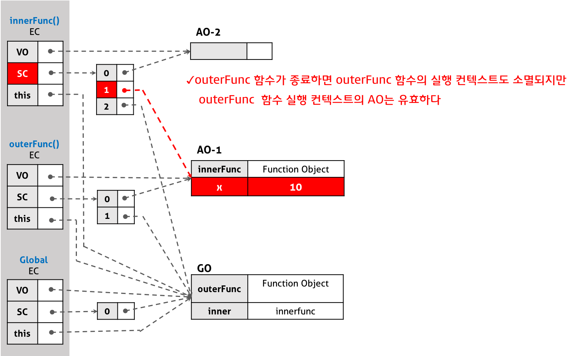

# 클로저(Closure)

-   [참고 자료(poiemaweb)](https://poiemaweb.com/js-closure)

-   클로저는 함수와 그 함수가 선언됐을 때의 렉시컬 환경(Lexical environment)과의 조합이다
-   클로저는 코드 실행이 해당 블록 밖으로 이동 한 후에도 로컬 변수를 유지하는 영구 범위이다.
-   함수의 코드 블록이 실행을 마친 후에도 범위 (부모 범위 포함)에 대한 참조(모든 지역 변수)는 그 함수에 묶여 있으며 함수가 지속되는 한 계속 지속된다.

```js
function funA() {
    var x = "Hello";
    var funB = function () {
        console.log(x);
    };
    return funB;
}

var funC = funA();
funC(); // Hello

/////

var add_the_handlers = function (nodes) {
    for (var i = 0; i < nodes.length; i++) {
        nodes[i].onClick = function (e) {
            alert(i);
        };
    }
};
```

<br />
<br />

```md
“A closure is the combination of a function and the lexical environment within which that function was declared.”
클로저는 함수와 그 함수가 선언됐을 때의 렉시컬 환경(Lexical environment)과의 조합이다.
```

위 정의에서 말하는 “함수”란 반환된 내부함수를 의미하고 “그 함수가 선언될 때의 렉시컬 환경(Lexical environment)”란 내부 함수가 선언됐을 때의 스코프를 의미한다. 즉, 클로저는 반환된 내부함수가 자신이 선언됐을 때의 환경(Lexical environment)인 스코프를 기억하여 자신이 선언됐을 때의 환경(스코프) 밖에서 호출되어도 그 환경(스코프)에 접근할 수 있는 함수를 말한다. 이를 조금 더 간단히 말하면 클로저는 자신이 생성될 때의 환경(Lexical environment)을 기억하는 함수다라고 말할 수 있겠다.

클로저에 의해 참조되는 외부함수의 변수 즉 outerFunc 함수의 변수 x를 자유변수(Free variable)라고 부른다. 클로저라는 이름은 자유변수에 함수가 닫혀있다(closed)라는 의미로 의역하면 자유변수에 엮여있는 함수라는 뜻이다.

실행 컨텍스트의 관점에 설명하면, 내부함수가 유효한 상태에서 외부함수가 종료하여 외부함수의 실행 컨텍스트가 반환되어도, 외부함수 실행 컨텍스트 내의 활성 객체(Activation object)(변수, 함수 선언 등의 정보를 가지고 있다)는 내부함수에 의해 참조되는 한 유효하여 내부함수가 스코프 체인을 통해 참조할 수 있는 것을 의미한다.

즉 외부함수가 이미 반환되었어도 외부함수 내의 변수는 이를 필요로 하는 내부함수가 하나 이상 존재하는 경우 계속 유지된다. 이때 내부함수가 외부함수에 있는 변수의 복사본이 아니라 실제 변수에 접근한다는 것에 주의하여야 한다.

이를 그림으로 표현하면 아래와 같다.



<br />
<br />

## 클로저의 활용

-   상태 유지
-   전역 변수의 사용 억제
-   정보의 은닉

<br />
<br />

## 예시

```js
function outerFunc() {
    var x = 10;
    var innerFunc = function () {
        console.log(x);
    };
    return innerFunc;
}

/**
 *  함수 outerFunc를 호출하면 내부 함수 innerFunc가 반환된다.
 *  그리고 함수 outerFunc의 실행 컨텍스트는 소멸한다.
 */
var inner = outerFunc();
inner(); // 10
```

<br /><br />

---

<br /><br />

## 클로저의 활용

-   상태 유지
-   전역 변수의 사용 억제
-   정보의 은닉
