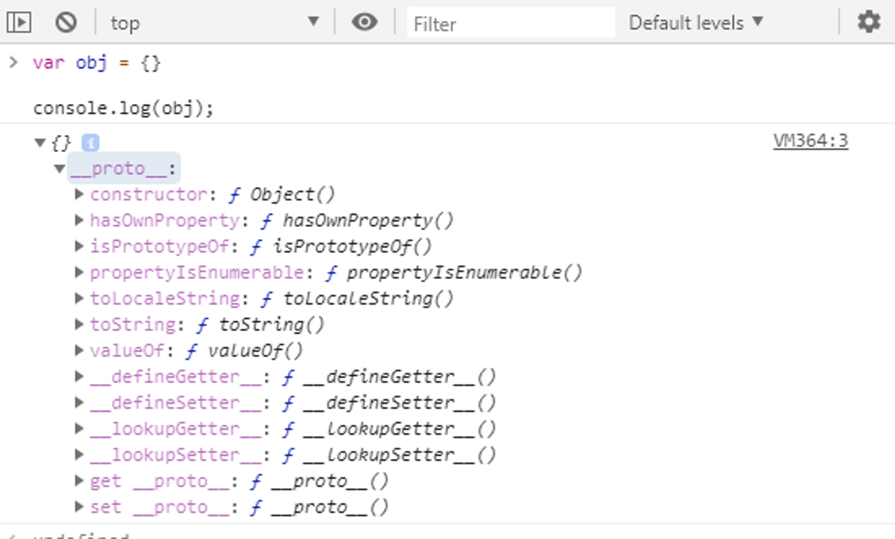
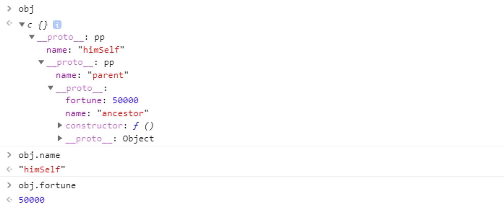
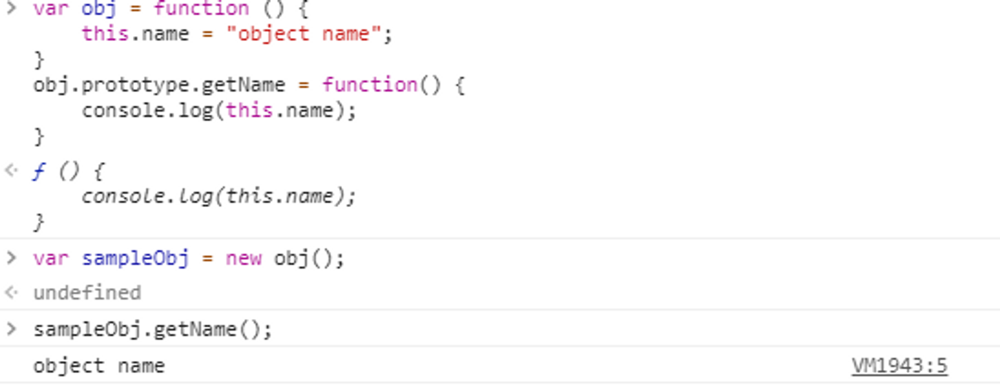
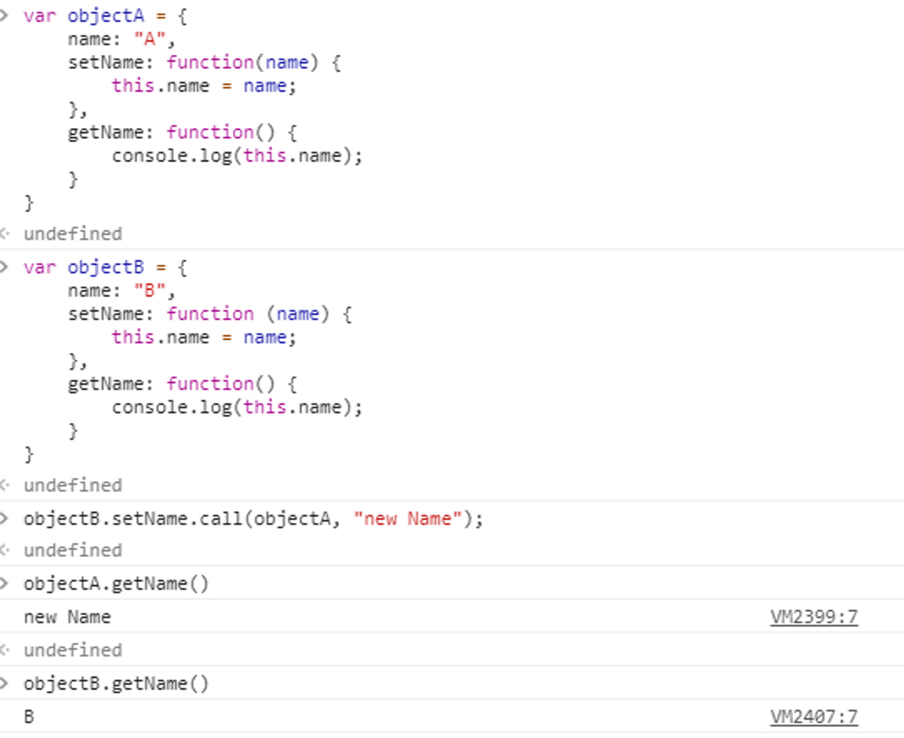
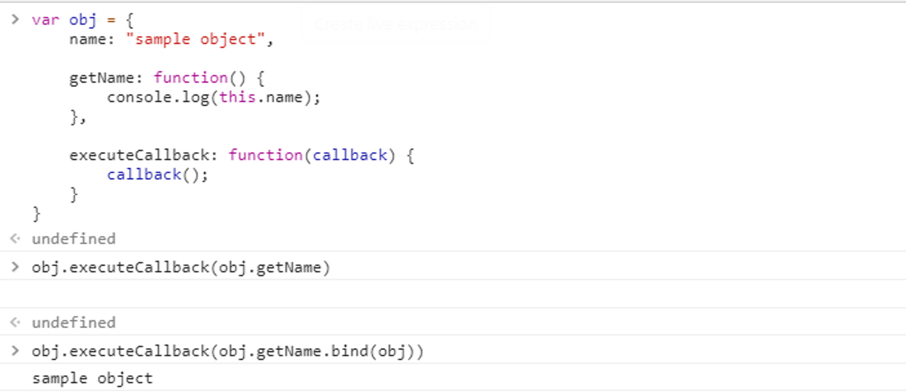

# context

## Prototype

### JavaScript 객체의 구조

-   모든 객체는 최상위 객체 Object가 연결되어있다.
-   타 언어의 상속과 같은 개념.

  

### Prototype 체인

-   객체에서 프로퍼티를 호출했을때 본인에게 없으면 본인의 **proto**안에서 탐색한다.
-   본인 객체 내의 값을 최 우선으로 탐색하므로, 같은 이름의 프로퍼티가 본인에게 있다면 프로토타입 체인 탐색을 멈춘다.

-   본인 **proto**안에 없으면 **proto**의 **proto**에서 탐색하는식으로 최상위 객체 까지 거슬러 올라가며 탐색한다.

  

### Class 모방

-   JavaScript에는 상속이라는 개념이 없으나, prototype을 통해 상속을 모방 할 수 있다.
-   객체의 prototype에 들어있는 요소들은 객체가 new 생성자로 객체화 될 때 새 객체의 **proto**에 연결된다.
-   객체의 prototype에 new 생성자로 생성한 객체를 연결하면 **proto**가 체인을 이루게 된다
-   타 언어의 상속처럼 상위 객체의 특정 요소를 재정의 할 필요 없이 공유할 수 있으므로, 클래스를 생성할때 이러한 원리를 사용한다.

  

---

  

## Context

### this

-   실행중인 코드가 바라보고있는 this의 값
-   new 생성자를 통해 생성된 객체는새로운 this 컨텍스트를 가진다.

-   객체는 데이터를 저장하는 모델로서의 역할도 하고 있기때문에, 함수 실행시 this가 무엇인지 확실히 알고 실행해야한다.
-   지정된 context가 없으면 기본적으로 global을 바라보게 된다.

  

### apply / call

-   메소드 실행시 실행 함수의 this를 변경시켜주는 함수.

-   함수 내에서 this를 참조하는 구문이 있다면, 함수명 앞에 왔던 대상이 아니라 apply/call 함수의 첫번째 파라메터로 전달된 객체를 this로 간주하고 작동한다.

  

### bind

-   함수 실행 전 함수가 어느 context로 실행될지 미리 지정해주는 함수.

-   특히 callback으로 전달받은 함수를 실행할때는 그 함수의 소속을 알 수 없으므로 함수자체만을 실행하게 되는데, 이 때 bind된 객체가 없으면 global context에서 실행되므로 원하는 결과를 출력할 수 없게 된다.

  

### context bind 우선순위

-   new 생성자< call/apply < bind
