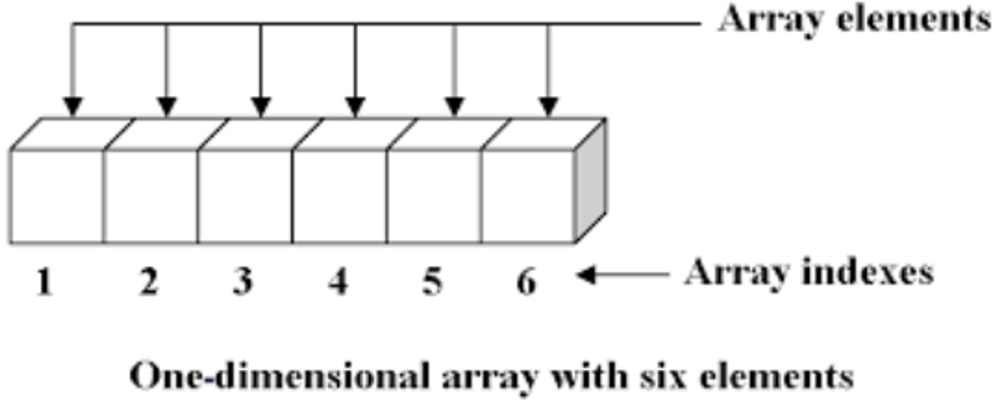
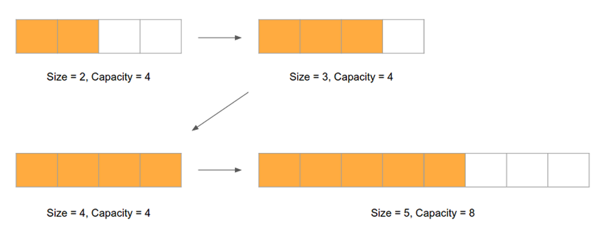
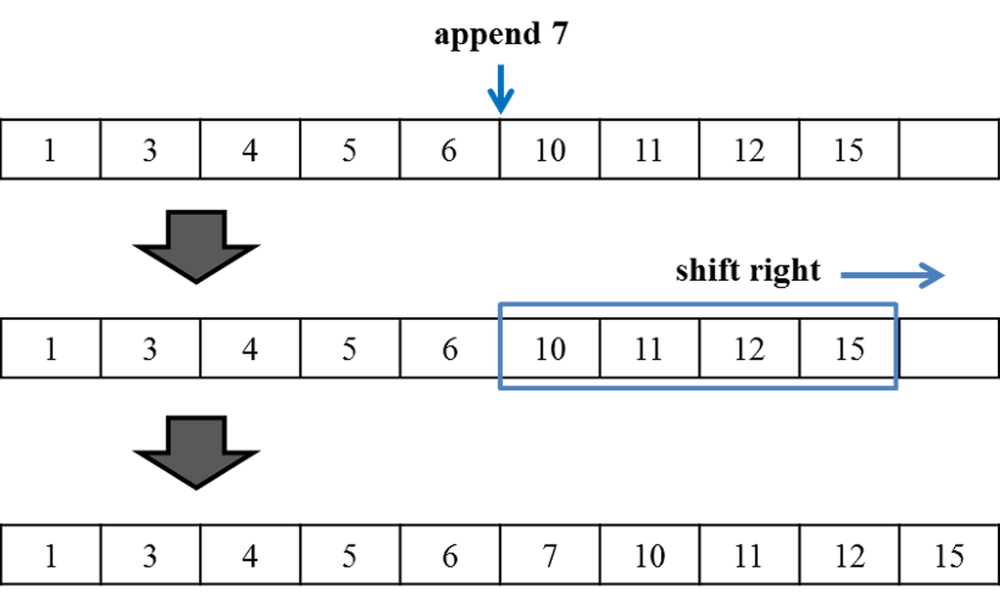

# 동적배열(ArrayList)

## 선형 자료 구조

선형 자료 구조란 연속된 자료를 저장하기 위한 것으로, 이에 해당하는 가장 기초적인 자료구조가 배열이다.



<br /><br />

---

<br /><br />

## 배열의 장단점

<br />

### **장점**

**1.항목 접근 속도가 빠르고 일정하다.**

배열의 원소들은 모두 연속된 메모리 위치에 저장되기 때문에 인덱스를 통해 가장 빠르게 원소를 참조하거나 변경할 수 있다.

<br />

### **단점**

**1.크기가 고정되어 있다. 사용하기 전에 배열 크기를 지정해야 한다.**

먼저 배열의 크기를 정해야 하기 때문에 만약 정해진 크기를 넘겨서 자료를 저장하고 싶다면 더 큰 크기의 배열을 새로 할당받아 사용해야 한다.

**2.삽입이 복잡하다.**

배열의 중간에 원소를 삽입하거나 삭제할 경우, 나머지 원소들의 연속적인 순서를 맞추기 위해 삽입/삭제가 이루어진 위치의 원소 이후부터의 원소들을 (삭제의 경우)앞쪽으로 당기거나 (삽입의 경우)뒤쪽으로 밀어야한다. 배열의 원소의 개수를 n이라고 한다면 원소들을 옮기는데 걸리는 시간은 O(n)이다.

**3.메모리를 한 덩어리로 차지하므로, 배열 크기가 클 경우 배열전체를 위한 메모리를 할당받지 못하는 경우가 있다.**

※ 위의 문제를 해결하기 위한 자료구조로 **동적 배열(Dynamic array)**과 **연결리스트(Linked list)**가 있다.

<br /><br />

---

<br /><br />

## **동적 배열(Dynamic array)**

<br />

### **개념 및 특징**

동적 배열은 배열의 단점을 어느정도 보완한 자료형으로, 기본적으로 배열로 구현되기에 초기에 고정된 크기를 할당 받으며 배열과 거의 비슷한 속도를 나타내지만, 필요에 따라 동적으로 크기가 변화하는 특징을 갖는다.

동적 배열은 내부적으로 배열로 구현되어 있어 메모리에 원소들이 연속적으로 위치에 있으며, 원소를 참조/변경하는데 O(1)시간이 걸리는 배열의 특징을 그대로 가지고 있다.

<br /><br />

### **동적배열의 동작원리 - 배열의 동적 확장**

동적 배열은 다음과 같은 원리로 동작한다. 처음 동적 배열이 생성되었을 때, 내부에 일정한 크기를 갖는 배열을 할당하고 원소를 추가한다.

추가된 원소의 총 개수가 내부 배열이 가진 크기를 넘어가면 **기존의 2배 크기**로 배열을 새로 할당한 후 기존의 원소를 새로운 배열에 복사한다.

그런 다음 내부에 가지고 있는 배열을 새로운 배열 객체로 바꿔치기한다.



위 그림은 전체 크기(capacity)를 4로 할당받은 후, 저장된 원소의 개수(size)를 2개에서 5개까지 추가하는 과정을 나타낸 그림이다.

마지막 배열에서 볼 수 있듯이 size가 capacity를 넘어갈 때, 2배 늘어난 크기의 배열 공간을 새로 할당한 후, 원소를 추가한 것을 알 수 있다.

이런 동작을 구현하기 위해서 동적 배열을 구현한 클래스는 할당된 배열을 가리키는 참조변수(array)와 배열의 전체 크기(capacity) 그리고 저장된 원소의 개수(size)를 가지고 있어야 한다.

<br /><br />

### **배열의 중간 삽입**



배열의 중간에 원소(데이터)를 추가하기 위해서는 해당 위치 다음에 저장된 모든 데이터를 일정 위치만큼씩 옮겨야한다.

반대로 삭제의 경우엔 삭제되는 해당 위치의 원소 다음 원소부터 앞쪽으로 한칸씩 옮겨야 한다.

<br /><br />

---

<br /><br />

## **ArrayList의 간단한 구현**

### C#

```csharp
public class MyArrayList
{
    private object[] _array;   // 할당된 배열을 가리키는 참조변수
    private int _size;         // 현재 저장된 원소 개수

    // 생성자
    public MyArrayList()
        : this(4)
    {
    }

    public MyArrayList(int capacity)
    {
        this._size = 0;
        this._array = new object[capacity];
    }

    public int Count
    {
        get { return _size; }
    }

    public int Capacity
    {
        get { return _array.Length; }
        set {
            if (value <= _size)
                throw new ArgumentOutOfRangeException();

            // TODO: 설정되는 크기로 새로운 배열 할당
            // 기존 원소를 새로운 배열로 복사
            // 할당된 배열을 가리키는 내부 참조변수를 새로운 배열로 변경
        }
    }

    // 외부에서 배열 요소에 접근을 위한 인덱서 프로퍼티
    public object this[int index]
    {
        get {
            if (index >= _size)  -> size가 아닌 capacity로 받아야함
                throw new IndexOutOfRangeException();
            return _array[index];
        }
        set {
            if (index >= _size)   -> size가 아닌 capacity로 받아야함
                throw new IndexOutOfRangeException();
            _array[index] = value;
        }
    }

    private void EnsureCapacity()
    {
        int capacity = _array.Length;
        if (_size >= capacity) {
            this.Capacity = capacity == 0 ? 4 : capacity * 2;
        }
    }

    // 배열의 마지막에 원소 추가
    public void Add(object element)
    {
        // 배열 공간 체크, 부족할 시 resize
        EnsureCapacity();

        // 원소 추가
        _array[_size] = element;
        _size++;
    }

    // 해당 위치에 원소 추가
    public void Insert(int index, object element)
    {
        // 배열 공간 체크, 부족할 시 resize
        EnsureCapacity();

        // 추가되려고 하는 위치부터 한칸씩 뒤로 데이터 이동
        for (int i = _size; i > TODO...) {
            _array[i] = _array[i - 1];
        }

        // 원소 추가
        _array[index] = element;
        _size++;
    }

    // 해당 위치의 원소 삭제
    public void RemoveAt(int index)
    {
        // TODO...
    }

    public void RemoveRange(int index, int count)
    {
        _size -= count;

        // 삭제하려는 위치부터 한칸씩 앞으로 데이터 이동
        for (int i = index; i < TODO...) {
            _array[i] = _array[i + 1];
        }
    }

    public void CopyTo(Array array)
    {
        CopyTo(array, 0);
    }

    public void CopyTo(Array array, int arrayIndex)
    {
        for (int i = arrayIndex; i < TODO...) {
            // TODO: ...
        }
    }
}
```

### java

```java
package DataStructure;

public class ArrayList<T> {
    Object[] arr = null;
    int capacity = 0;
    int size = 0;

    public ArrayList(int capacity){
        this.capacity = capacity;
    	arr = new Object[capacity];
        size = 0;
    }

    public ArrayList(){
        capacity = 1;
    	arr = new Object[capacity];
        size = 0;
    }

    public void add(T element){
        if(size == capacity){
            expandArray();
        }

        arr[size++] = element;
    }

    public void addFirst(T element){
        add(0, element);
    }

    public void add(int index, T element){
        if(size == capacity){
            expandArray();
        }

        for(int i = size; i >= index; i--)
        	arr[i] = arr[i-1];

        arr[index] = element;
        size++;
    }

    private void expandArray(){
        capacity *= 2;
        Object[] tempArr = new Object[capacity];
        copyArr(tempArr, arr);
        arr = new Object[capacity];
        copyArr(arr, tempArr);
    }

    private void copyArr(Object[] arr1, Object[] arr2){
        for(int i = 0; i < arr2.length; i++){
            arr1[i] = arr2[i];
        }
    }

    public T get(int index){
        if(size <= 0){
            System.out.println("배열이 비어있습니다.");
            return null;
        }

        return (T) arr[index];
    }

    public T remove(int index){
        /*
            크기 초과, 이미 비어있는지 등 조건문은 원하는대로 추가해주면 된다.
        */
        T result = (T) arr[index];
        arr[index] = null;
        size--;
        if(size > 0) {
        /*
        	삭제한 이후부터 앞으로 한칸씩 땡긴다.
        */
        	for(int i = index; i < size; i++) {
        		arr[i] = arr[i+1];
        	}
        }


        return result;
    }
    public void reset(){
        arr = new Object[capacity];
        size = 0;
    }

    public int size() {
    	return this.size;
    }

    public int getCapacity() {
    	return this.capacity;
    }
}
```

<br /><br />

---

<br /><br />

## **생성자**

- **MyArrayList(int capacity)**: 비어 있는 상태에서 지정한 초기 용량을 가지는 MyArrayList 클래스의 새 인스턴스를 초기화합니다.
- **MyArrayList()**: 비어 있는 상태에서 기본 초기 용량(4)을 가지는 MyArrayList 클래스의 새 인스턴스를 초기화합니다.

<br /><br />

## **속성**

- **int Count**: MyArrayList에 실제로 포함된 요소의 수를 가져옵니다.
- **object Item[ int index]**: 지정한 인덱스에 있는 요소를 가져오거나 설정합니다.
- **int Capacity**: MyArrayList에 포함될 수 있는 요소의 수를 가져오거나 설정합니다.

<br /><br />

## **메서드**

- **void Add( object item)**: 개체를 MyArrayList의 끝 부분에 추가합니다.
- **void Clear()**: MyArrayList에서 모든 요소를 제거합니다.
- **void CopyTo(Array array)**: 대상 배열의 맨 처음부터 시작하여 전체 MyArrayList를 호환되는 1차원 Array에 복사합니다.
- **void CopyTo(Array array, int arrayIndex)**: 대상 배열의 지정된      인덱스에서 시작하여 전체 MyArrayList을 호환되는 1차원 Array에 복사합니다.
- **void Insert(int index, object item)**: MyArrayList의 지정된 인덱스에 요소를 삽입합니다.
- **void RemoveAt(int index)**: MyArrayList의 지정된 인덱스에 있는 요소를 제거합니다.
- **void RemoveRange(int index, int count)**: MyArrayLis 서 요소의 범위를 제거합니다.
- **void Swap(int i, int j)**: MyArrayList의 지정된 첫번째 인덱스와 두번째 인덱스에 있는 요소들을 바꿉니다.
- **object[] ToArray()**: MyArrayList의 요소를 새 Object 배열에 복사합니다.

<br /><br />

---

<br /><br />


