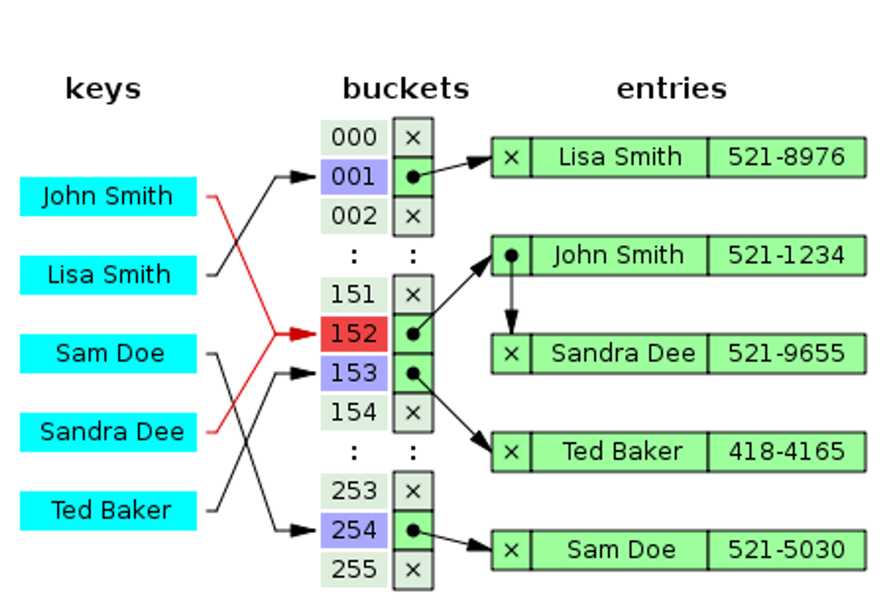

# 딕셔너리(Dictionary)

딕셔너리(해시테이블)는 키를 해시함수(Hash Function)를 통해 해싱한 후 해당 배열(버킷)의 인덱스에 값을 저장하는 자료구조로 해시셋과 동작 방식은 동일하다.

해시셋과 차이점은 해시셋은 키(Key)만 저장하지만 딕셔너리는 키(Key)로 해싱한 후 해당 위치에 값(Entry)을 저장한다는 차이가 있다.

 

 

키를 이용하여 해당 키에 대응하는 값을 찾을 때 사용된다.

  

---

  

## 생성자

- **Dictionary<TKey,TValue>(IEqualityComparer<TKey> equalityComparer = null)**: 기본 초기 용량을 갖고 있고 키 형식에 대한 기본 같음 비교자를 사용하는 비어 있는 Dictionary<TKey,TValue> 클래스의 새 인스턴스를 초기화합니다

- **Dictionary<TKey,TValue>(int capacity, IEqualityComparer<TKey> equalityComparer = null)**: 기본 초기 용량을 갖고 있고 지정된 Dictionary<TKey,TValue>을 사용하는 비어 있는 IEqualityComparer<T>클래스의 새 인스턴스를 초기화합니다.

  

## 속성

- **int Count**: Dictionary<TKey,TValue>에 포함된 키/값 쌍의 수를 가져옵니다.

- **TValue Item[TKey key]**: 지정된 키에 연결된 값을 가져오거나 설정합니다.

  

## 메소드

- **void Add(TKey key, TValue value)**: 지정한 키와 값을 사전에 추가합니다.
- **void Clear()**: Dictionary<TKey,TValue>에서 모든 키와 값을 제거합니다.
- **bool Contains(TKey key)**: Dictionary<TKey,TValue>에 지정한 키가 포함되어 있는지 여부를 확인합니다.
- **IEnumerator<KeyValuePair<TKey, TValue>> GetEnumerator()**: Dictionary<TKey,TValue>를 반복하는 열거자를 반환합니다.
- **void Remove(TKey key)**: Dictionary<TKey,TValue>에서 지정한 키가 있는 값을 제거합니다.
- **bool TryGetValue(TKey key, out TValue value)**: 지정한 키와 연결된 값을 가져옵니다.
