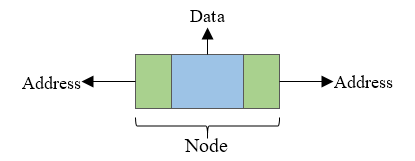
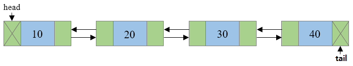

# 양방향 연결리스트(Doubly Linked List)

 

각 노드(Node)에 데이터를 담고 있는 공간과 이전 노드(Prev)와 다음 노드(Next)를 가리키는 두개의 포인터를 갖고 있는 자료구조다.

단일 연결 리스트에 비해 구현은 복잡하지만 역방향 조회가 가능하다는 장점이 있다.

  

  

  

---

  

## 생성자

- **int Count**: LinkedList에 실제로 포함된 노드의 수를 가져옵니다.
- **LinkedNode<T> Firs**: LinkedList의 첫 번째 노드를 가져옵니다.
- **LinkedNode<T> Last**: LinkedList의 마지막 노드를 가져옵니다.

## 속성

- **LinkedNode<T> AddAfter(LinkedNode<T> node, T data)**: LinkedList의 지정한 기존 노드 다음에 지정한 값이 포함된 새 노드를 추가합니다.
- **LinkedNode<T> AddBefore(LinkedNode<T> node, T data)**: LinkedList의 지정한 기존 노드 앞에 지정한 값이 포함된 새 노드를 추가합니다.
- **void AddFirst(T data)**: LinkedList의 시작 위치에 지정한 값이 포함된 새 노드를 추가합니다.
- **void AddLast(T data)**: LinkedList의 끝에 지정한 값이 포함된 새 노드를 추가합니다.
- **void Clear()**: LinkedList에서 노드를 모두 제거합니다.
- **bool Contains(T data)**: 값이 LinkedList에 있는지 여부를 확인합니다.
- **bool Contains(Predicate<T> match)**: 지정된 조건자에 정의된 조건과 일치하는 요소가 LinkedList<T>에 포함되어 있는지 여부를 확인합니다.
- **LinkedNode<T> Find(T data)**: 지정한 값이 포함된 첫 번째 노드를 찾습니다.
- **LinkedNode<T> Find(Predicate<T> match)**: 지정된 조건자에 정의된 조건과 일치하는 요소를 검색하고 노드를 반환합니다.
- **IEnumerator<T> GetEnumerator()**: LinkedList를 반복하는 열거자를 반환합니다.
- **void Remove(LinkedNode<T> node)**: LinkedList에서 지정된 노드를 제거합니다.
- **bool Remove(T data)**: LinkedList에서 맨 처음 발견되는 지정된 값을 제거합니다.
- **T RemoveFirst()**: LinkedList의 시작 위치에서 노드를 제거합니다.
- **T RemoveLast()**: LinkedList의 끝에서 노드를 제거합니다.
- **T[] ToArray()**: LinkedList를 새 배열에 복사합니다.
- **LinkedNode<T> FindLast(T data)**: 지정한 값이 포함된 첫 번째 노드를 찾습니다.
- **LinkedNode<T> FindLast(Predicate<T> match)**: 지정된 조건자에 정의된 조건과 일치하는 요소를 검색하고 노드를 반환합니다.