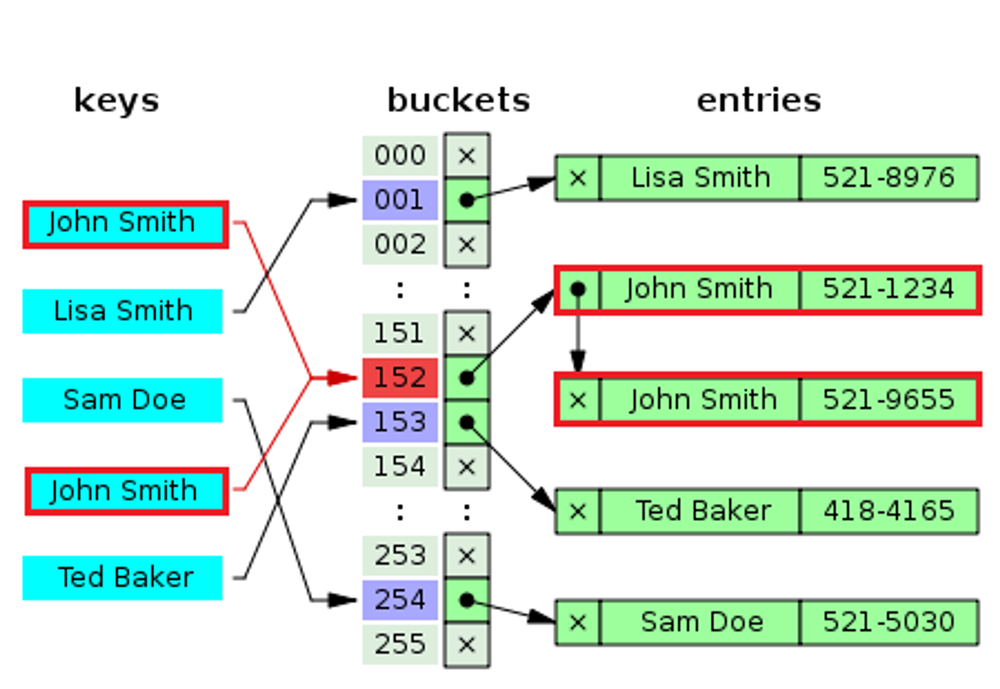

# 그룹핑 딕셔너리(HashMap)

그룹핑 딕셔너리는 하나의 키로 중복-되는 여러개의 값을 저장하는 자료구조로 딕셔너리와 동작 방식은 동일하다.

딕셔너리와 차이점은 딕셔너리는 이미 중복된 키가 있으면 오류를 발생시키지만 그룹핑 딕셔너리는 중복을 허용하여 단일 키 아래에 리스트를 이용하여 여러 값을 저장한다.

**키 중복을 허용하고 대소문자를 구분하지 않는 자료구조 특성때문에 .NET Request 객체의 헤더, 쿼리 문자열, 폼데이터 및 쿠키를 관리하는데 주로 사용된다.**

**즉, 데이터를 키 기준으로 그룹핑 할 때 사용하는 자료구조로 딕셔너리와 달리 입,.력된 순서대로 출력 및 인덱스 접근을 허용한다.**

  

---

  

## Dictionary VS HashMap

 

|                 | Dictionary | VS HashMap                   |
| --------------- | ---------- | ---------------------------- |
| 중복추가 허용   | X          | O                            |
| 없는키 검색     | X          | O                            |
| 순서대로 출력   | X          | O                            |
| 배열인덱스 접근 | X          | O                            |
| 성능(효율)      | 높음       | 낮음(키 목록 관리 비용 때문) |

  

---

  

## 생성자

-   **MyHashMap<TValue>()**: 비어 있는 상태이고 기본 초기 용량을 가지며 대/소문자를 구분하지 않는 기본 해시 코드 공급자와 대/소문자를 구분하지 않는 기본 비교자를 사용하는 MyHashMap클래스의 새 인스턴스를 초기화합니다.
-   **MyHashMap<TValue>(IEqualityComparer<string>)**: 기본 초기 용량을 갖고 있고 지정된 지정된 IEqualityComparer 비교자를 사용하는 MyHashMap클래스의 새 인스턴스를 초기화합니다.

  

## 속성

-   **int Count**: MyHashMap 인스턴스에 포함된 키/값 쌍의 수를 가져옵니다.
-   **TValue Item[int index]**: MyHashMap 에서 지정된 키를 가지는 엔트리를 가져오거나 설정합니다.
-   **TValue Item[string key]**: MyHashMap 에서 지정된 키를 가지는 엔트리를 가져오거나 설정합니다.
-   **IEnumerable<string> Keys**: MyHashMap의 모든 키를 가져옵니다.

  

## 메서드

-   **void Add(string key, TValue value)**: 지정된 이름과 값을 가지는 엔트리를MyHashMap에 추가합니다.
-   **void Clear()**: 캐시된 배열을 무효로 만들고MyHashMap에서 모든 엔트리를 제거합니다.
-   **IEnumerator<KeyValuePair<string, TValue>> GetEnumerator()**: MyHashMap에서 KeyValuePair<string, TValue>를 반복하는 열거자를 반환합니다.
-   **TValue[] GetValues(string key)**: MyHashMap에서 지정된 키와 관련된 값의 배열 TValue[] 를 가져옵니다.
-   **TValue[] GetAllValues()**: MyHashMap에서 등록된 모든 값의 배열 TValue[] 를 가져옵니다
-   **bool Contains(string key)**: MyHashMap에  키값이 추가되어 있는지 여부를 가져옵니다.
-   **void Remove(string key)**: MyHashMap인스턴스에서 지정한 키를 가지는 엔트리를 제거합니다.
