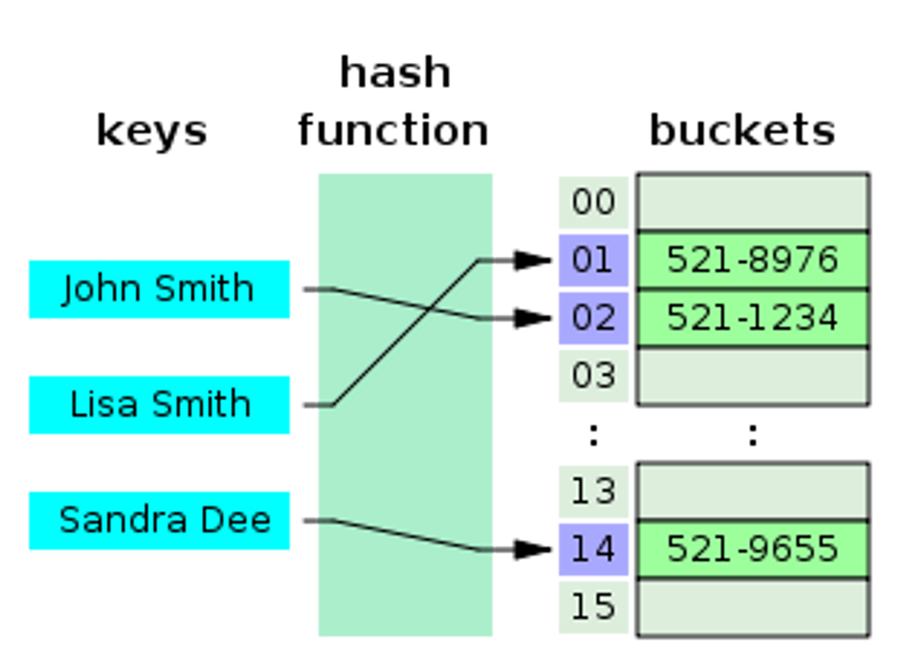
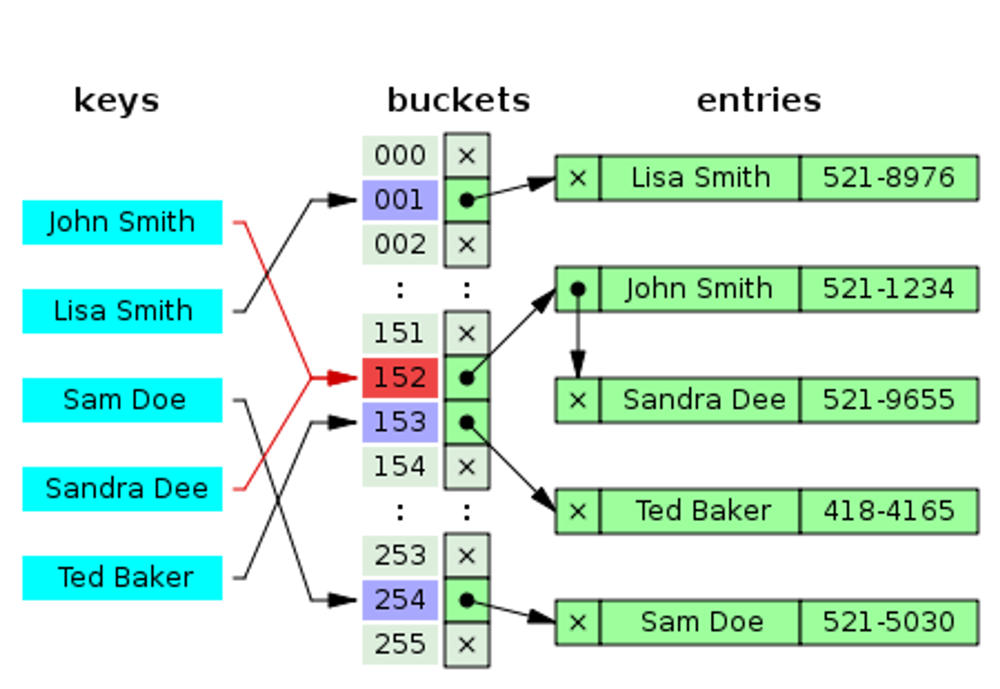

# 해시셋(HashSet)

해시함수(Hash Function)란 임의의 데이터를 특별한 알고리즘을 통해 고유한 숫자로 맵핑하는 함수다.

이 때 매핑하기 전 원래 데이터의 값을 **키(Key)**, 매핑 후 데이터의 값을 **해시값(Hash Code)**, 매핑하는 과정 자체를 **해싱(Hashing)** 이라고 한다.

해쉬(Hash)는 데이터의 값을(Key) 고유한 숫자로(Hash Code) 만들어 낸뒤 이를 내부적으로 **배열의(Bucket)** 인덱스로 사용하기 때문에 빠른 검색 속도를 갖는다.

인덱스에 해시값을 사용하는 구조이기 때문에 별도의 정렬을 거치지 않고도 원하는 데이터를 빠르게 찾아내거나 삽입할 수 있다.

단, 해시값을 이용해 자료가 분산되므로, 자료 전체를 어떠한 기준에 의해 정렬하여 출력하고자 하는 작업에는 적합하지 않다.

\+

사전적 의미로는 집합을 의미하며 대표적인 데이터의 중복을 허용하지 않는 자료구조로 중복된 데이터를 제거하거나 이미 추가되어 있는지 검사할 때 주로 이용한다.

또한, 위 그림에서 보듯이 저장되는 데이터가 해싱되어 해당 배열(버킷)의 인덱스에 할당되므로 저장된 데이터의 순서를 파악할 수 없는 특징이 있다.

<br />



<br /><br />

---

<br /><br />

## 해시함수의 특징

해시 함수의 결과물은 특정 길이의 숫자이므로, 원래의 해싱한 원보 정보는 알수없다.

예) 100의 해시값이 35 , "HI"의 해시값이 45, "이카운트"의 해시값이 35라고 할때 35또는 45라는 해시값만 가지고는 원본 키값을 추적하기란 매우 어렵다.

따라서, 해시는 비밀번호, 전자서명, 전자투표, 전자상거래와 같은 민감한 입력의 무결성을 검증해야 하는 보안 분야에서도 널리 사용된다.

(예 - 입력값으로 해시값을 구해 기존에 계산한 해시값과 비교하면 자료 변경 여부를 알 수 있다.)

<br /><br />

---

<br /><br />

## 간단한 해시 알고리즘(Hash Function) 구현

```c#
public override int GetHashCode(){
    int hashCode = 17;
    hashCode = (hashCode \* 23) + (name == null ? 0 : this.name.GetHashCode());
    hashCode = (hashCode \* 23) + this.phoneNumber;
    return hashCode;
}
```

<br /><br />

---

<br /><br />

## 해시 자료구조에서 저장/조회시 버킷을 계산하는 방법

int index = (X.GetHashCode() & 0x7fffffff) % bucket_size;

또는

int index = Math.Abs(X.GetHashCode() % bucket_size);

배열의 인덱스로 활용해야 하므로, 배열의 크기로 나눈 나머지 값을 이용하면 크기를 벗어나지 않게 할 수 있다.

0x7fffffff 로 AND 연산을 하는 이유는 GetHashCode의 결과값이 음수(-) 값이 나올 수 있기 때문이다.

또는 Math.Abs 함수를 이용하여 음수(-) 값인 경우 절대값으로 바꿔주는 방법도 있다.

참고 : 배열의 인덱스는 0부터 시작한다 (음수를 사용하지 않는다.)

<br /><br />

---

<br /><br />

## 충돌방지와 회피

해시함수는 대개 많은 키값을 고유한 값으로 맵핑하기 때문에 결과값으로 이용 가능한 값에 비해 입력가능한 값이 현저히 많다고 볼 수 있다.

(쉽게 말하면 담을 공간을 정해져 있는데, 입력가능한 값은 무한하다고 보면 된다.)

따라서 아무리 잘 만들어진 해시함수라 할지라도 서로 다른 두 개의 키에 대해 동일한 해시값이 만들어지는 **해시충돌(collision)**이 발생하게 된다.

해싱된 배열(버킷 - Bucket)의 인덱스에 이미 다른 값이 들어 있다면 새로운 데이터를 저장 할 다른 위치가 필요하다.

따라서 이런한 충돌 해결은 필수이며 해결 방법으로는 해당 버킷에 데이터가 이미 있다면 체인처럼 노드를 추가하여 다음 노드를 가리키는 방식(연결리스트)의 구현이 많이 사용된다.

<br />



<br /><br />

---

<br /><br />

## C#/JAVA 해시셋(딕셔너리)의 데이터 검색과정

-   **1단계** - 저장하는 요소의 **GetHashCode** 메소드의 반환 값을 해시값으로 사용하여 배열(bucket)의 크기로 나눈 나머지를 배열의 인덱스로 사용한다.
-   **2단계** - 저장하는 요소의 **Equals** 메소드의 비교 결과를 이용하여 실제 데이터가 같은지 다른지 판단한다.

위와 같이 1단계에서 해시값을 이용하여 검색하는 범위를 최소로 줄인 후 2단계에서 중복(동일값) 여부를 체크한다.

그렇기 때문에 직접 작성한 클래스를 해시셋에 사용하는 경우 기본 동작방식과 다르게 해싱하고 값을 비교하게 하려면 해당 클래스의 GetHashCode와 Equals 메소드를 재정의해서 사용하거나 `IEqualityComparer<T>` 인터페이스를 구현한 형식 같음 비교자를 사용해야 한다.

클래스의 GetHashCode와 Equals 메소드를 재정의 하는 것은 기본동작을 바꾸는 것이고 `IEqualityComparer<T>` 인터페이스를 구현한 형식 같음 비교자를 사용하는 것은 기본동작 이외의 다른 방식으로  비교 할 필요가 있는 경우에 사용된다.

## 해시 버킷 동적 확장(Resize)

해시 배열(버킷)의 개수가 적다면 메모리 사용을 아낄 수 있지만 해시 충돌로 인한 성능상 손실이 발생한다.

그렇기 때문에 일반적으로 저장된 데이터의 개수가 일정 개수 이상이 되면 해시 버킷의 개수를 두 배로 늘리는데

일반적으로 해시 버킷의 크기를  확장하는 임계점은 현재 데이터 개수가 해시 버킷 개수의 1.25(125%)가 될 때이다.

일단 배열(버킷)이 확장되면 이미 기존에 저장되어 있던 모든 데이터에 대해 다시 해싱하는 과정을 수행해야 한다.

그 이유는 버킷의 크기가 변경되었으므로 값을 찾을 때 사용하는 해시값을 나누는 버킷의 크기가 기존과 달라졌기 때문이다.

<br />

## 해시셋(HashSet)의 구현

해시 구현시 해시 충돌 최소화를 위해 배열(버킷)의 크기는 소수(자신보다 작은 두개의 자연수를 곱하여 만들 수 없는 1보다 큰 자연수) 중 하나로 설정한다.

보통 동적 확장을 구현한 경우 기본값은 일반적으로 17으로 시작하며 2배 증가시 17\*2 = 34이지만 34보다 큰 소수인 37이 버킷의 크기로 설정된다.

<br />

### 생성자

-   **MyHashSet<T>(IEqualityComparer<T> equalityComparer = null)**: 비어 있으며 집합 형식에 대한 기본 같음 비교자를 사용하는 MyHashSet<T> 클래스의 새 인스턴스를 초기화합니다.
-   **MyHashSet<T>(int capacity, IEqualityComparer<T> equalityComparer = null)**: 비어 있으며 집합 형식에 대한 지정된 같음 비교자를 사용하는 MyHashSet<T> 클래스의 새 인스턴스를 초기화합니다.

<br />

### 속성

-   **int Count**: 집합에 포함된 요소 수를 가져옵니다.

<br />

### 메소드

-   **bool Add(T)**: 지정된 요소를 집합에 추가합니다.
-   **void Clear()**: HashSet<T> 개체에서 요소를 모두 제거합니다.
-   **bool Contains(T)**: HashSet<T> 개체에 지정된 요소가 포함되어 있는지 확인합니다.
-   **IEnumerator<T> GetEnumerator()**: HashSet<T> 개체에서 반복되는 열거자를 반환합니다.
-   **void Remove(T)**: HashSet<T> 개체에서 지정된 요소를 제거합니다.
