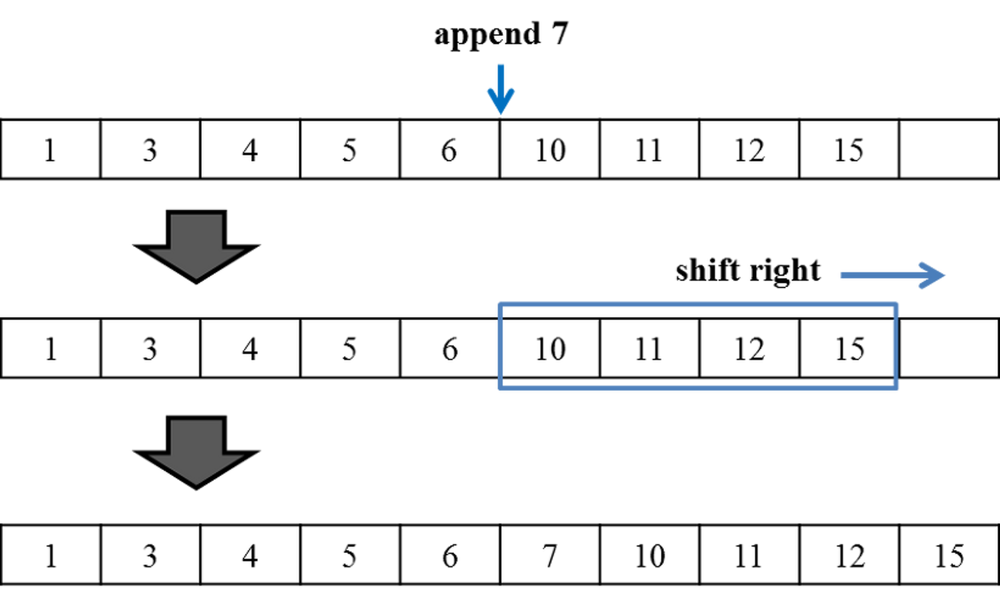
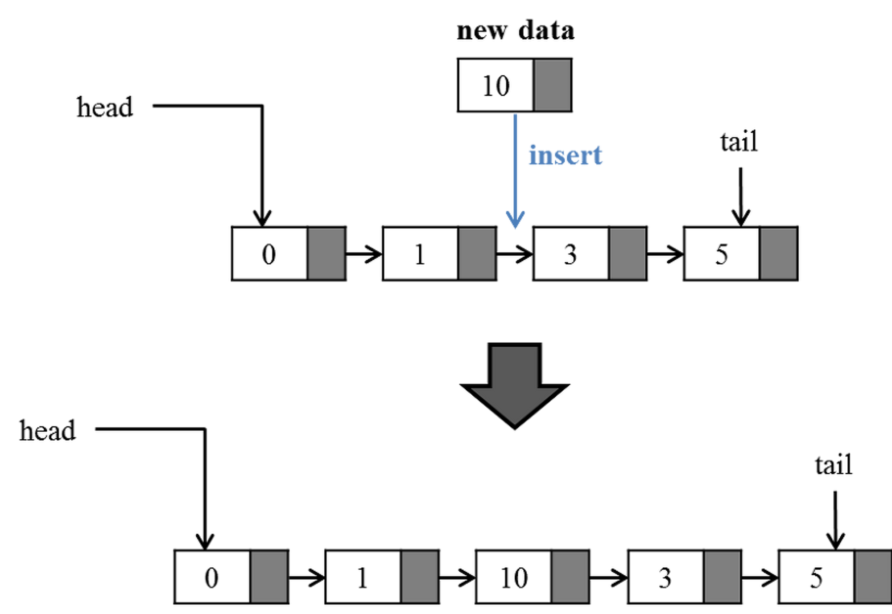
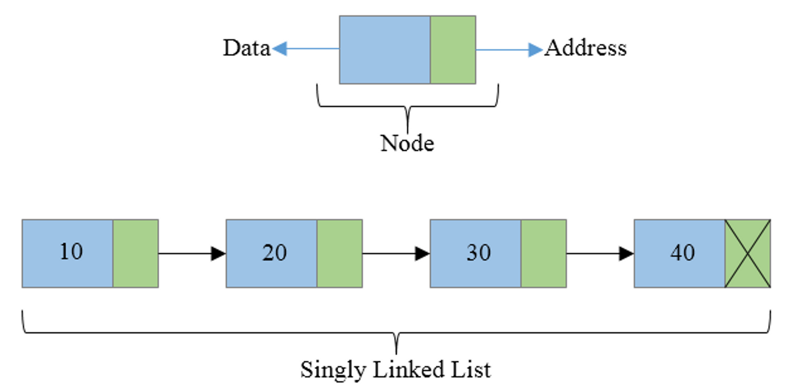
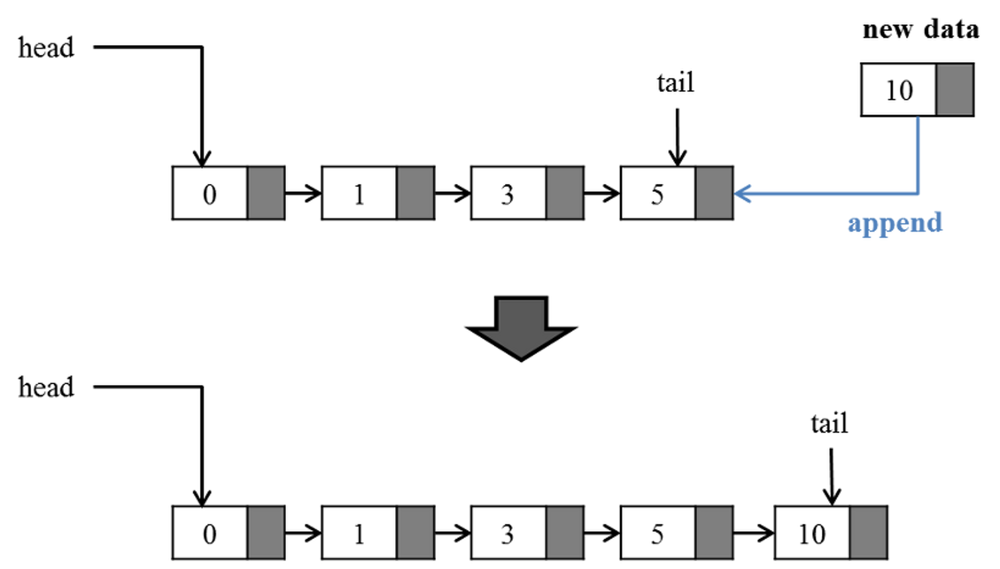
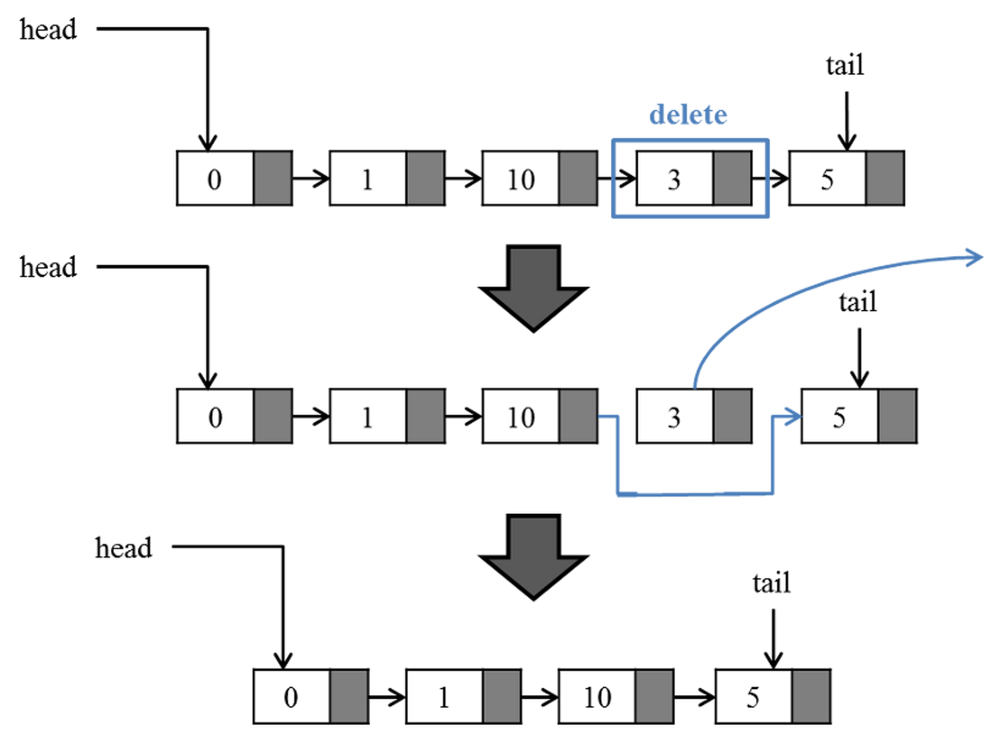

# 연결리스트(LinkedList)

연결 리스트 또는 링크드 리스트는 각 노드(Node)가4. 연결리스트(LinkedList) 데이터와 포인터를 가지고 연결되어 있는 자료 구조이다.

### **연결 리스트의 장단점**

선형 자료 구조를 이용하는 동적배열, 큐는 배열을 기반으로 데이터를 저장하기 때문에 데이터에 대한 접근성이 좋다.

하지만 추가되는 원소의 총 개수가 내부 배열이 가진 크기를 넘거나 삭제 연산이 수행되는 경우 배열안의 원소들을 복사하거나 이동시켜야 하는 단점이 있다.

아래의 그림은 배열에서 새로운 원소가 추가되는 경우, 연산이 실행되는 과정을 나타낸다.

 

 

선형 자료 구조를 이용하는 배열과 같은 구조에서는 중간에 데이터를 추가하기 위해서는 해당 위치 다음에 저장된 모든 데이터를 일정 위치만큼씩 옮겨야한다.

원하는 위치의 칸을 비워놔야 삽입이 가능하기 때문이다. 만약 1,000,000(백만)개의 데이터가 있는데 첫 번째 위치에 데이터를 삽입하려 하면 그 뒤에 있는 모든 데이터를 한칸씩 옮겨야 한다.

이것은 시간적으로나 비용적으로나 엄청난 낭비다. 이러한 shift 동작은 메모리 상에서 많은 오버헤드가 발생한다.

배열과 같은 구조의 또다른 문제점은 항상 고정된 크기를 갖기 때문에 예상한 것보다 데이터가 적게 저장되는 경우에는 저장 공간이 낭비가 발생한다.

또한 배열은 연속된 메모리 위치에 저장되기 때문에 배열의 크기가 커지는 경우 연속된 메모리 공간을 확보하지 못해 메모리 부족(Out Of Memory) 현상이 발생할 수 있다.

**그러므로, 배열의 인덱스를 통해 원소를 접근하거나 변경하는 경우가 아닌 단순 목록 관리를 하는 경우라면 동적배열(List<T>) 사용을 자제해야 한다.**

 

---

 

 

**연결 리스트**는 **_노드의 동적 할당과 포인터를 기반_**으로 구현되기 때문에 연속된 메모리가 필요하지 않다.

즉, 예상한 것 보다 데이터가 적게 저장되거나 많게 저장되는 경우에도 필요한 만큼만 노드(Node)를 만들고 연결하기 때문에 배열에 비해 메모리 사용에 유연하다.

연결 리스트는 동적 배열과 달리 늘어선 노드의 중간지점에서도 자료의 추가와 삭제가 O(1)의 시간에 가능하다는 장점을 갖는다.

그러나 배열이나 트리 구조와는 달리 특정 위치의 데이터를 검색하는 경우 원소의 개수가 n이라고 할때 O(n)의 시간이 걸리는 단점도 갖고 있다.

 

---

 

**단일 연결 리스트(Singly Linked List)**

각 노드(Node)에 데이터를 담고 있는 공간과 다음 노드(Next)를 가리키는 한개의 포인터를 갖고 있는 자료구조다.

 

---

 

[원소 추가]

 

---

 

[원소 삭제]

 

---

 

## 생성자

- **MySLinkedList<T>(IEqualityComparer<T> equalityComparer = null)**: 비어 있는 MySLinkedList클래스의 새 인스턴스를 초기화합니다.

  

## 속성

- **int Count**: LinkedList에 실제로 포함된 노드의 수를 가져옵니다.
- **SLinkedNode<T> First**: LinkedList의 첫 번째 노드를 가져옵니다.
- **SLinkedNode<T> Last**: LinkedList의 마지막 노드를 가져옵니다.

  

## 메서드

- **SLinkedNode<T> AddAfter(SLinkedNode<T> node, T data)**: LinkedList의 지정한 기존 노드 다음에 지정한 값이 포함된 새 노드를 추가합니다.
- **SLinkedNode<T> AddBefore(SLinkedNode<T> node, T data)**: LinkedList의 지정한 기존 노드 앞에 지정한 값이 포함된 새 노드를 추가합니다.
- **void AddFirst(T data)**: LinkedList의 시작 위치에 지정한 값이 포함된 새 노드를 추가합니다.
- **void AddLast(T data)**: LinkedList의 끝에 지정한 값이 포함된 새 노드를 추가합니다.
- **void Clear()**: LinkedList에서 노드를 모두 제거합니다.
- **bool Contains(T data)**: 값이 LinkedList에 있는지 여부를 확인합니다.
- **bool Contains(Predicate<T> match)**: 지정된 조건자에 정의된 조건과 일치하는 요소가 LinkedList<T>에 포함되어 있는지 여부를 확인합니다.
- **SLinkedNode<T> Find(T data)**: 지정한 값이 포함된 노드를 찾습니다.
- **SLinkedNode<T> Find(Predicate<T> match)**: 지정된 조건자에 정의된 조건과 일치하는 요소를 검색하고 노드를 반환합니다.
- **IEnumerator<T> GetEnumerator()**: LinkedList를 반복하는 열거자를 반환합니다.
- **void Remove(SLinkedNode<T> node)**: LinkedList에서 지정된 노드를 제거합니다.
- **bool Remove(T data)**: LinkedList에서 맨 처음 발견되는 지정된 값을 제거합니다.
- **T RemoveFirst()**: LinkedList의 시작 위치에서 노드를 제거합니다.
- **T RemoveLast()**: LinkedList의 끝에서 노드를 제거합니다.
- **T[] ToArray()**: LinkedList를 새 배열에 복사합니다.
