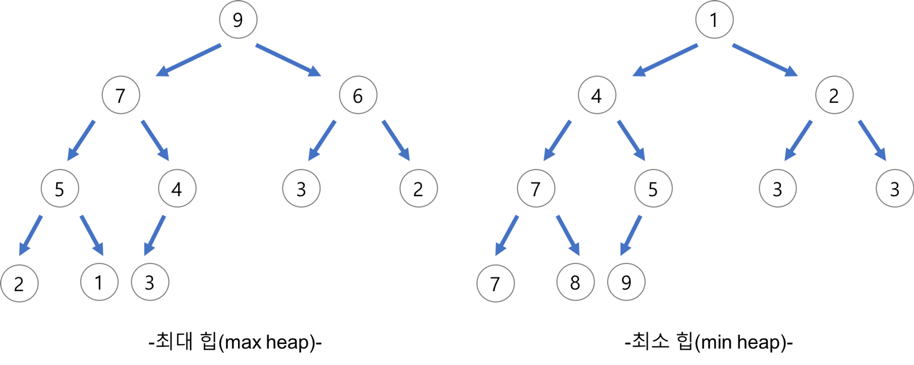

# 우선순위 큐(Priority Queue)

큐는 먼저 들어간 데이터가 먼저 나오지만 우선순위 큐는 들어간 순서에 상관없이 우선순위가 높은 데이터가 먼저 나오는 자료구조이다.

즉, 우선순위의 개념을 큐에 도입한 자료 구조로 저장되는 데이터들이 우선순위를 가지고 있고 우선순위가 높은 데이터가 늦게 들어왔어도 먼저 나간다.

우선순위 큐에서 중요한 것은 데이터의 우선순위 이며 우선순위가 다른 데이터 뿐만 아니라 같은 데이터가 존재할 수도 있다.

```md
우선 순위 큐(Priority Queue)의 사용 사례

1. 운영 체제에서의 작업 스케쥴링

2. 네트워크 트래픽 제어

3. 시뮬레이션 시스템
```

<br /><br />

---

<br /><br />

## 우선 순위 큐 - 자료구조 ‘힙(Heap)’이란?

완전 이진 트리의 일종으로 여러 개의 값들 중에서 최대값이나 최소값을 빠르게 찾아내도록 우선순위 큐를 위하여 만들어진 자료구조이다.

힙 트리에서는 중복된 값을 허용한다. (이진 트리에서는 중복된 값을 허용하지 않는다.)

**[힙(Heap)의 종류]**

**1. 최대 힙(max heap)**

- 부모 노드의 키 값이 자식 노드의 키 값보다 크거나 같은 완전 이진 트리
- key(부모 노드) >= key(자식 노드)

**2. 최소 힙(min heap)**

- 부모 노드의 키 값이 자식 노드의 키 값보다 작거나 같은 완전 이진 트리
- key(부모 노드) <= key(자식 노드)



<br /><br />

---

<br /><br />

## [힙(Heap)의 삽입]


1. 힙에 새로운 요소가 들어오면, 일단 새로운 노드를 힙의 마지막 위치에 삽입한다.

2. 기준 인덱스를 힙의 마지막 인덱스로 설정하고 해당 인덱스가 0(루트노드)보다 클때까지 거슬러 올라가며 반복문을 수행한다.

3. 기준 인덱스로 부모 노드의 인덱스를 구한다.

4. 기준 인덱스의 노드와 부모 노드의 값을 비교하여 값이 크면 부모 노드와 swap하고 기준 인덱스를 부모 노드의 인덱스로 설정한다. 그렇지 않다면 반복문을 빠져 나간다.

<br /><br />

---

<br /><br />

## [힙(Heap)의 삭제]


<br /><br />

## [힙(Heap)의 삭제 - 오른쪽 자식 노드가 없는 경우]


1. 최대 힙에서 최대값은 루트 노드이므로 루트 노드의 값을 리턴할 변수에 저장한다.

2. 루트 노드에 힙의 마지막 노드의 값을 설정한다.

3. 마지막 노드를 삭제한다.

4. 현재 인덱스를 루트(0) 노드에서 시작하여 왼쪽 자식 노드의 인덱스가 힙의 크기보다  작을때 까지 반복문을 수행한다.

5. 현재 노드의 값이 왼쪽 자식 노드와 오른쪽 자식 노드보다 크면 반복문을 빠져 나간다.

6. 왼쪽 자식 노드의 값이 오른쪽 보다 더 큰 경우, 왼쪽 자식 노드와 현재 노드의 값을 swap하고 현재 인덱스를 왼쪽 자식 노드의 인덱스로 설정한다.

7. 오른쪽 자식 노드의 값이 왼쪽 노드보다 더 큰 경우, 오른쪽 자식 노드와 현재 노드의 값을 swap하고 현재 인덱스를 오른쪽 자식 노드의 인덱스로 설정한다.

<br /><br />

---

<br /><br />

## [힙(Heap)의 구현]

힙을 저장하는 표준적인 자료구조는 배열 이다.

- 구현을 쉽게 하기 위하여 루트 노드의 인덱스는 항상 0으로 고정한다.
- 루트 노드의 왼쪽은 항상 1이고 오른쪽 노드의 번호는 항상 2이다. (아래 관계 계산식 참고)

힙에서의 부모 노드와 자식 노드의 관계

- 부모의 인덱스 = (자식의 인덱스 - 1) / 2
- 왼쪽 자식의 인덱스 = (부모의 인덱스 \* 2) + 1
- 오른쪽 자식의 인덱스 = (부모의 인덱스 \* 2) + 2


<br /><br />

---

<br /><br />

## 생성자

- **PriorityQueue<T>()**: 비어 있는 상태이고 기본 초기 용량을 가지며 기본 증가 비율을 사용하는 Queue 클래스의 새 인스턴스를 초기화합니다.

<br /><br />

## 속성

- **int Count**: Queue에 포함된 요소 수를 가져옵니다.

<br /><br />

## 메서드

- **void Clear()**: Queue에서 개체를 모두 제거합니다.
- **bool Contains(T)**: Queue에 요소가 있는지 여부를 확인합니다.
- **T Dequeue()**: Queue의 시작 부분에서 개체를 제거하고 반환합니다.
- **void Enqueue(T)**: 개체를 Queue의 끝 부분에 추가합니다.
- **IEnumerator<T> GetEnumerator()**: Queue를 반복하는 열거자를 반환합니다.
- **T Peek()**: Queue의 시작 부분에서 개체를 제거하지 않고 반환합니다.
- **T[] ToArray()**: Queue 요소를 새 배열에 복사합니다.
