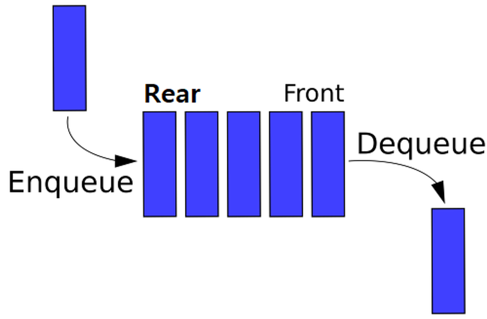
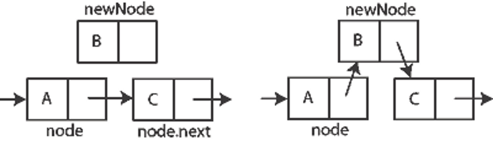
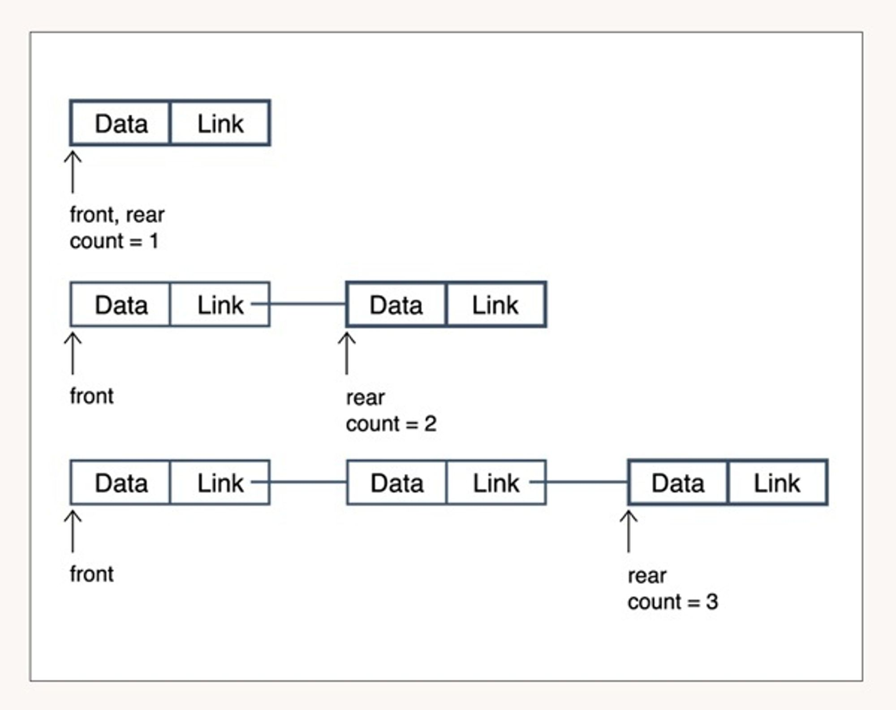
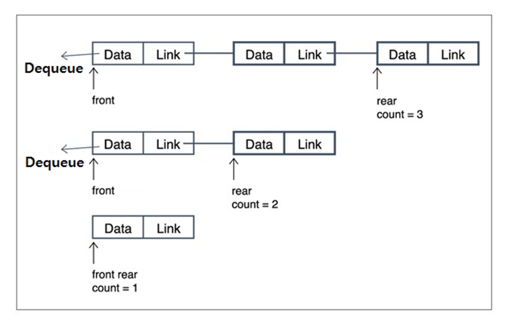

# 큐(Queue)

먼저 집어 넣은 데이터가 먼저 나오는 FIFO(First In First Out) 구조의 자료구조로, 스택(Stack)과는 반대 개념의 자료구조이다.

스택은 막힌 박스나 빈통과 같아서 먼저 들어온 것이 가장 나중에 나가는 구조지만, 큐는 먼저 들어온 것이 먼저 나가는 파이프 구조이다.

좋은 예로 은행에서 업무를 볼때 발급받는 번호표가 있다. 은행에 방문하여 기다리는데, 나보다 늦게 온 사람이 먼저 업무를 본다면 기분이 나쁠것이다.

즉, 먼저 온 손님이 늦게 온 손님보다 항상 먼저 서비스를 받을 수 있도록 하는 이러한 은행의 번호표 체계가 큐(Queue)의 한 예이다.

  

---

  

## **큐(Queue)의 사용 사례**

데이터가 입력된 시간 순서대로 처리해야 할 필요가 있는 상황에 이용한다.

1. 캐시(Cache) 구현

2. 우선순위가 같은 작업 예약 (인쇄 대기열)

3. 선입선출이 필요한 대기열 (티켓 카운터)

4. 콜센터 고객 대기시간

5. 프린터의 출력 처리

6. 윈도 시스템의 메시지 처리기

  

---

  

## **큐(Queue)의 구현**

큐의 구현 방법은 동적 배열을 사용하는 것과 연결 리스트를 사용하는 것 두 가지가 있다.

두 가지 방법 모두 장단점이 존재한다. 배열의 장점은 구현이 쉽고, 원하는 데이터의 접근 속도가 빠르다.

만약 내가 원하는 데이터가 배열의 3번째 위치에 있으면 arr[2]를 사용한다면 한번에 접근이 가능하기 때문이다.

하지만 단점으로는 데이터 최대 개수를 미리 정해야 한다. 또한 데이터의 삽입/삭제시 자료구조에 저장된 데이터를 앞/뒤로 옮겨야 하는 비효율성이 있다.

연결 리스트의 장점으로는 데이터의 최대 개수가 한정되어 있지 않고, 데이터의 삽입 삭제가 용이하다.

연결 리스트는 배열과 다르게 데이터들이 순차적으로 나열되어 있지 않다. 아래 그림처럼 연결리스트를 구성하고 있는 요소를 노드라고 한다.

이 노드는 데이터와 다음 위치에 해당하는 노드의 주소값을 갖는다. 이러한 구조 때문에 연결리스트 중간에 데이터를 삽입하는 방법은 배열보다 쉽다.

다음 위치에 해당하는 노드의 주소값만 바꿔주면 되기 때문이다. 하지만 치명적인 단점은 배열과 다르게 한번에 원하는 데이터의 접근이 불가능하다.

연결되어 있는 링크를 따라 차근차근 하나씩 확인하며 데이터를 찾아야 하기 때문이다.

이처럼 배열, 연결리스트 각각의 장단점이 있다. 배열은 데이터 양이 많지만 삽입/삭제가 거의 없고, 데이터의 접근이 빈번히 이뤄질 때 유리하다.

반대로 연결리스트는 삽입/삭제가 빈번히 이뤄지고, 데이터의 접근이 거의 없을 때 유리하다.

각각의 상황에 맞게 배열을 사용할지, 연결리스트를 사용할지는 전적으로 개발자의 몫이다.

일반적으로 큐는 데이터 삽입/삭제가 빈번하고 데이터를 찾는 용도로 사용되지 않으므로 배열보다 연결리스트로 구현하는 것이 더 적합한 방법이다.

  

---

  

### [큐에 데이터 추가 동작 예시]

  

### [큐에 데이터 삭제 동작 예시]

  

---

  

## 생성자

-   **MyQueue<T>()**: 비어 있는 상태이고 기본 초기 용량을 가지며 기본 증가 비율을 사용하는 MyQueue 클래스의 새 인스턴스를 초기화합니다.

  

## 속성

-   **int Count**: Queue에 포함된 요소 수를 가져옵니다.

  

## 메서드

-   **void Clear()**: Queue에서 개체를 모두 제거합니다.
-   **bool Contains(T)**: Queue에 요소가 있는지 여부를 확인합니다.
-   **T Dequeue()**: Queue의 시작 부분에서 개체를 제거하고 반환합니다.
-   **void Enqueue(T)**: 개체를 Queue의 끝 부분에 추가합니다.
-   **IEnumerator<T> GetEnumerator()**: Queue를 반복하는 열거자를 반환합니다.
-   **T Peek()**: Queue의 시작 부분에서 개체를 제거하지 않고 반환합니다.
-   **T[] ToArray()**: Queue 요소를 새 배열에 복사합니다.
