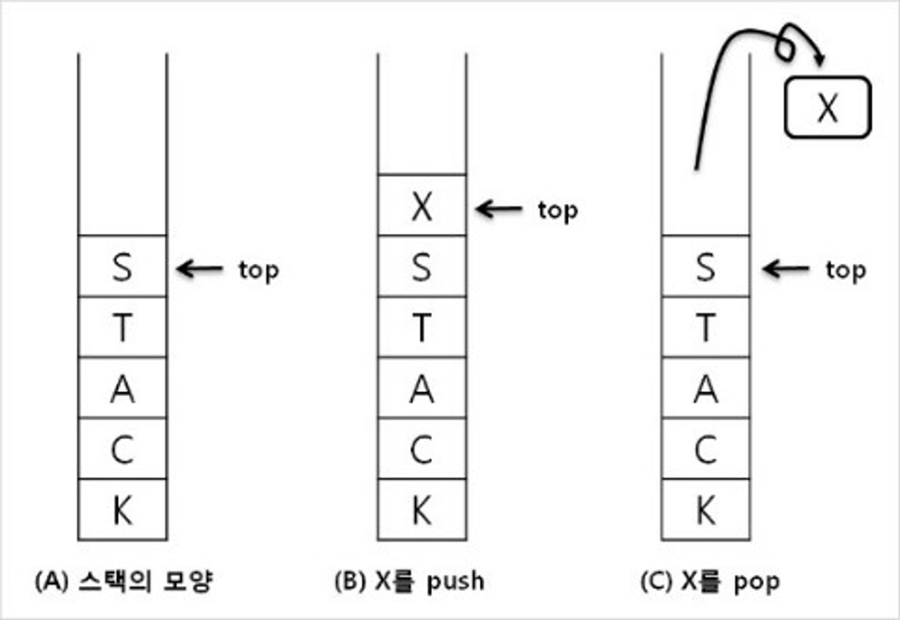
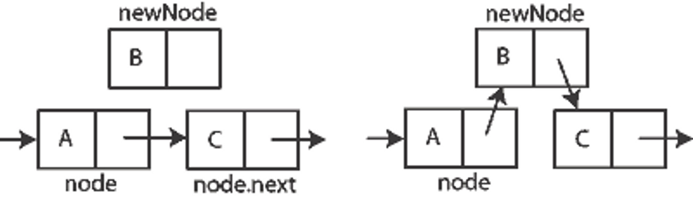
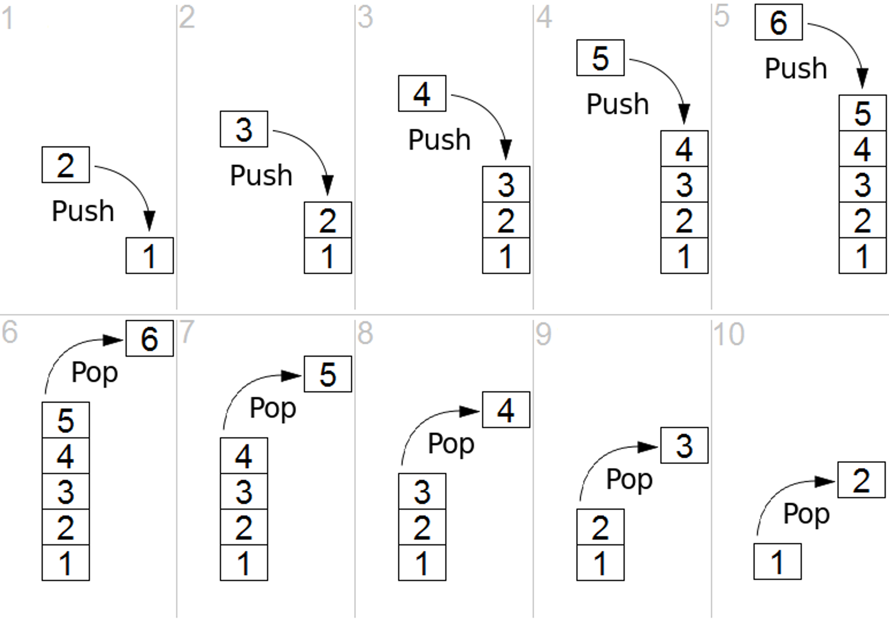

# 스택(Stack)

한 쪽 끝에서만 자료를 넣고 뺄 수 있는 LIFO(Last In First Out) 형식의 자료 구조로, 가장 최근에 추가한 항목이 가장 먼저 제거되는 자료구조이다.

스택이란 자료구조는 사전적 정의인 '쌓다' 와 같이 밑이 막힌 상자나 통을 생각하면 된다.

밑이 막혔으니 위로만 물건을 집어 넣을 수 있고, 뺄 수가 있다.

  

---

  

## **스택(Stack)의 사용 사례**

1. 재귀 알고리즘

    - 재귀적으로 함수를 호출해야 하는 경우에 임시 데이터를 스택에 넣어준다.
    - 재귀함수를 빠져 나와 퇴각 검색(backtrack)을 할 때는 스택에 넣어 두었던 임시 데이터를 빼 줘야 한다.
    - 스택은 이런 일련의 행위를 직관적으로 가능하게 해 준다.
    - 또한 스택은 재귀 알고리즘을 반복적 형태(iterative)를 통해서 구현할 수 있게 해준다.

2. 웹 브라우저 방문기록 (뒤로가기)

3. 실행 취소 (undo)

4. 역순 문자열 만들기

5. 수식의 괄호 검사 (연산자 우선순위 표현을 위한 괄호 검사)

  

---

  

## **스택(Stack)의 구현**

스택의 구현 방법은 동적 배열을 사용하는 것과 연결 리스트를 사용하는 것 두 가지가 있다.

두 가지 방법 모두 장단점이 존재한다. 배열의 장점은 구현이 쉽고, 원하는 데이터의 접근 속도가 빠르다.

만약 내가 원하는 데이터가 배열의 3번째 위치에 있으면 arr[2]를 사용한다면 한번에 접근이 가능하기 때문이다.

하지만 단점으로는 데이터 최대 개수를 미리 정해야 한다. 또한 데이터의 삽입/삭제시 자료구조에 저장된 데이터를 앞/뒤로 옮겨야 하는 비효율성이 있다.

연결 리스트의 장점으로는 데이터의 최대 개수가 한정되어 있지 않고, 데이터의 삽입 삭제가 용이하다.

연결 리스트는 배열과 다르게 데이터들이 순차적으로 나열되어 있지 않다. 아래 그림처럼 연결리스트를 구성하고 있는 요소를 노드라고 한다.

이 노드는 데이터와 다음 위치에 해당하는 노드의 주소값을 갖는다. 이러한 구조 때문에 연결리스트 중간에 데이터를 삽입하는 방법은 배열보다 쉽다.

다음 위치에 해당하는 노드의 주소값만 바꿔주면 되기 때문이다. 하지만 치명적인 단점은 배열과 다르게 한번에 원하는 데이터의 접근이 불가능하다.

연결되어 있는 링크를 따라 차근차근 하나씩 확인하며 데이터를 찾아야 하기 때문이다.

 

 

이처럼 배열, 연결리스트 각각의 장단점이 있다. 배열은 데이터 양이 많지만 삽입/삭제가 거의 없고, 데이터의 접근이 빈번히 이뤄질 때 유리하다.

반대로 연결리스트는 삽입/삭제가 빈번히 이뤄지고, 데이터의 접근이 거의 없을 때 유리하다.

각각의 상황에 맞게 배열을 사용할지, 연결리스트를 사용할지는 전적으로 개발자의 몫이다.

일반적으로 스택은 데이터 삽입/삭제가 빈번하고 데이터를 찾는 용도로 사용되지 않으므로 배열보다 연결리스트로 구현하는 것이 더 적합한 방법이다.

 

  

---

  

## 생성자

-   **MyStack<T>()**: 비어 있는 상태에서 기본 초기 용량을 가지는 MyStack클래스의 새 인스턴스를 초기화합니다.

  

## 속성

-   **int Count**: Stack에 포함된 요소 수를 가져옵니다.

  

## 메서드

-   **void Clear()**: Stack에서 개체를 모두 제거합니다.
-   **bool Contains(T)**: Stack에 요소가 있는지 여부를 확인합니다.
-   **IEnumerator<T> GetEnumerator()**: IEnumerator의 Stack를 반환합니다.
-   **T Peek()**: Stack의 맨 위에서 개체를 제거하지 않고 반환합니다.
-   **T Pop()**: Stack의 맨 위에서 개체를 제거하고 반환합니다.
-   **void Push(T)**: 개체를 Stack의 맨 위에 삽입합니다.
-   **T[] ToArray()**: Stack을 새 배열에 복사합니다.
