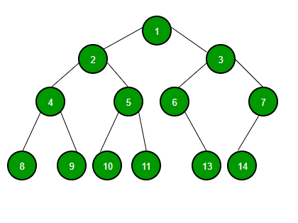

# 트리(tree)

> Node와 Edge로 이루어진 자료구조

트리는 값을 가진 노드(Node)와 이 노드들을 연결해주는 간선(Edge)으로 이루어져있다.

그림 상 데이터 1을 가진 노드가 루트(Root) 노드다.

모든 노드들은 0개 이상의 자식(Child) 노드를 갖고 있으며 보통 부모-자식 관계로 부른다.

<br/>

## 특징

-   트리에는 사이클이 존재할 수 없다. (만약 사이클이 만들어진다면, 그것은 트리가 아니고 그래프다)
-   모든 노드는 자료형으로 표현이 가능하다.
-   루트에서 한 노드로 가는 경로는 유일한 경로 뿐이다.
-   노드의 개수가 N개면, 간선은 N-1개를 가진다.

가장 중요한 것은, 그래프와 트리의 차이가 무엇인가인데, 이는 사이클의 유무로 설명할 수 있다.

사이클이 존재하지 않는 그래프라 하여 무조건 트리인 것은 아니다 사이클이 존재하지 않는 그래프는 Forest라 지칭하며 트리의 경우 싸이클이 존재하지 않고 모든 노드가 간선으로 이어져 있어야 한다

<br/>

## 트리 순회 방식



1. 전위 순회(pre-order)
   각 부모 노드를 순차적으로 먼저 방문하는 방식이다.
   (부모 → 왼쪽 자식 → 오른쪽 자식)
   1 → 2 → 4 → 8 → 9 → 5 → 10 → 11 → 3 → 6 → 13 → 7 → 14

2. 중위 순회(in-order)
   왼쪽 하위 트리를 방문 후 부모 노드를 방문하는 방식이다.
   (왼쪽 자식 → 부모 → 오른쪽 자식)
   8 → 4 → 9 → 2 → 10 → 5 → 11 → 1 → 6 → 13 → 3 →14 → 7

3. 후위 순회(post-order)
   왼쪽 하위 트리부터 하위를 모두 방문 후 부모 노드를 방문하는 방식이다.
   (왼쪽 자식 → 오른쪽 자식 → 부모)
   8 → 9 → 4 → 10 → 11 → 5 → 2 → 13 → 6 → 14 → 7 → 3 → 1

4. 레벨 순회(level-order)
   부모 노드부터 계층 별로 방문하는 방식이다.

<br/>

## 코드

```java
public class Tree<T> {
    private Node<T> root;

    public Tree(T rootData) {
        root = new Node<T>();
        root.data = rootData;
        root.children = new ArrayList<Node<T>>();
    }

    public static class Node<T> {
        private T data;
        private Node<T> parent;
        private List<Node<T>> children;
    }
}
```
