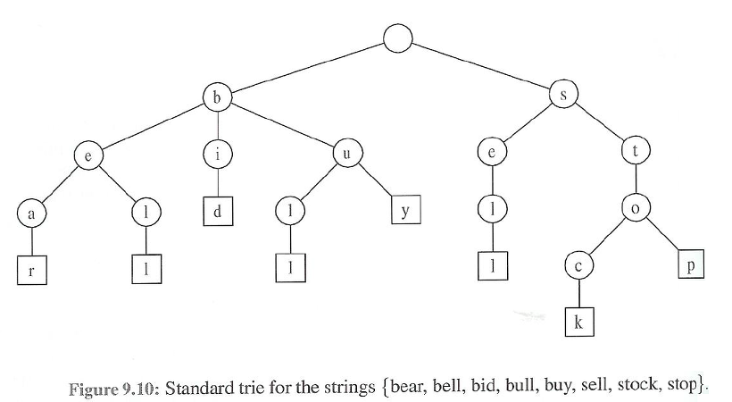

# 트라이(Trie)

```
문자열에서 검색을 빠르게 도와주는 자료구조

정수형에서 이진탐색트리를 이용하면 시간복잡도 O(logN)
하지만 문자열에서 적용했을 때, 문자열 최대 길이가 M이면 O(M*logN)이 된다.

트라이를 활용하면? → O(M)으로 문자열 검색이 가능함!
```



## 코드

```java
static class Trie {
    boolean end;
    boolean pass;
    Trie[] child;

    Trie() {
        end = false;
        pass = false;
        child = new Trie[10];
    }

    public boolean insert(String str, int idx) {

        //끝나는 단어 있으면 false 종료
        if(end) return false;

        //idx가 str만큼 왔을때
        if(idx == str.length()) {
            end = true;
            if(pass) return false; // 더 지나가는 단어 있으면 false 종료
            else return true;
        }
        //아직 안왔을 때
        else {
            int next = str.charAt(idx) - '0';
            if(child[next] == null) {
                child[next] = new Trie();
                pass = true;
            }
            return child[next].insert(str, idx+1);
        }

    }
}
```
