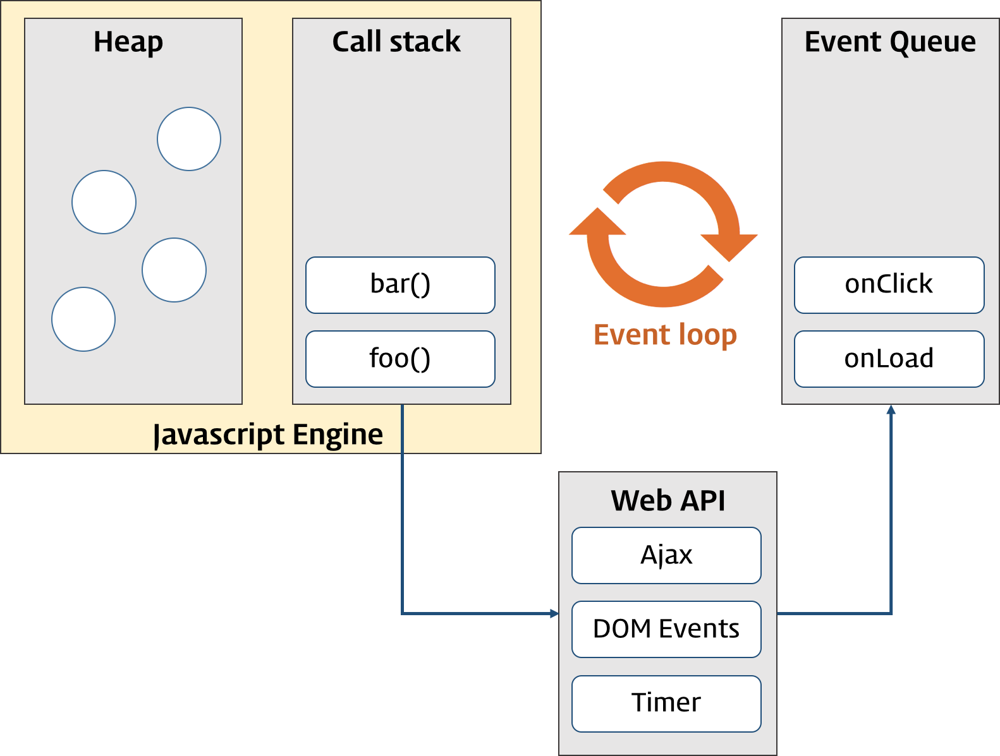

# Event

- [참고 자료(poiemaweb)](https://poiemaweb.com/js-event)

  

## 이벤트 루프(Event Loop)와 동시성(Concurrency)

브라우저는 단일 쓰레드(single-thread)에서 이벤트 드리븐(event-driven) 방식으로 동작한다.

단일 쓰레드는 쓰레드가 하나뿐이라는 의미이며 이말은 곧 하나의 작업(task)만을 처리할 수 있다는 것을 의미한다. 하지만 실제로 동작하는 웹 애플리케이션은 많은 task가 동시에 처리되는 것처럼 느껴진다. 이처럼 자바스크립트의 동시성(Concurrency)을 지원하는 것이 바로 이벤트 루프(Event Loop)이다.

 

### 자바스크립트 엔진

- Call Stack(호출 스택)
  작업이 요청되면(함수가 호출되면) 요청된 작업은 순차적으로 Call Stack에 쌓이게 되고 순차적으로 실행된다. 자바스크립트는 단 하나의 Call Stack을 사용하기 때문에 해당 task가 종료하기 전까지는 다른 어떤 task도 수행될 수 없다.
- Heap
  동적으로 생성된 객체 인스턴스가 할당되는 영역이다.

  

---

  

## 종류

- UI Event
- Keyboard Event
- Mouse Event
- Focus Event
- Form Event
- Clipboard Event

  

---

  

## 이벤트 핸들러 등록

- 인라인 이벤트 핸들러 방식
- 이벤트 핸들러 프로퍼티 방식
- addEventListener 메소드 방식

  

---

  

## 이벤트 핸들러 함수 내부의 this

- 인라인 이벤트 핸들러 방식
- 이벤트 핸들러 프로퍼티 방식
- addEventListener 메소드 방식

  

---

  

## 이벤트의 흐름

  

---

  

## Event 객체

- Event Property
  - Event.target
  - Event.currentTarget
  - Event.type
  - Event.cancelable
  - Event.eventPhase

  

---

  

## Event Delegation (이벤트 위임)

동적으로 요소가 추가되는 경우, 아직 추가되지 않은 요소는 DOM에 존재하지 않으므로 이벤트 핸들러를 바인딩할 수 없다. 이러한 경우 이벤트 위임을 사용한다.

이벤트 위임(Event Delegation)은 다수의 자식 요소에 각각 이벤트 핸들러를 바인딩하는 대신 하나의 부모 요소에 이벤트 핸들러를 바인딩하는 방법이다. 위의 경우 6개의 자식 요소에 각각 이벤트 핸들러를 바인딩하는 것 대신 부모 요소에 이벤트 핸들러를 바인딩하는 것이다.

또한 DOM 트리에 새로운 li 요소를 추가하더라도 이벤트 처리는 부모 요소인 ul 요소에 위임되었기 때문에 새로운 요소에 이벤트를 핸들러를 다시 바인딩할 필요가 없다.

이는 이벤트가 이벤트 흐름에 의해 이벤트를 발생시킨 요소의 부모 요소에도 영향(버블링)을 미치기 때문에 가능한 것이다.

실제로 이벤트를 발생시킨 요소를 알아내기 위해서는 Event.target을 사용한다.

  

---

  

## 기본 동작의 변경

- Event.preventDefault()
- Event.stopPropagation()
- preventDefault & stopPropagation
