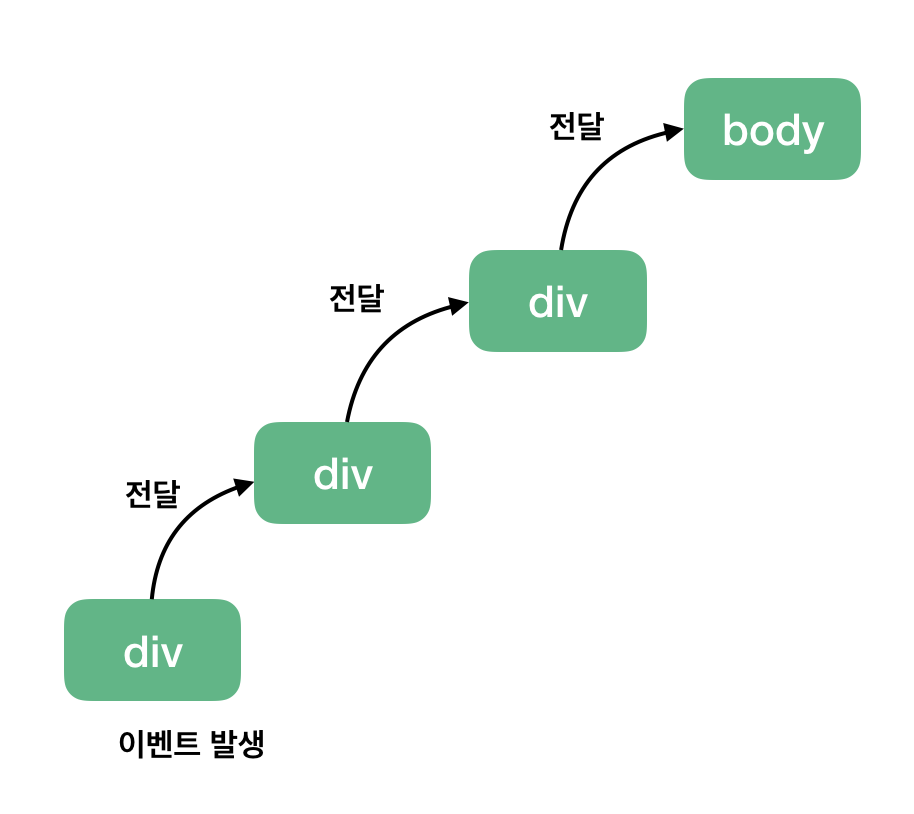
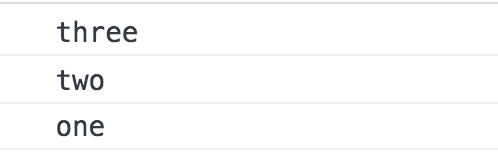

# 이벤트 버블링

- [참고 자료](https://joshua1988.github.io/web-development/javascript/event-propagation-delegation/)

특정 화면 요소에서 이벤트가 발생했을 때 해당 이벤트가 더 상위의 화면 요소들로 전달되어 가는 특성을 의미



```html
<body>
  <div class="one">
    <div class="two">
      <div class="three"></div>
    </div>
  </div>
</body>
```

```js
var divs = document.querySelectorAll("div");
divs.forEach(function (div) {
  div.addEventListener("click", logEvent);
});

function logEvent(event) {
  console.log(event.currentTarget.className);
}
```

위 코드는 세 개의 div 태그에 모두 클릭 이벤트를 등록하고 클릭 했을 때 logEvent 함수를 실행시키는 코드입니다. 여기서 위 그림대로 최하위 div 태그 `<div class="three"></div>`를 클릭하면 아래와 같은 결과가 실행됩니다.



브라우저는 특정 화면 요소에서 이벤트가 발생했을 때 그 이벤트를 최상위에 있는 화면 요소까지 이벤트를 전파시킵니다. 따라서, 클래스 명 three -> two -> one 순서로 div 태그에 등록된 이벤트들이 실행됩니다. 마찬가지로 two 클래스를 갖는 두 번째 태그를 클릭했다면 two -> one 순으로 클릭 이벤트가 동작하겠죠.

여기서 주의해야 할 점은 각 태그마다 이벤트가 등록되어 있기 때문에 상위 요소로 이벤트가 전달되는 것을 확인할 수 있습니다. 만약 이벤트가 특정 div 태그에만 달려 있다면 위와 같은 동작 결과는 확인할 수 없습니다.

이와 같은 하위에서 상위 요소로의 이벤트 전파 방식을 이벤트 버블링(Event Bubbling)이라고 합니다.
