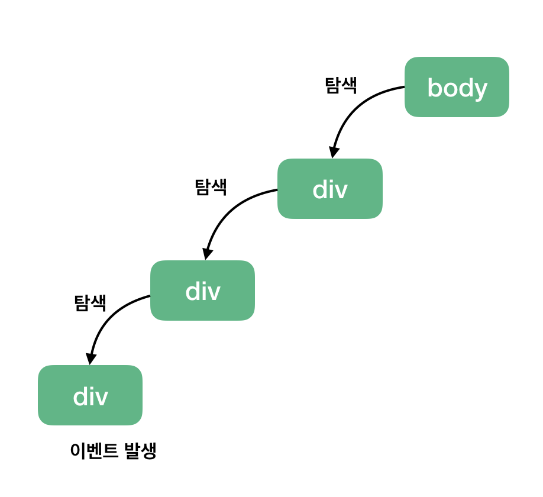
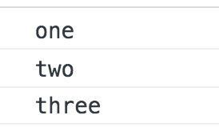

# 이벤트 캡쳐

-   [참고 자료](https://joshua1988.github.io/web-development/javascript/event-propagation-delegation/)

이벤트 캡쳐는 이벤트 버블링과 반대 방향으로 진행되는 이벤트 전파 방식



-   클릭 이벤트가 발생한 지점을 찾아내려 가는 그림

```html
<body>
    <div class="one">
        <div class="two">
            <div class="three"></div>
        </div>
    </div>
</body>
```

```js
var divs = document.querySelectorAll("div");
divs.forEach(function (div) {
    div.addEventListener("click", logEvent, {
        capture: true, // default 값은 false입니다.
    });
});

function logEvent(event) {
    console.log(event.currentTarget.className);
}
```

addEventListener() API에서 옵션 객체에 capture:true를 설정해주면 됩니다. 그러면 해당 이벤트를 감지하기 위해 이벤트 버블링과 반대 방향으로 탐색합니다.

따라서, 아까와 동일하게 <div class="three"></div> 를 클릭해도 아래와 같은 결과가 나타납니다.


