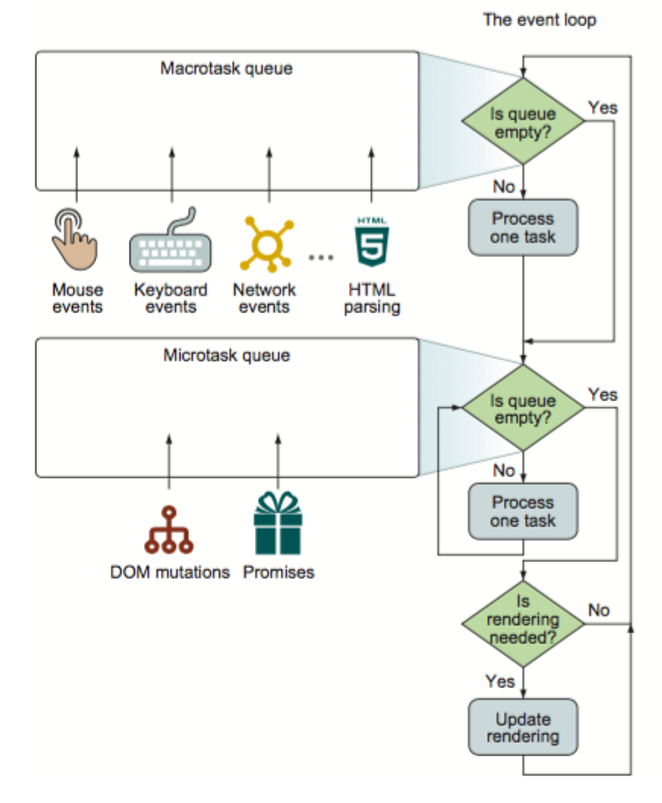

# EventDriven

## SingleThread

-   하나의 Thred에서 모든 동작이 이루어진다

-   User Interaction
    -   DOM 클릭, 화면 스크롤링 등의 유저가 입력할 수 있는 화면 조작
-   HTML parser
    -   html parsing 또한 같은 스레드 내에서 작동하기 때문에, page 내에 용량이 큰 파일을 불러오는 태그가 있으면 파일이 로드 될 때까지 기다리며 화면 로딩이 지체된다
-   Page Repaint / Redraw
    -   Redraw
        -   DOM 개개 객체의 형태속성 재정의하는 행위
    -   Repaint
        -   DOM 전체의 배치속성을 재정의하는 행위
    -   Rendering이 Queue에 추가되는 주기는 Browser에서 OS의 Render API를 호출하는 주기에 따라 다름
-   Networking
    -   Network response로 인해 eventLoop에 반응하는 listener 이벤트.
    -   이미지 로드, 파일 로드 등이 포함.
-   Javascript code
    -   JavaScript 코드로 작성된 JavaScript 연산

  

---

  

## Task

-   Function 단위로 작동.
-   Event Queue에서 Task가 한 번 실행이 시작되면 외부의 방해를 받지않고 작동이 이루어진다.
-   한 번 험수 실행이 시작되면 전체가 실행 끝나기 전까지는 데이터 수정이나 함수 조작을 할 수 없다.
-   비동기 함수
    -   Ajax request Callbak
        -   response 도착 후에 eventQueue에 callback을 추가한다.
    -   setTimeout / setInterval
        -   코드 실행 시점에는 몇 초 후 callback을 EventQueue에 등록할 것인지 callbackQueue에 추가하기만 한다.
        -   지정된 시간 후 지정된 callback이 EventQueue에 추가된다.
        -   callback 추가 시점에 이미 EventQueue에 다른 task가 추가되어있으면 해당 task들의 완료 후에 실행되므로, 정확히 timeout시간 후에 실행되는 것은 아님.
        -   Windows OS에서는 클럭 인터럽트를 15.6m마다 전달받으므로 Interval 실행도 동일 주기를 가진다.
