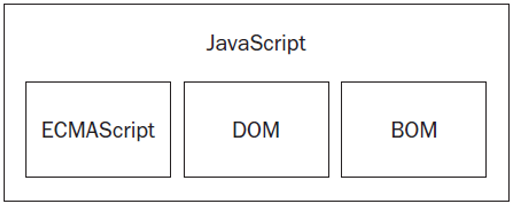
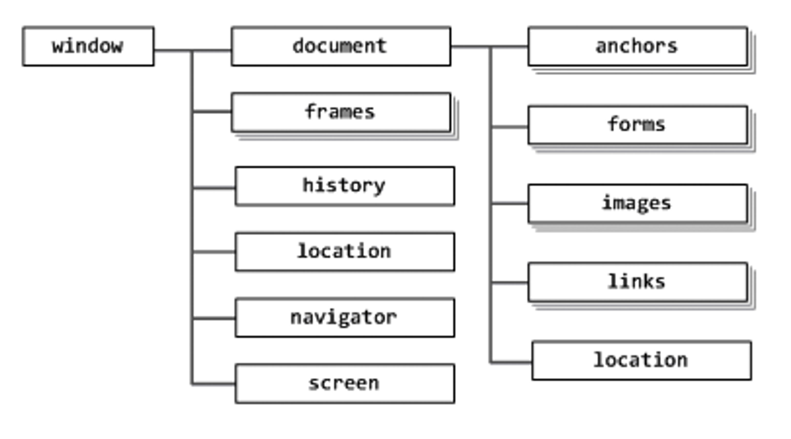

# javascript

-   ECMA Script (European Computer Manufactures Association Script)
-   JavaScript의 토대가 되는 스크립트.
-   JavaScript엔진에서 이를 해석하는 기능을 실행함으로서 성립된다.
-   연산자, 식, 구문 그 자체. JavaScript 코어만을 뜻한다.
-   DOM(Document Object Model)
-   HTML 태그를 조작하기 위한 인터페이스
-   HTML 태그 문서를 Object로 다룰 수 있도록 해준다
-   BOM(Browser Object Model)
-   JavaScript가 돌아가는 브라우저 환경을 조작하기 위한 인터페이스
-   각 브라우저마다 다르게 구현되어있으므로 표준이 아님.

 

---

 

## Core JavaScript와 Runtime JavaScript

-   Core JavaScript
-   ECMA표준이 구현된 스크립트 언어 그 자체.

-   Runtime JavaScript
-   V8 / Chakra / SpiderMonkey/ Nashron 등의 웹브라우저 내장 JavaScript 엔진에 의해 자바스크립트가 돌아가는 환경.

-   자바스크립트 Global 객체가 Window객체로 연계된다.
-   Global객체 : JavaScript환경에서 기본으로 로드되는 객체.
-   Browser 관련 API(BOM)이 제공된다.

ex) open, close, opener, parent, self...

 

---

 

## Interpret 언어로서의 특징

-   빌드과정을 거치지않는다.
-   동작과 동시에 해석이 이루어지므로, 앞서 선언한 코드를 아랫줄에서 override 할 수 있다.
