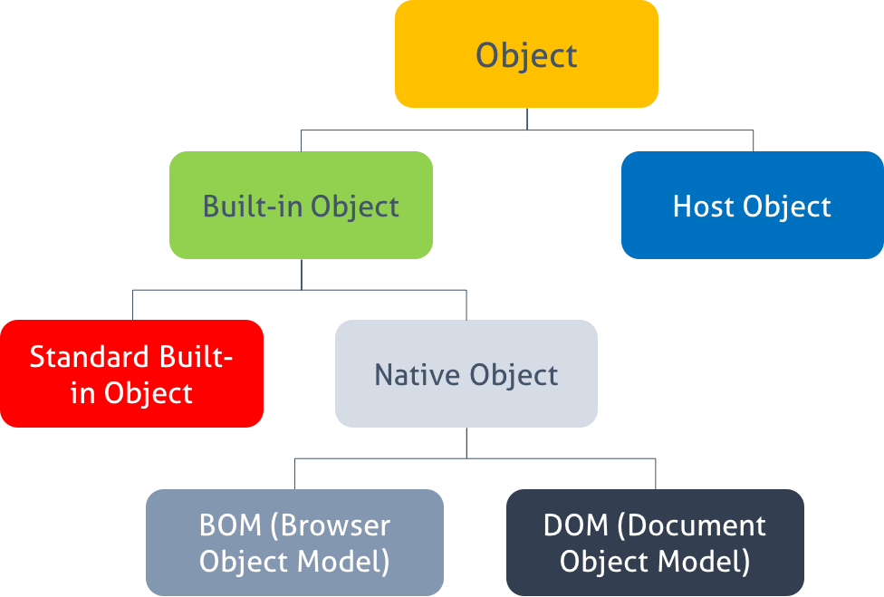
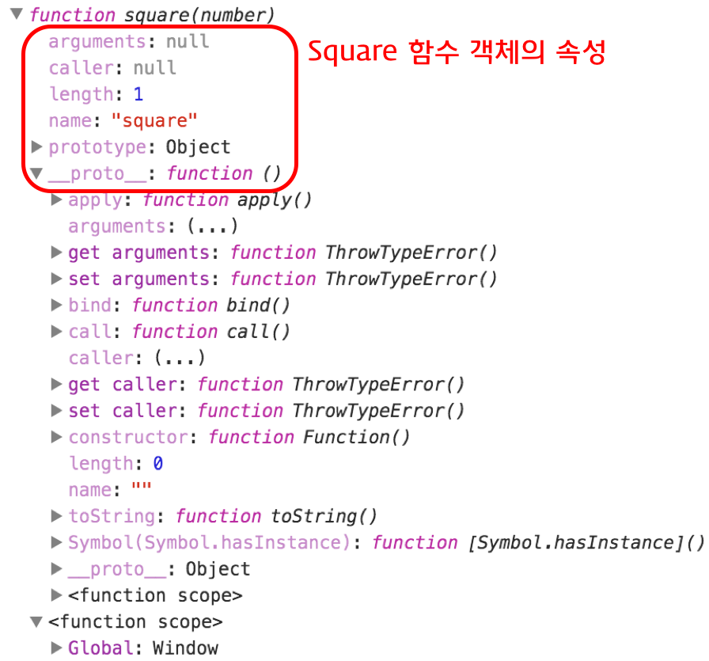
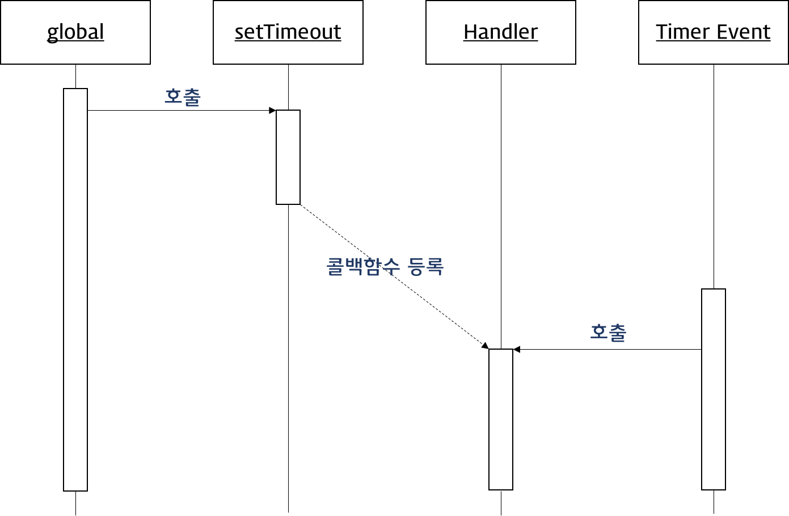

# Object(객체)

-   [참고 자료(poiemaweb)](https://poiemaweb.com/js-object)

자바스크립트의 객체는 키(key)과 값(value)으로 구성된 프로퍼티(Property)들의 집합이다. 프로퍼티의 값으로 자바스크립트에서 사용할 수 있는 모든 값을 사용할 수 있다. 자바스크립트의 함수는 일급 객체이므로 값으로 취급할 수 있다. 따라서 프로퍼티 값으로 함수를 사용할 수도 있으며 프로퍼티 값이 함수일 경우, 일반 함수와 구분하기 위해 메소드라 부른다.

이와 같이 객체는 데이터를 의미하는 프로퍼티(property)와 데이터를 참조하고 조작할 수 있는 동작(behavior)을 의미하는 메소드(method)로 구성된 집합이다. 객체는 데이터(프로퍼티)와 그 데이터에 관련되는 동작(메소드)을 모두 포함할 수 있기 때문에 데이터와 동작을 하나의 단위로 구조화할 수 있어 유용하다.

<br /><br />

-   프로퍼티

프로퍼티는 프로퍼티 키(이름)와 프로퍼티 값으로 구성된다. 프로퍼티는 프로퍼티 키로 유일하게 식별할 수 있다. 즉, 프로퍼티 키는 프로퍼티를 식별하기 위한 식별자(identifier)다. 프로퍼티 키의 명명 규칙과 프로퍼티 값으로 사용할 수 있는 값은 아래와 같다.

프로퍼티 키 : 빈 문자열을 포함하는 모든 문자열 또는 symbol 값
프로퍼티 값 : 모든 값
프로퍼티 키에 문자열이나 symbol 값 이외의 값을 지정하면 암묵적으로 타입이 변환되어 문자열이 된다. 이미 존재하는 프로퍼티 키를 중복 선언하면 나중에 선언한 프로퍼티가 먼저 선언한 프로퍼티를 덮어쓴다. 배열과는 달리 객체는 프로퍼티를 열거할 때 순서를 보장하지 않는다.

<br /><br />

-   메소드

프로퍼티 값이 함수일 경우, 일반 함수와 구분하기 위해 메소드라 부른다. 즉, 메소드는 객체에 제한되어 있는 함수를 의미한다.

<br /><br />

---

<br /><br />

## 객체 생성 방법

<br /><br />

### 객체 리터럴

```js
var emptyObject = {};

var person = {
    name: "Lee",
    gender: "male",
    sayHello: function () {
        console.log("Hi! My name is " + this.name);
    },
};
```

<br /><br />

### Object 생성자 함수

생성자(constructor) 함수란 new 키워드와 함께 객체를 생성하고 초기화하는 함수를 말한다. 생성자 함수를 통해 생성된 객체를 인스턴스(instance)라 한다. 자바스크립트는 Object 생성자 함수 이외에도 String, Number, Boolean, Array, Date, RegExp 등의 빌트인 생성자 함수를 제공한다. 일반 함수와 생성자 함수를 구분하기 위해 생성자 함수의 이름은 파스칼 케이스(PascalCase)를 사용하는 것이 일반적이다.

객체가 소유하고 있지 않은 프로퍼티 키에 값을 할당하면 해당 객체에 프로퍼티를 추가하고 값을 할당한다. 이미 존재하는 프로퍼티 키에 새로운 값을 할당하면 프로퍼티 값은 할당한 값으로 변경된다.

```js
// 빈 객체의 생성
var person = new Object();

// 프로퍼티 추가
person.name = "Lee";
person.gender = "male";
person.sayHello = function () {
    console.log("Hi! My name is " + this.name);
};
```

객체 리터럴 방식으로 생성된 객체는 결국 빌트인(Built-in) 함수인 Object 생성자 함수로 객체를 생성하는 것을 단순화시킨 축약 표현(short-hand)

<br /><br />

### 생성자 함수

```js
// 생성자 함수
function Person(name, gender) {
    this.name = name;
    this.gender = gender;
    this.sayHello = function () {
        console.log("Hi! My name is " + this.name);
    };
}

// 인스턴스의 생성
var person1 = new Person("Lee", "male");
var person2 = new Person("Kim", "female");
```

-   생성자 함수 이름은 일반적으로 대문자로 시작한다. 이것은 생성자 함수임을 인식하도록 도움을 준다.
-   프로퍼티 또는 메소드명 앞에 기술한 this는 생성자 함수가 생성할 인스턴스(instance)를 가리킨다.
-   this에 연결(바인딩)되어 있는 프로퍼티와 메소드는 public(외부에서 참조 가능)하다.
-   생성자 함수 내에서 선언된 일반 변수는 private(외부에서 참조 불가능)하다. 즉, 생성자 함수 내부에서는 자유롭게 접근이 가능하나 외부에서 접근할 수 없다.

<br /><br />

---

<br /><br />

## 객체 프로퍼티 접근

<br /><br />

### 프로퍼티 키

프로퍼티 키는 문자열이므로 따옴표(‘’ 또는 ““)를 사용한다. 하지만 자바스크립트에서 사용 가능한 유효한 이름인 경우, 따옴표를 생략할 수 있다. 반대로 말하면 자바스크립트에서 사용 가능한 유효한 이름이 아닌 경우, 반드시 따옴표를 사용하여야 한다.

<br /><br />

### 프로퍼티 값 읽기

```js
var person = {
  'first-name': 'Ung-mo',
  'last-name': 'Lee',
  gender: 'male',
  1: 10
};

console.log(person);

console.log(person.first-name);    // NaN: undefined-undefined
console.log(person[first-name]);   // ReferenceError: first is not defined
console.log(person['first-name']); // 'Ung-mo'

console.log(person.gender);    // 'male'
console.log(person[gender]);   // ReferenceError: gender is not defined
console.log(person['gender']); // 'male'

console.log(person['1']); // 10
console.log(person[1]);   // 10 : person[1] -> person['1']
console.log(person.1);    // SyntaxError
```

<br /><br />

### 프로퍼티 값 갱신

```js
var person = {
    "first-name": "Ung-mo",
    "last-name": "Lee",
    gender: "male",
};

person["first-name"] = "Kim";
```

<br /><br />

### 프로퍼티 동적 생성

객체가 소유하고 있지 않은 프로퍼티 키에 값을 할당하면 하면 주어진 키와 값으로 프로퍼티를 생성하여 객체에 추가한다.

```js
var person = {
    "first-name": "Ung-mo",
    "last-name": "Lee",
    gender: "male",
};

person.age = 20;
```

<br /><br />

### 프로퍼티 삭제

```js
var person = {
    "first-name": "Ung-mo",
    "last-name": "Lee",
    gender: "male",
};

delete person.gender;
```

<br /><br />

### for-in 문

```js
var person = {
    "first-name": "Ung-mo",
    "last-name": "Lee",
    gender: "male",
};

// prop에 객체의 프로퍼티 이름이 반환된다. 단, 순서는 보장되지 않는다.
for (var prop in person) {
    console.log(prop + ": " + person[prop]);
}
```

<br /><br />

---

<br /><br />

## Pass-by-reference

object type을 객체 타입 또는 참조 타입이라 한다. 참조 타입이란 객체의 모든 연산이 실제값이 아닌 참조값으로 처리됨을 의미한다. 원시 타입은 값이 한번 정해지면 변경할 수 없지만(immutable), 객체는 프로퍼티를 변경, 추가, 삭제가 가능하므로 변경 가능(mutable)한 값이라 할 수 있다.

```js
// Pass-by-reference
var foo = {
    val: 10,
};

var bar = foo;
console.log(foo.val, bar.val); // 10 10
console.log(foo === bar); // true

bar.val = 20;
console.log(foo.val, bar.val); // 20 20
console.log(foo === bar); // true
```

참조하고 있는 객체의 val 값이 변경되면 변수 foo, bar 모두 동일한 객체를 참조하고 있으므로 두 변수 모두 변경된 객체의 프로퍼티 값을 참조하게 된다. 객체는 참조(Reference) 방식으로 전달된다. 결코 복사되지 않는다.

<br /><br />

---

<br /><br />

## Pass-by-value

원시 타입은 값(value)으로 전달된다. 즉, 값이 복사되어 전달된다.

```js
// Pass-by-value
var a = 1;
var b = a;

console.log(a, b); // 1  1
console.log(a === b); // true

a = 10;
console.log(a, b); // 1  10
console.log(a === b); // false
```

<br /><br />

---

<br /><br />

## 객체의 분류



<br /><br />

---

<br /><br />

## 반환값

함수는 자신을 호출한 코드에게 수행한 결과를 반환(return)할 수 있다. 이때 반환된 값을 반환값(return value)이라 한다.

-   return 키워드는 함수를 호출한 코드(caller)에게 값을 반환할 때 사용한다.
-   함수는 배열 등을 이용하여 한 번에 여러 개의 값을 리턴할 수 있다.
-   함수는 반환을 생략할 수 있다. 이때 함수는 암묵적으로 undefined를 반환한다.
-   자바스크립트 해석기는 return 키워드를 만나면 함수의 실행을 중단한 후, 함수를 호출한 코드로 되돌아간다. 만일 return 키워드 이후에 다른 구문이 존재하면 그 구문은 실행되지 않는다.

<br /><br />

---

<br /><br />

## 함수 객체의 프로퍼티



<br /><br />

### arguments 프로퍼티

arguments 객체는 함수 호출 시 전달된 인수(argument)들의 정보를 담고 있는 순회가능한(iterable) 유사 배열 객체(array-like object)이며 함수 내부에서 지역변수처럼 사용된다. 즉, 함수 외부에서는 사용할 수 없다.

매개변수(parameter)는 인수(argument)로 초기화된다.

매개변수의 갯수보다 인수를 적게 전달했을 때(multiply(), multiply(1)) 인수가 전달되지 않은 매개변수는 undefined으로 초기화된다.

매개변수의 갯수보다 인수를 더 많이 전달한 경우, 초과된 인수는 무시된다.

이러한 자바스크립트의 특성때문에 런타임 시에 호출된 함수의 인자 갯수를 확인하고 이에 따라 동작을 달리 정의할 필요가 있을 수 있다. 이때 유용하게 사용되는 것이 arguments 객체이다.

arguments 객체는 매개변수 갯수가 확정되지 않은 가변 인자 함수를 구현할 때 유용하게 사용된다.

```js
function sum() {
    var res = 0;

    for (var i = 0; i < arguments.length; i++) {
        res += arguments[i];
    }

    return res;
}

console.log(sum()); // 0
console.log(sum(1, 2)); // 3
console.log(sum(1, 2, 3)); // 6
```

자바스크립트는 함수를 호출할 때 인수들과 함께 암묵적으로 arguments 객체가 함수 내부로 전달된다. arguments 객체는 배열의 형태로 인자값 정보를 담고 있지만 실제 배열이 아닌 유사배열객체(array-like object)이다.

<br /><br />

### caller 프로퍼티

자신을 호출한 함수

<br /><br />

### length 프로퍼티

함수 정의 시 작성된 매개변수 갯수를 의미

<br /><br />

### name 프로퍼티

함수명을 나타낸다. 기명함수의 경우 함수명을 값으로 갖고 익명함수의 경우 빈문자열을 값으로 갖는다.

<br /><br />

### **proto** 접근자 프로퍼티

모든 객체는 [[Prototype]]이라는 내부 슬롯이 있다. [[Prototype]] 내부 슬롯은 프로토타입 객체를 가리킨다. 프로토타입 객체란 프로토타입 기반 객체 지향 프로그래밍의 근간을 이루는 객체로서 객체간의 상속(Inheritance)을 구현하기 위해 사용된다. 즉, 프로토타입 객체는 다른 객체에 공유 프로퍼티를 제공하는 객체를 말한다.

<br /><br />

### prototype 프로퍼티

함수 객체만이 소유하는 프로퍼티

prototype 프로퍼티는 함수가 객체를 생성하는 생성자 함수로 사용될 때, 생성자 함수가 생성한 인스턴스의 프로토타입 객체를 가리킨다.

<br /><br />

---

<br /><br />

## 함수의 다양한 형태

<br /><br />

### 즉시 실행 함수(IIFE, Immediately Invoke Function Expression)

함수의 정의와 동시에 실행되는 함수

최초 한번만 호출되며 다시 호출할 수는 없다. 이러한 특징을 이용하여 최초 한번만 실행이 필요한 초기화 처리등에 사용할 수 있다.

```js
// 기명 즉시 실행 함수(named immediately-invoked function expression)
(function myFunction() {
    var a = 3;
    var b = 5;
    return a * b;
})();

// 익명 즉시 실행 함수(immediately-invoked function expression)
(function () {
    var a = 3;
    var b = 5;
    return a * b;
})();
```

<br /><br />

### 내부 함수(Inner function)

함수 내부에 정의된 함수

아래 예제의 내부함수 child는 자신을 포함하고 있는 부모함수 parent의 변수에 접근할 수 있다. 하지만 부모함수는 자식함수(내부함수)의 변수에 접근할 수 없다.

```js
function parent(param) {
    var parentVar = param;
    function child() {
        var childVar = "lee";
        console.log(parentVar + " " + childVar); // Hello lee
    }
    child();
    console.log(parentVar + " " + childVar);
    // Uncaught ReferenceError: childVar is not defined
}
```

<br /><br />

### 재귀 함수(Recusive function)

자기 자신을 호출하는 함수

```js
// 피보나치 수열
// 피보나치 수는 0과 1로 시작하며, 다음 피보나치 수는 바로 앞의 두 피보나치 수의 합이 된다.
// 0, 1, 1, 2, 3, 5, 8, 13, 21, 34, 55, 89, 144, 233, 377, 610, ...
function fibonacci(n) {
    if (n < 2) return n;
    return fibonacci(n - 1) + fibonacci(n - 2);
}

// 팩토리얼
// 팩토리얼(계승)은 1부터 자신까지의 모든 양의 정수의 곱이다.
// n! = 1 * 2 * ... * (n-1) * n
function factorial(n) {
    if (n < 2) return 1;
    return factorial(n - 1) * n;
}
```

<br /><br />

### 콜백 함수

콜백 함수(Callback function)는 함수를 명시적으로 호출하는 방식이 아니라 특정 이벤트가 발생했을 때 시스템에 의해 호출되는 함수를 말한다.

콜백 함수가 자주 사용되는 대표적인 예는 이벤트 핸들러 처리이다.


