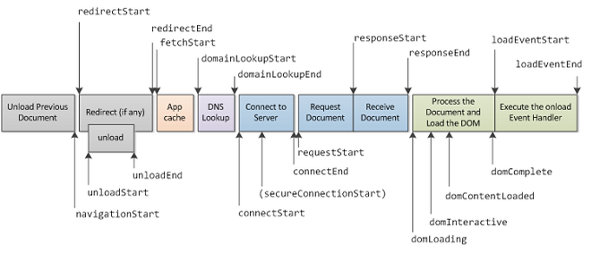
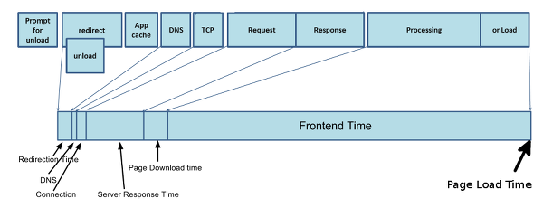
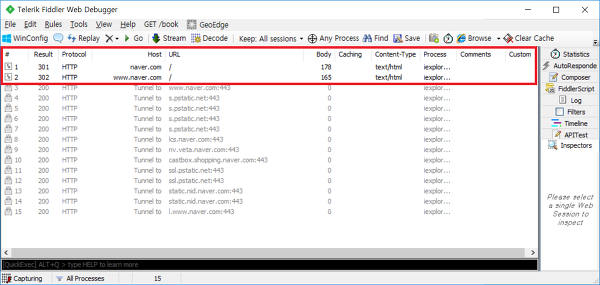

# 웹 사이트 최적화

브라우저가 웹페이지를 처리하는 방식은 1. 서비스 이동 단계 → 2. 리다이렉트 단계 → 3. 애플리케이션 캐시 확인 단계 → 4. 네트워크 통신 단계 → 5. 브라우저 처리 단계 로 나누어 집니다. 각 단계마다 최적화에 고려해야 할 사항들이 있습니다.

```
웹사이트의 반응 시간 
- 0.1초 : 사용자의 동작에 해당 기능이 바로 반응한다고 느끼는 시간
- 1초: 불필요하게 오래 기다리지 않았다고 느끼는 시간, 0.2~1초의 시간은 컴퓨터가 동작하는 시간으로 이해될수 있는 시간. 시간이 1초 이상 걸리면 컴퓨터의 동작에 이상이 생겼다고 생각하게 된다.
- 10초: 사용자가 집중력을 잃지 않는 최대 시간
```

<br>

## 브라우저 동작 방식을 기반으로 한 최적화





```
- 1. 서비스 이동 단계 (Prompt for unload) :사용자가 웹 서비스를 이용하다 다른 주소로 이동할 때 브라우저가 제일 먼저 실행하는 단계입니다. 프로세싱 모델의 Prompt for unload에 해당합니다.
- 2. 리다이렉트 단계 (redirect) : 사용자가 요청한 URL에서 다른 URL로 다시 보내는 단계입니다. 프로세싱 모델의 redirect에 해당합니다.
- 3. 애플리케이션 캐시 확인 단계 (App Cache) : 브라우저의 캐시에 데이터가 있는지 확인하는 단계입니다. 프로세싱 모델의 App Cache에 해당합니다.
- 4. 네트워크 통신 단계 (DNS, TCP, Request, Response) : 브라우저가 네트워크와 통신해서 웹페이지와 구성 요소를 다운로드하는 단계입니다. 네트워크 통신 단계에 해당하는 프로세싱 모델의 단계는 DNS, TCP, Request, Response 등입니다.
- 5. 브라우저 처리 단계 (Processing, onload) : 다운로드한 웹 페이지와 구성 요소로 웹 페이지를 화면에 그리는 단계입니다. 프로세싱 모델의 Processing과 onLoad에 해당합니다.
```

<br>

## 서비스 이동 단계

프로세싱 모델의 Prompt for unload에 해당하는 서비스 이동 단계는 사용자가 웹서비스를 이용하다가 다른 주소로 이동할 때 브라우저가 제일 먼저 실행하는 단계입니다. 이 단계의 작업은 다른 주소로 이동하기 전에 보고 있던 페이지에서 실행하는데, 모두 브라우저 내부에서 처리하기 때문에 브라우저 성능과 직결됩니다.
 
웹서비스를 이용하면 페이지가 표시될 때 우리도 모르게 이벤트가 할당되고 이때 메모리를 조금씩 사용하게 됩니다. 그런데 이 메모리를 더 이상 사용하지 않을 때, 즉 페이지를 떠날 때는 메모리를 해제해야 합니다. 이 메모리 해제 작업이 서비스 이동 단계에서 실행하는 작업 가운데 하나입니다.
 
필요없는 메모리 해제를 담당하는 가비지 컬렉션 기능이 제대로 동작하지 않으면 브라우저가 응답 없음 상태가 되거나 실행 속도가 급격히 느려지게 됩니다. 웹 페이지에서 동시에 많은 변수가 생성되고 처리되는 동안 브라우저에서 허용한 임계치를 넘었을 때 가비지 컬렉션이 동작하게 되고, 가비지 컬렉션이 동작하면 스크립트 실행이 중단됩니다. 가비지 컬렉션이 완료되기 전까지는 스크립트가 동작하지 못해 페이지가 느려지는 것입니다. 이를 해결하는 여러 가지 방법이 있지만 성능이 개선된 최신 브라우저로 업데이트하는 방법이 가장 좋습니다.
 
DOM(Document Object Model)의 생성과 삭제가 빈번한 페이지, 한 페이지에 다수의 AJAX 통신이 필요한 페이지, 이벤트 바인딩 수가 많은 페이지, 사용자 체류 시간이 긴 페이지를 개발할 때는 필요 없는 변수나 오브젝트 삭제, 이벤트 해제 등을 활용해 메모리를 관리해야 합니다. 자바스크립트의 변수와 객체, DOM 객체, AJAX 통신 등을 사용할 때 성능을 높이려면 코드 스타일, 렌더링, UI 스레드와 타이머 사용, DOM 스크립팅, AJAX와 다이나믹 로딩 방법 등이 있습니다.
 
서비스 이동 단계의 작업은 브라우저 내부에서 자동으로 실행합니다. 만약 별도로 처리하려면 beforeunload 이벤트를 활용할 수 있습니다. 어떤 사이트를 방문한 다음 다른 사이트로 이동할 때 "이용해 주셔서 감사합니다."라는 알림 문구가 나타나는 것을 본 적이 있다면, 이 알림 문구를 나타낼 때 beforeunload 이벤트를 활용합니다. beforeunload 이벤트를 활용하여 메모리 해제를 담당하는 모듈을 만들 수 있습니다.

<br>

## 리다이렉트 단계

프로세싱 모델의 redirect에 해당하는 리다이렉트 단계는 사용자가 요청한 URL에서 다른 URL로 다시 보내는 단계입니다. 쉽게 볼 수 있는 리다이렉트는 소셜 네트워크 서비스(SNS, Social Networking Service)에서 사용하는 단축 URL입니다. SNS의 특성상 입력하는 글자수에 제한이 있습니다. 단축 URL을 사용하면 SNS의 글자수 제한을 피할 수 있습니다.
 
리다이렉트가 발생하면 상태 코드로 '301'이나 '302'를 반환하는데, 이는 HTTP 요청을 완수하기 위해서 추가로 무언가를 해야한다는 의미입니다. 이런 이유로 리다이렉트가 발생하면 어떤 자원도 다운로드하지 않으며 브라우저에 일시적으로 빈페이지가 보입니다. 그렇기 때문에 특정한 목적으로 리다이렉트를 사용하는 것은 어쩔 수 없지만 의도치 않게 또는 실수로 리다이렉트가 발생한다면 웹페이지의 성능 향상을 바로 잡아야 합니다.
 
리다이렉트와 관련해서 개발자가 흔히 저지르는 실수 가운데 하나는 URL 뒤에 슬래쉬를 넣지 않는 것입니다. 인터넷 익스플로러의 주소창에 'naver.com'을 입력하고 Enter키를 누르면, 주소창에 입력한 주소가 'http://www.naver.com/'으로 바뀌면서 리다이렉트가 됩니다. 이 과정을 웹사이트 모니터링 도구인 Fiddler로 확인하면 아래와 같이 302 Redirect가 발생하는 것을 볼 수 있습니다.
 

