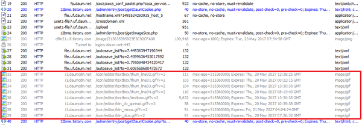
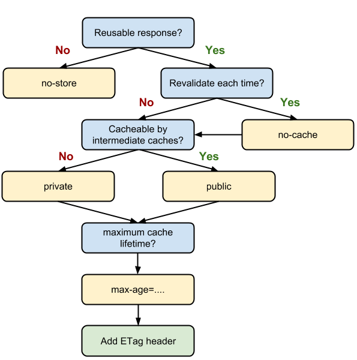

# 웹 사이트 최적화

브라우저가 웹페이지를 처리하는 방식은 1. 서비스 이동 단계 → 2. 리다이렉트 단계 → 3. 애플리케이션 캐시 확인 단계 → 4. 네트워크 통신 단계 → 5. 브라우저 처리 단계 로 나누어 집니다. 각 단계마다 최적화에 고려해야 할 사항들이 있습니다.

```
웹사이트의 반응 시간 

- 0.1초 : 사용자의 동작에 해당 기능이 바로 반응한다고 느끼는 시간

- 1초: 불필요하게 오래 기다리지 않았다고 느끼는 시간, 0.2~1초의 시간은 컴퓨터가 동작하는 시간으로 이해될수 있는 시간. 시간이 1초 이상 걸리면 컴퓨터의 동작에 이상이 생겼다고 생각하게 된다.

- 10초: 사용자가 집중력을 잃지 않는 최대 시간
```

<br>

## 브라우저 동작 방식을 기반으로 한 최적화


```
- 1. 서비스 이동 단계 (Prompt for unload) :사용자가 웹 서비스를 이용하다 다른 주소로 이동할 때 브라우저가 제일 먼저 실행하는 단계입니다. 프로세싱 모델의 Prompt for unload에 해당합니다.

- 2. 리다이렉트 단계 (redirect) : 사용자가 요청한 URL에서 다른 URL로 다시 보내는 단계입니다. 프로세싱 모델의 redirect에 해당합니다.

- 3. 애플리케이션 캐시 확인 단계 (App Cache) : 브라우저의 캐시에 데이터가 있는지 확인하는 단계입니다. 프로세싱 모델의 App Cache에 해당합니다.

- 4. 네트워크 통신 단계 (DNS, TCP, Request, Response) : 브라우저가 네트워크와 통신해서 웹페이지와 구성 요소를 다운로드하는 단계입니다. 네트워크 통신 단계에 해당하는 프로세싱 모델의 단계는 DNS, TCP, Request, Response 등입니다.

- 5. 브라우저 처리 단계 (Processing, onload) : 다운로드한 웹 페이지와 구성 요소로 웹 페이지를 화면에 그리는 단계입니다. 프로세싱 모델의 Processing과 onLoad에 해당합니다.
```

<br>

## 서비스 이동 단계

프로세싱 모델의 Prompt for unload에 해당하는 서비스 이동 단계는 사용자가 웹서비스를 이용하다가 다른 주소로 이동할 때 브라우저가 제일 먼저 실행하는 단계입니다. 이 단계의 작업은 다른 주소로 이동하기 전에 보고 있던 페이지에서 실행하는데, 모두 브라우저 내부에서 처리하기 때문에 브라우저 성능과 직결됩니다.
 

웹서비스를 이용하면 페이지가 표시될 때 우리도 모르게 이벤트가 할당되고 이때 메모리를 조금씩 사용하게 됩니다. 그런데 이 메모리를 더 이상 사용하지 않을 때, 즉 페이지를 떠날 때는 메모리를 해제해야 합니다. 이 메모리 해제 작업이 서비스 이동 단계에서 실행하는 작업 가운데 하나입니다.
 

필요없는 메모리 해제를 담당하는 가비지 컬렉션 기능이 제대로 동작하지 않으면 브라우저가 응답 없음 상태가 되거나 실행 속도가 급격히 느려지게 됩니다. 웹 페이지에서 동시에 많은 변수가 생성되고 처리되는 동안 브라우저에서 허용한 임계치를 넘었을 때 가비지 컬렉션이 동작하게 되고, 가비지 컬렉션이 동작하면 스크립트 실행이 중단됩니다. 가비지 컬렉션이 완료되기 전까지는 스크립트가 동작하지 못해 페이지가 느려지는 것입니다. 이를 해결하는 여러 가지 방법이 있지만 성능이 개선된 최신 브라우저로 업데이트하는 방법이 가장 좋습니다.
 

DOM(Document Object Model)의 생성과 삭제가 빈번한 페이지, 한 페이지에 다수의 AJAX 통신이 필요한 페이지, 이벤트 바인딩 수가 많은 페이지, 사용자 체류 시간이 긴 페이지를 개발할 때는 필요 없는 변수나 오브젝트 삭제, 이벤트 해제 등을 활용해 메모리를 관리해야 합니다. 자바스크립트의 변수와 객체, DOM 객체, AJAX 통신 등을 사용할 때 성능을 높이려면 코드 스타일, 렌더링, UI 스레드와 타이머 사용, DOM 스크립팅, AJAX와 다이나믹 로딩 방법 등이 있습니다.
 

서비스 이동 단계의 작업은 브라우저 내부에서 자동으로 실행합니다. 만약 별도로 처리하려면 beforeunload 이벤트를 활용할 수 있습니다. 어떤 사이트를 방문한 다음 다른 사이트로 이동할 때 "이용해 주셔서 감사합니다."라는 알림 문구가 나타나는 것을 본 적이 있다면, 이 알림 문구를 나타낼 때 beforeunload 이벤트를 활용합니다. beforeunload 이벤트를 활용하여 메모리 해제를 담당하는 모듈을 만들 수 있습니다.

<br>

## 리다이렉트 단계

프로세싱 모델의 redirect에 해당하는 리다이렉트 단계는 사용자가 요청한 URL에서 다른 URL로 다시 보내는 단계입니다. 쉽게 볼 수 있는 리다이렉트는 소셜 네트워크 서비스(SNS, Social Networking Service)에서 사용하는 단축 URL입니다. SNS의 특성상 입력하는 글자수에 제한이 있습니다. 단축 URL을 사용하면 SNS의 글자수 제한을 피할 수 있습니다.
 

리다이렉트가 발생하면 상태 코드로 '301'이나 '302'를 반환하는데, 이는 HTTP 요청을 완수하기 위해서 추가로 무언가를 해야한다는 의미입니다. 이런 이유로 리다이렉트가 발생하면 어떤 자원도 다운로드하지 않으며 브라우저에 일시적으로 빈페이지가 보입니다. 그렇기 때문에 특정한 목적으로 리다이렉트를 사용하는 것은 어쩔 수 없지만 의도치 않게 또는 실수로 리다이렉트가 발생한다면 웹페이지의 성능 향상을 바로 잡아야 합니다.
 

리다이렉트와 관련해서 개발자가 흔히 저지르는 실수 가운데 하나는 URL 뒤에 슬래쉬를 넣지 않는 것입니다. 인터넷 익스플로러의 주소창에 'naver.com'을 입력하고 Enter키를 누르면, 주소창에 입력한 주소가 'http://www.naver.com/'으로 바뀌면서 리다이렉트가 됩니다. 이 과정을 웹사이트 모니터링 도구인 Fiddler로 확인하면 아래와 같이 302 Redirect가 발생하는 것을 볼 수 있습니다.
 


두번째로 실수하는 부분은 웹페이지를 이용한 리다이렉트입니다. 흔히 사용하는 방법은 메타태그를 이용하는 방법입니다. 
 

```<meta http-equiv="refresh" content="1; url=http://www.naver.com/">```

 
이 코드에는 두가지 성능 문제가 있습니다. 첫번째는 이 코드를 실행시킬 별도의 페이지를 거쳐야 리다이렉트된다는 점입니다. 두번째는 최종 페이지에 도착했을 때 캐시가 설정된 리소스임에도 불구하고 조건부 GET 요청이 이루어진다는 점입니다.

 
조건부 GET 요청은 브라우저에 캐싱된 리소스를 사용하기 전에 해당 리소스를 사용해도 되는지 서버에 물어보는 것입니다. 이때 헤더의 If-Modified-Since 정보를 이용해 서버에 요청을 보냅니다. 리소스가 수정되지 않았다면 '304 Not Modified' 코드를 받아 캐시에 있는 리소스를 사용합니다. 자원이 수정됐다면 서버로부터 리소스를 다운로드 합니다.

 
캐시의 만료 날짜를 설정했다면 서버의 확인을 거치지 않고 바로 캐싱된 리소스를 사용할 수 있는데, 메타태그로 리다이렉트하면 조건부 GET 요청으로 불필요한 서버 통신이 발생해 응답 속도가 느려집니다. 아래 그림은 캐시 만료날짜를 설정하여 서버를 거치지 않고 캐싱된 리소스를 받아오는 경우입니다.



개발기간이 부족해서 기존 페이지에 메타태그를 넣어 리다이렉트 용도로만 사용하고 해당 페이지에 있던 이미지와 스타일시트, 스크립트 등의 링크를 제거하지 않았다면 이 파일까지 다운로드한다는 문제도 있습니다. 리다이렉트 용도로만 사용하는 페이지인데 불필요한 파일을 받게 되는 것입니다. 이렇게 되면 사용자는 리다이렉트 페이지를 거쳐 최종 페이지의 렌더링이 완료되기 전까지 영문도 모른 채 빈 페이지만 보고 있어야 합니다.

 
리다이렉트가 필요하다면 메타태그가 아니라 서버사이드 설정으로 처리하는 편이 더 좋습니다. 서버사이드 설정으로 리다이렉트하는 대표적인 방법에는 아파치 웹 서버에서 제공하는 mod_alias 모듈을 사용하는 방법이 있습니다. mod_rewrite 모듈도 있지만 패턴이 복잡하지 않다면 mod_alias 모듈로도 충분히 처리할 수 있씁니다.

 
웹페이지 주소뿐아니라 이미지와 스타일시트, 자바스크립트와 같이 페이지를 구성하는 요소도 리다이렉트 될 수 있습니다. Fiddler를 이용하여 301이나 302 상태 코드가 발생하는 요소들을 찾아 의도치 않게 리다이렉트가 발생하고 있는 부분은 성능향상을 위해 바로 잡아야 합니다.

<br>

## 애플리케이션 캐시 확인 단계

리다이렉트 작업을 마치고 HTTP 요청을 처리하기 위한 준비를 마쳤다면 브라우저는 맨 먼저 서버로 요청을 보내게됩니다. 서버에서 응답이 오면 개별 요소(이미지, 스타일시트, 자바스크립트 등)가 사용자 PC에 있는지 캐시 데이터를 찾게 됩니다. 별도로 설정하지 않았다면 윈도우 운영체제에서는 C:\Documents and Settings\{User}\Local Settings\Temporary Internet Files 디렉터리에 캐시 데이터가 존재하게됩니다. 캐시 데이터의 종류에는 쿠키(cookie), 이미지, 스크립트, 스타일시트 등이 있습니다. 성능 향상을 위해 가장 효과적인 방법은 브라우저와 서버 사이의 통신을 최대한으로 줄이는 것입니다. 그러므로 다시 방문한 사용자에게 좀 더 빠른 응답 속도를 제공하려면 애플리케이션 캐시를 잘 활용해야 합니다.



브라우저에서 URL 정보를 이용해 서버에 요청을 보내면 마크업 데이터가 브라우저에 도착합니다. 이때 a.gif라는 이미지 파일을 다운로드하는 태그를 만났을 때 브라우저의 처리 절차는 다음과 같습니다.

 
1. Expires 정보 확인
브라우저가 a.gif 파일을 서버에 요청하기 전에 사용자 PC에 저장된 Expires 정보(만료 날짜)를 확인합니다. Expires 정보가 있고 설정한 기한이 남았다면 사용자 PC의 a.gif 파일을 사용하게 됩니다. 이 단계가 네트워크 통신 단계의 Cache Read 단계입니다.

 
2. If-Modified-Since 정보 확인
Expires 정보가 없거나 기한이 지났으면 If-Modified-Since 정보(마지막으로 수정한 날짜)가 있는지 확인합니다. If-Modified-Since 정보가 없으면 서버에 요청해 이미지를 받게됩니다. 이때 상태 코드는 '200 OK'입니다. If-Modified-Since 정보가 있으면 If-Modified-Since 정보를 서버에 보냅니다.

 
3. If-Modified-Since 정보와 Last-Modified 정보 비교
서버는 브라우저가 보낸 If-Modified-Since 정보를 Last-Modified 정보(서버에 저장된 마지막 수정 날짜)와 비교합니다. 수정한 날짜가 같다면 상태 코드 '304 Not Modified'를 보내 사용자 PC에 있는 파일을 사용하게 합니다. 날짜가 다르다면 서버에서 파일을 보냅니다. 이때 상태 코드는 200 OK 입니다.

 
이 과정에서 알 수 있듯이 사용자 PC에 캐시 파일이 있고 Expires 정보가 유효하다면 해당 파일을 서버에 요청하지 않고 캐시에 저장된 파일을 이용합니다. 이러면 동적인 이미지 등을 제외한 나머지 정적인 요소(이미지, 스타일시트, 자바스크립트 등)는 별도로 서버에 요청하지 않기 때문에 로딩 속도를 크게 향상 시킬 수 있습니다.

 
사용자가 서비스를 처음 방문했을 때는 캐시가 없는 상태이기 때문에 큰 효과를 거둘 수 없겠지만, 캐시를 올바르게 설정했다면 그 이후에는 웹 서비스의 응답 속도를 개선하는 데 큰 도움을 줄 것입니다.

<br>

## 네트워크 통신 단계

프로세싱 모델의 DNS, TCP, Request, Response는 모두 네트워크 통신에 관련된 단계 입니다. 이 네 단계를 거치는 비용은 상당히 큽니다. 네트워크 통신에 들어가는 비용을 줄이면 성능 향상에 큰 효과를 볼 수 있습니다. 
 
Expires 설정이나 Cache Control 속성을 이용해 사용자 웹페이지에 다시 왔을때 캐시를 사용하거나 스타일시트나 자바스크립트와 같이 파일을 합쳐서 서비스해도 문제가 없는 리소스를 합쳐 하나의 링크로 제공해 요청 횟수를 줄이면 네트워크의 비용을 줄일 수 있습니다.
 
- Blocked: 브라우저에서 리소스를 호출하기 전에 소요되는 대기 시간. 이 대기 시간은 브라우저 캐시를 확인하는 시간과 네트워크에 연결하기 전에 소요되는 준비 시간으로 이뤄집니다.

- DNS(DNS Lookup): 호스트 이름으로 IP 주소를 조회한 시간. 보통 20~120ms(밀리초) 정도 소요됩니다. 이 작업이 완료되지 않으면 어떤 자원도 다운로드하지 않습니다. 브라우저에서 IP 주소를 조회할 때 동일한 호스트로 요청하는 요소는 다시 IP 주소를 확인하지 않아 시간이 추가로 걸리지 않습니다. 그럼 하나의 호스트로 모든 리소스를 호출하면 시간을 줄일 수 있을 것 같지만, 대신 호스트별 동시 연결 기능은 포기해야 합니다.

- TCP(Connect): 웹 서버와의 TCP 연결을 생성하는 데 필요한 시간. 프론트엔드에서는 이 단계에서 걸리는 시간을 줄일 수 없습니다. 백엔드 영역입니다.

- Request(Send): 웹 서버와 TCP 연결이 이뤄지면 원하는 정보를 서버에 보내는 시간. 주로 요청 헤더 정보를 보내는 시간이 여기에 해당합니다. Send 시간은 파일 올리기와 같이 보내야 할 정보가 많을수록 오래 걸립니다. 파일을 올리면 브라우저에서는 해당 파일을 바이너리 형태로 변환해 데이터를 헤더 정보에 실어서 웹 서버로 보내는데, 파일 크기가 클수록 Send 시간이 오래 걸립니다.

- Wait: 웹 서버에서 보내는 응답 메시지를 받기까지의 대기 시간. 서버 연산 처리 시간에 해당됩니다. 모든 요소에 대해서 Wait 시간이 전반적으로 느리다면 사용자가 많아 웹서버가 과부하 상태이거나 기타 다른 이유가 있을 수 있습니다. 그러나 특정 요소만 느리다면 서버 측 연산 처리 시간을 튜닝해야 합니다. Ajax로 개발할 때 응답이 느리다면 먼저 Wait 시간을 확인해봅니다.

- Response(Receive): 서버에서 보내는 응답 메시지를 받는 시간. 이 시간은 해당 요소의 데이터 크기에 비례하기 때문에 사용자의 네트워크 상태에 따라서 다를 수 있습니다. 이 단계에서 성능을 개선하는 방법으로는 데이터 크기를 줄이기 위해 Gzip과 같은 파일 압축 기술을 사용하는 방법이 있습니다. 요즘에는 웹페이지에 동적인 기능이 많아져 자바스크립트 파일의 크기가 늘어나고 있습니다.

- TTFB(Time To First Byte): 서버가 해당 요소의 첫번째 바이트 정보를 브라우저에 보내는 데 걸린 시간. Receive 시간의 첫단계라고 말할 수 있습니다. 프론트엔드에서는 이 단계에 걸리는 시간을 줄일 수 없습니다.

- Cache Read: 사용자 PC에 저장돼 있는 캐시를 읽어 오는 시간. Blocked 단계와 Cache Read 단계는 네트워크 단계에 속하지는 않습니다. 캐시가 설정돼 있지 않으면 많은 단계를 거치게 됩니다. 이런 요소들이 하나 둘 모여서 40~50개 정도 된다면 응답 속도는 계속 느려질 것입니다.

<br>

## 브라우저 처리 단계

프로세싱 모델의 Processing과 onLoad에 해당하는 브라우저 처리 단계는 서버에서 받은 HTML과 이미지, 스타일시트를 조합해 사용자가 실제로 보는 화면을 만드는 단계입니다. 서버에 요청한 요소가 모두 도착하면 브라우저는 DOM을 생성하기 시작합니다. 이렇게 생성된 DOM을 조작하는 시점에 따라 응답 속도가 달라질 수 있습니다.

그래서 복잡한 UI를 개발할 때는 인라인 형태의 이벤트 바인딩 방법보다 이벤트 핸들러로 바인딩하는 방법을 사용합니다. 이벤트 핸들러로 이벤트를 바인딩하려면 최우선 조건이 해당 DOM이 존재해야 한다는 것입니다. 모든 DOM이 존재하는 바로 그 시점이 DOMContentLoaded 이벤트나 onload 이벤트가 발생하는 시점입니다.

DOMContentLoaded 이벤트와 onload 이벤트는 모두 "이제 모든 준비가 완료됐으니 마음대로 DOM을 조작해도 된다"라는 의미입니다. 그러나 두 이벤트는 발생시점이 다릅니다.

```
[domLoading] ▶ [domInteractive] ▶ [domContent Loaded] ▶ [domComplete] ▶ [onload]
```
 
onload 이벤트는 DOM에서 기본으로 제공하는 이벤트로 문서에 있는 모든 이미지, 스타일시트, 자바스크립트 등이 모두 다운될 때마다 발생합니다. 이와 달리 DOMContentLoaded 이벤트는 기본적으로 DOM 생성에만 관련돼 있습니다. 이미지나 다른 요소를 다운로드하는 것과 관계없이 DOM이 로딩되고 난 직후에 발생합니다.
 
많은 양의 이벤트를 바인딩해야 하고 이미지나 스타일시트의 개수가 많은 페이지를 개발한다면 onload 이벤트보다는 DOMContentLoaded 이벤트를 이용하는게 좋습니다. 또는 페이지를 로딩하고 실제 사용자가 동작할 때까지의 시간이 많이 걸려 문제가 됐다면 DOMContentLoaded 이벤트를 이용하면 됩니다. 이전보다 체감 속도가 더 빨라질 것입니다.

## 요약

- 웹페이지 성능을 개선하려면 먼저 브라우저가 웹페이지를 어떻게 처리하는지 알아야 합니다.
 
- 페이지를 떠나는 서비스 이동 단계에서 브라우저는 메모리 해제 작업을 실행합니다. 그러나 브라우저에 따라 메모리 해제를 담당하는 가비지 컬렉션 기능이 제대로 동작하지 않아 페이지가 느려질 수 있습니다. 서비스 이동 단계에서 일어나는 성능 문제를 개선하려면 필요없는 변수나 객체를 삭제하고, 이벤트를 해제해 메모리를 관리해야 합니다.
 
- 리다이렉트가 발생하면 어떤 파일도 다운로드하지 않고, 리다이렉트가 완료되기 전까지는 빈화면이 보입니다. 되도록 리다이렉트를 사용하지 않습니다. 리다이렉트를 해야 한다면 웹페이지를 통한 리다이렉트보다는 웹서버 설정을 이용한 리다이렉트를 권장합니다.
 
- 만료 날짜를 설정하는 등 애플리케이션 캐시를 올바르게 설정해 활요하면 브라우저와 서버 사이의 통신을 최대한으로 줄일 수 있습니다. 브라우저와 서버 사이의 통신이 줄면 웹 페이지를 방문했을때 응답 속도가 빨라지고 로딩 속도가 빠랄져 사용자가 웹페이지를 더 빨리 볼 수 있습니다.
 
- 브라우저에는 여러 가지 처리 과정이 있지만 무엇보다 네트워크 통신 단계(DNS, TCP, Request, Response)에 들어가는 비용이 가장 큽니다. 네트워크 통신 단계에 들어가느 비용을 줄여 성능을 높이는 방법에는 여러가지가 있습니다. 브라우저가 허용하는 호스트별 동시 연결 개수를 활용해 데이터와 파일을 동시에 받는 방법이 있으며, 쿠키의 크기를 줄여 요청 헤더의 크기를 줄이는 방법도 있습니다. 또한 스타일시트 파일과 자바스크립트 파일을 Gzip으로 압축해 전송받는 파일의 크기를 줄이는 방법이 있으며, 이미 다운로드한 리소스를 캐시에 저장해 다시 사용하는 방법도 있습니다. 이런 방법들은 모두 웹사이트를 구성하는 요소 때문에 생기는 네트워크 비용을 줄여 성능을 향상시키는 방법입니다.
 
- 브라우저 처리 단계는 서버에서 받은 HTML과 이미지, 스타일시트를 조합해 사용자가 실제로 보는 화면을 만드는 단계입니다. 이 단계에서 onload 이벤트보다 DOMContentLoaded 이벤트로 DOM을 조작하는 시점을 조절하면 웹페이지의 응답 속도를 더 빠르게 할 수 있습니다.


출처:[길은 가면, 뒤에 있다.:티스토리](https://12bme.tistory.com/127)