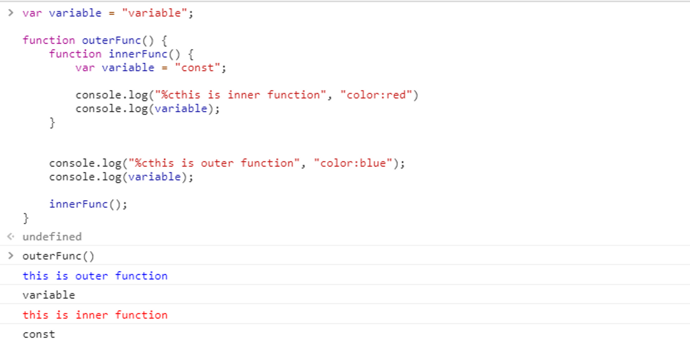
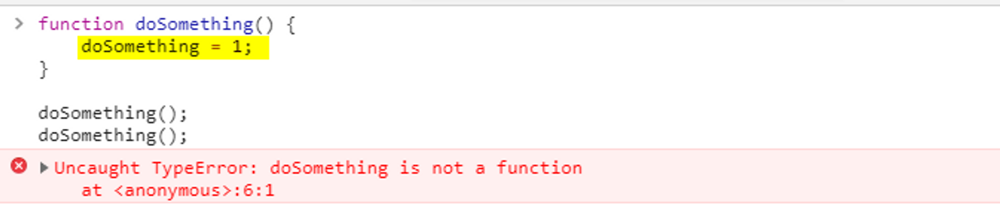
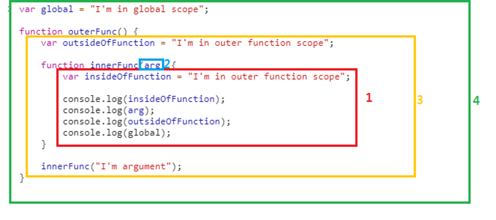
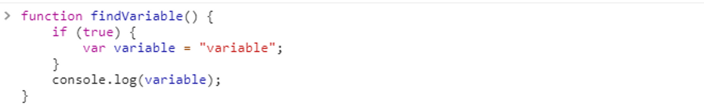
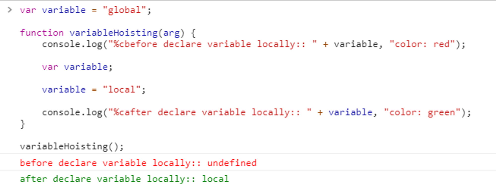
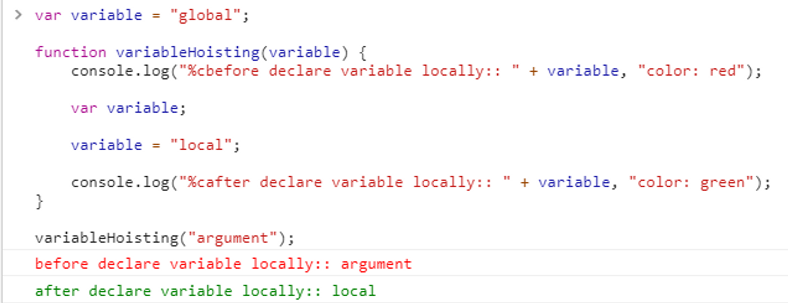
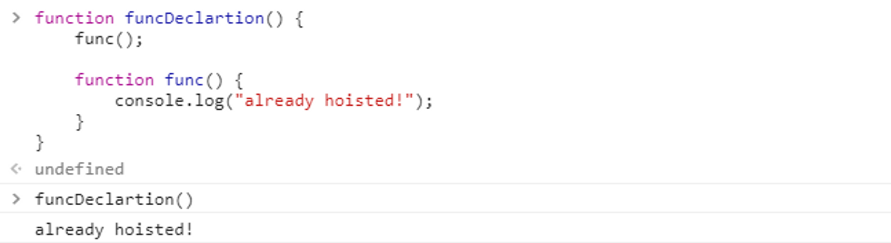
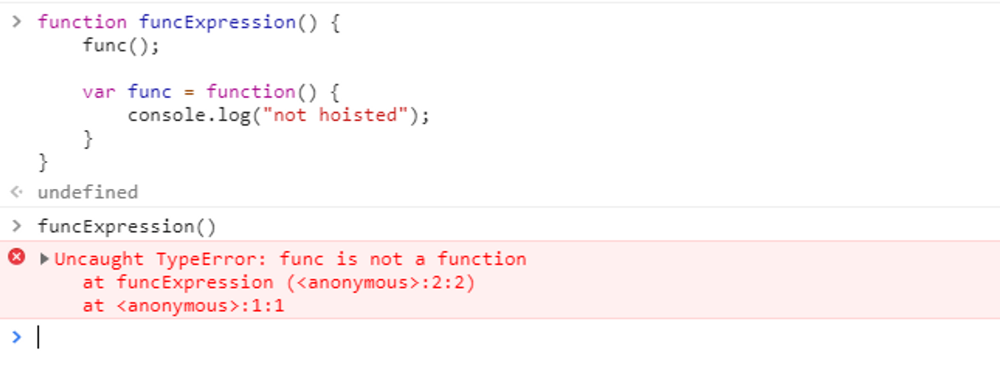
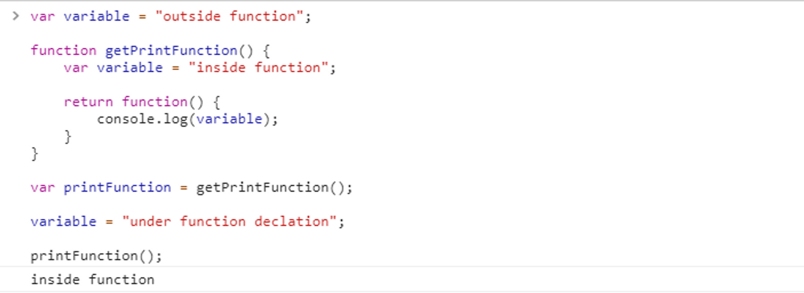

# Scope

실행중인 함수가 코드의 어디까지를 참조할수 있는가하는 범위

-   한 페이지내에서 다수의 JS파일을 로드하여 사용하는 특성상, 모두가 공유하는 global Scope를 이용하는 것은 위험소지가 큼.
-   javaScript는 runtime 도중에 namespace 오버라이딩이 가능하므로, global Scope는 오염시키지 않도록 한다.

  

---

  

## Function Scope

변수값을 찾는 순서: Function 내부 > arguments > 펑션 외부

-   scope의 최소단위가 function이기 때문에, {} 블록 밖에 있는 변수도 참조 가능.

  

---

  

## Hoisting

-   Function의 실행순서

1. 해당 function의 scope내에서 선언된 변수를 모두 읽어들여 초기화 한다
2. 선언된 function 들을 읽어들인다
3. function paremeter에 변수값을 배당한다
4. function 내부를 차례대로 실행한다

-   같은 이름의 변수가 function scope내에서 새로 선언될 경우, 인터프리터 도달전에 초기화 되어버리므로 동일한 명칭의 변수를 참조할 수 없게된다.

-   변수 선언 > 코드 실행 사이에 function parameter로 들어온 변수에 값을 할당하기 때문에, parameter와 동일한 이름의 변수를 선언해도 코드를 읽으면서 값 할당이 이루어지기 전 까지는 parameter값이 유지된다.

-   함수 선언(Function Declaration) vs 함수 표현(Function Expression)
-   함수선언은 변수를 읽어온 다음에 값도 배정되기 때문에 같은 스코프 내에서 선언된것은 인터프리터가 읽기전에 호출할 수 있다.

함수표현은 변수와 같이 취급되므로 선언부가 인터프리터에 의해 해석되고 난 후에 호출가능.

  

---

  

## Closure

-   JavaScript는 실행 될 때가 아니라 선언 될 때의 Scope를 유지하는 특성이 있음.
-   이미 선언한 Function을 외부에서 호출해도, function은 선언 당시 참조했던 Scope의 변수를 읽어오게 된다.

-   위와 같은 경우 외부에서는 접근할 수 없으나 이미 선언된 펑션에서는 접근할 수 있는 스코프가 생성.
-   Closure 내부 함수는 GC대상이 되지 않으므로 memory leak 가능성이 있음.
