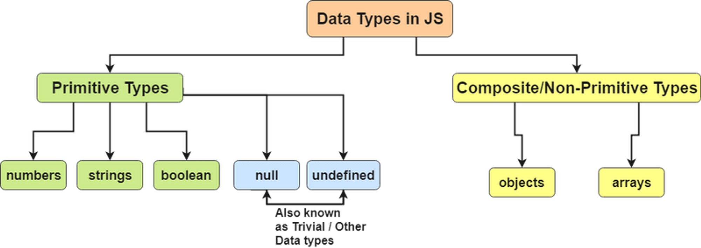
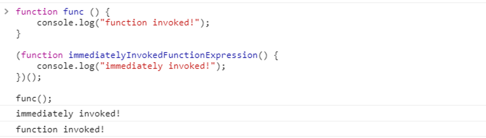
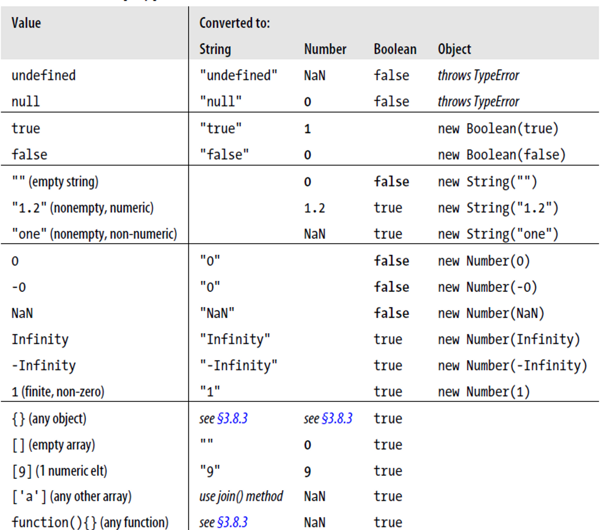

# Type

JavaScript는 변수타입을 선언하지 않는다. 변수 할당 prefix는 var를 사용.



-   원시타입(Primitive) : 메모리에 직접 저장되는 타입의 데이터
-   Boolean
-   Wrapper: Boolean()
-   Number: Float64(-253~253)
-   Infinity(larger than 10308) , Number.POSITIVE_INFINITY, Number.MAX_VALUE +1, 1/0
-   Infinity(Smaller than 10-324), Number.NEGATIVE_INFINITY, -Number.MAX_VALUE -1, -1/0
-   NaN, Nubmer.NaN, 0/0
-   0, -0
-   Wrapper: Number()
-   String
-   Wrapper: String()
-   null
-   Wrapper Object 없음
-   undefined
-   Wrapper Object 없음
-   Symbol
-   ES6부터 추가.
-   객체타입(Object): 메모리상의 주소 참조가 저장되는 타입의 데이터
-   Object
-   생성자: new Obejct()
-   리터럴: {}
-   Array
-   생성자: new Array()
-   리터럴: []
-   Date
-   생성자: new Date()
-   RegExp
-   생성자: new RegExp,
-   리터럴: /expString/
-   Function
-   함수선언(Function declaration)

```js
function functionName() {
    /* contents */
}
```

-   함수 표현(Function expression)

```js
var func = function () {
    /* contents */
};
```

<br /><br />

---

<br /><br />

## Object 객체

-   JavaScript에 존재하는 모든 객체의 최상위 객체
-   모든 객체는 이 객체를 상속받는다.
-   기본 method
-   hasOwnProperty()
-   객체가 가지고 있는 키 검사
-   isPrototypeOf ()
-   객체의 상속구조 검사
-   toString()
-   객체를 String으로 나타낸 값 리턴
-   valueOf()
-   객체의 값 리턴
-   toLocaleString()
-   객체를 String으로 나타낸 값 지역특성 반영하여 리턴

<br /><br />

---

<br /><br />

## Function

-   Object의 한 종류로 분류됨.
-   statement의 덩어리.
-   무조건 값을 return한다. function 내부에 return이 없다면 undefined를 리턴한다.
-   뒤에 ()를 붙여서 실행. function 선언 후 바로 괄호()를 붙이면 선언 즉시 실행된다



<br /><br />

---

<br /><br />

## 형변환

-   명시적 형변환(Parsing) : 명시적으로 형변환을 시행하여 타입이 변환되는 것.
-   Primitive > Object
-   WrapperObject : Number() / String() / Boolean() / Object() 사용
-   Object > Primitive
-   valueOf() / toString(base)
-   Number Object > String
-   toFixed(fraction digit) / toExponential(fraction digit) / toPrecision(precision)
-   String > Number
-   parseInt() / parseFloat()
-   암시적 형변환(Coresion): 인터프리터가 JavaScript를 해석할 때, 문맥에 맞게 타입을 변환시키는것.
-   Operator 사용시
-   "z" + 1 -> "z1" / +"3" -> 3
-   값비교에 사용시
-   "2" > 3 -> false
-   조건절에 사용시
-   if Statement
-   삼항연산자



-   암시적 형변환을 하는 값 비교
-   == Operator
-   If / while / 3항연산
-   암시적 형변환을 하지않는 값 비교
-   === Operator
-   Switch Statement
