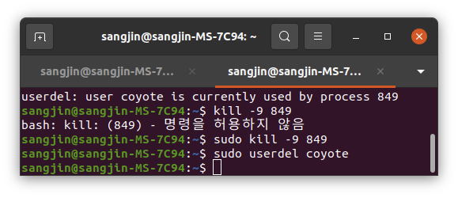

# user(계정)

## 계정생성

<br />

- 전체 계정 설정

```bash
# 그룹과 계정 id가 추가되고 초기 비밀번호를 설정한다.
adduser test
```

<br />

- 계정, 비밀번호 각자 설정

```bash
# 비밀번호 생성없이 유저를 생성한다.
useradd test
# 계정에 대한 비밀번호를 설정한다.
passwd test
```

<br />

- 그룹 설정

```bash
# 그룹을 생성해준다.
groupadd testgroup
# 그룹에 계정을 추가해준다.
usermod -G testgroup test
# 계정의 그룹이 뭔지 확인한다.
groups test
```

<br /><br />

---

<br /><br />

## 계정 삭제

```bash
# test 계정을 삭제한다.
userdel test
# 옵션을 통해 계정에 설정된 홈 디렉토리도 삭제한다.
userdel -r test
```

<br /><br />

---

<br /><br />

## error

보통 계정 삭제를 하면


user [계정명] is currently used by process [프로세스 번호]

이렇게 많이 뜨는데, user가 떠있는 프로세를 종료 후 다시 계정 삭제하면 정상동작 됨
