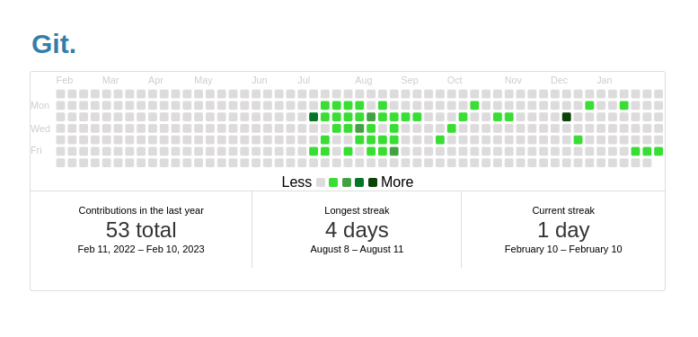

# 1.git\_잔디심기

### 1. [잔디심어주는 코드 생성 페이지](https://bloggify.github.io/github-calendar/example/)에서 html속 "your-username"에 git id를 넣어준다.

<br/>

예시

```html
<!-- Include the library. -->
<script src="https://unpkg.com/github-calendar@latest/dist/github-calendar.min.js"></script>

<!-- Optionally, include the theme (if you don't want to struggle to write the CSS) -->
<link
  rel="stylesheet"
  href="https://unpkg.com/github-calendar@latest/dist/github-calendar-responsive.css"
/>

<!-- Prepare a container for your calendar. -->
<div class="calendar">
  <!-- Loading stuff -->
  Loading the data just for you.
</div>

<script>
  GitHubCalendar(".calendar", "tkdwls9277");
  // or enable responsive functionality
  GitHubCalendar(".calendar", "tkdwls9277", { responsive: true });
</script>
```

<br/>
<br/>

### 2. 생성된 html 코드를 [html 블록 생성 페이지](https://www.notion-tools.com/embeds/html)에서 변환해준다.


<br/>
<br/>

### 3. html 블록을 임베드 해서 넣는다.


<br/>
<br/>

### 4. 조금 기다리면 잔디가 나온다.


