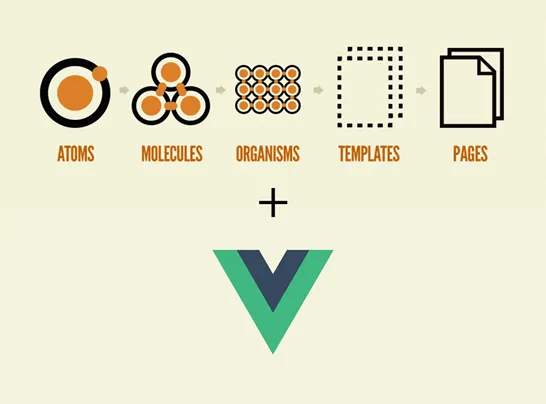
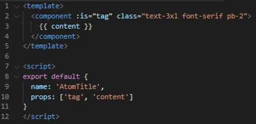

# atomic design

아토믹 디자인(atomic design)은 화학을 기반으로 디자인 시스템을 만드는 방법론으로, 매우 기본적인 것부터 시작하여 더욱 복잡해집니다. 원자 설계에는 5개의 고유한 레벨이 있습니다.

- Atom (chemistry-based naming)(화학 기반 명명)
- Molecule (chemistry-based naming)(화학 기반 명명)
- Organism (chemistry-based naming)(화학 기반 명명)
- Template (web-based naming)(웹 기반 이름 지정)
- mPage (web-based naming)(웹 기반 이름 지정)

Atomic 디자인은 많은 프런트엔드 프레임워크에서 구현될 수 있습니다. 이 기사에서는 Vue 프레임워크 코드가 포함된 모든 구성 요소의 예를 제공합니다.

 

## Atom

Atom은 애플리케이션을 구성하는 가장 작은 단위입니다. 애플리케이션을 빌드하는 데 단독으로 사용할 수는 없지만 컬렉션을 사용하면 가능합니다. 코드에서 Atom은 애플리케이션 전체에서 재사용될 사용자 정의 스타일과 동적 콘텐츠가 포함된 HTML 태그를 의미합니다.

> 예시 title.vue

 

## Molecule

분자는 서로 연결된 원자 그룹입니다. 우리의 응용 프로그램에서 분자는 하나 이상의 관련 원자로 구성된 가장 작은 구성 요소이며 재사용을 위해 만들어진 조합으로 구성됩니다.

 

## Organism

유기체는 원자 및/또는 분자가 함께 결합되어 상대적으로 복잡한 구성 요소, 인터페이스의 고유한 부분을 형성하는 집합입니다.

 

## Template

템플릿은 페이지의 공통 구조를 형성하는 유기체 및/또는 분자의 그룹입니다. 우리는 일반적으로 템플릿을 레이아웃이라고 부릅니다.

 

## mPage

페이지는 out 템플릿의 인스턴스입니다. 이것은 원자 설계 단계의 마지막 수준입니다. 템플릿과 페이지의 차이점은 내부 구성 요소의 내용입니다. 템플릿은 여전히 ​​더미 콘텐츠를 사용하는 반면, 페이지는 사용자가 보게 될 내용을 설명하기 위해 더미 콘텐츠를 실제 콘텐츠로 대체합니다. 이 단계에서는 적용한 디자인의 효율성을 테스트하고 콘텐츠가 예상대로 구축되었는지 확인할 수 있습니다.

  

## 장점 

Atomic Design 패턴을 사용하면 애플리케이션 전반에 걸쳐 일관성을 유지하고 재사용이 가능하며 업데이트가 쉽다는 장점이 있습니다. 같은 분자를 사용한다면 페이지 A의 형태는 페이지 B의 형태와 동일할 것입니다. 우리는 해당 양식 분자를 한 번만 만들고 여러 페이지로 가져옵니다. 애플리케이션에서 양식 구성 요소를 업데이트하려면 한 번만 업데이트하면 사용된 전체 페이지에 적용됩니다.

 

## 단점

Atomic Design 패턴을 사용할 때의 단점은 애플리케이션이 점점 더 복잡해지고 검색하는 데 시간이 걸릴 경우 긴 구성 요소 목록이 생성될 수 있다는 것입니다. 구성 요소에 대한 전체 문서를 작성하면 이 문제를 최소화하는 데 도움이 될 수 있습니다. 처음에는 구성 요소를 구현하고 분할하고 구현하는 데 추가 노력이 필요합니다.