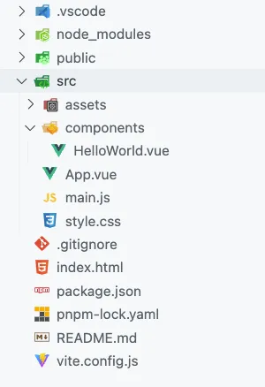
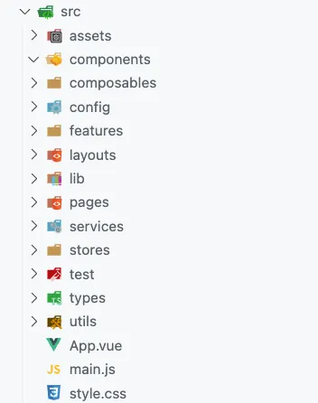
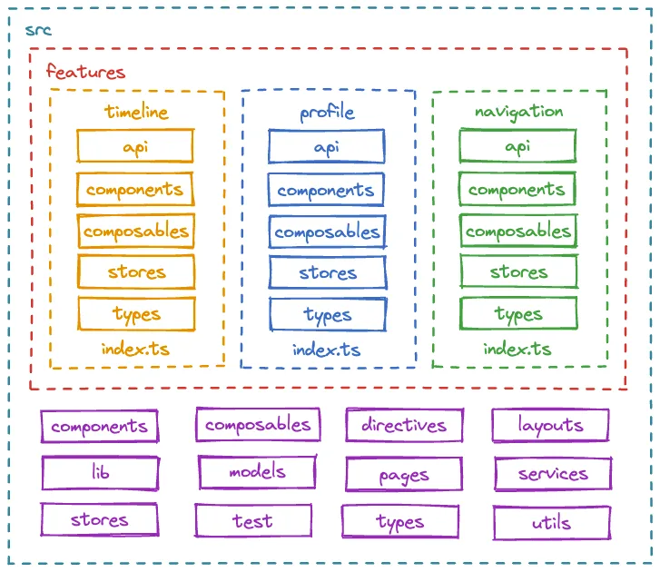

# 프론트엔드 폴더 구조

[참고자료](https://medium.com/@fadamakis/a-front-end-application-folder-structure-that-makes-sense-ecc0b690968b)

대규모 애플리케이션의 가장 중요하면서도 어려운 측면 중 하나는 훌륭하고 합리적인 폴더 구조입니다. 마이크로 프런트엔드를 사용하여 코드베이스를 여러 애플리케이션으로 나누는 것을 고려하기 전에 프로젝트 수준에서 아키텍처를 개선하고 해당 경로를 고려하는 경우 전환을 더 쉽게 만들기 위해 따를 수 있는 몇 가지 단계가 있습니다.

목표는 기능 간의 경계를 설정하고 코드 결합 및 부작용을 최소화하여 코드베이스를 더 쉽게 이해할 수 있도록 일종의 모듈화를 적용하는 것입니다.

## 기본 프로젝트 구조

기본적으로 널리 사용되는 프런트 엔드 프레임워크 중 하나를 사용하여 새 프로젝트를 스캐폴딩할 때 구성 요소 구조는 평면적이며 어떤 계층 구조도 따르지 않습니다.



- assets: 애플리케이션 전체에서 사용되는 이미지, 글꼴, CSS 파일과 같은 정적 자산이 저장됩니다.
- components: 재사용 가능한 Vue 구성 요소가 포함되어 있습니다. 평면 계층 구조가 권장됩니다.
- main.js파일: 애플리케이션의 진입점 역할을 하여 Vue 초기화 및 플러그인 또는 추가 라이브러리 구성을 가능하게 합니다.
- App.vue: 애플리케이션의 루트 구성 요소를 나타내며, 다른 구성 요소의 컨테이너 역할과 기본 템플릿 역할을 합니다.

우리는 대규모 프로젝트의 경우 이 아키텍처가 곧 통제 불능이 될 것이라는 어려운 상황을 보았습니다. 특정 파일을 쉽게 찾고, 기능 간의 경계를 설정하고, 구성 요소의 긴밀한 결합을 방지하려면 일종의 모듈화가 필요합니다.

## 더 정교한 프로젝트 구조



- components: 전체 애플리케이션에서 사용되는 모든 공유 구성 요소입니다.
- composables: 모든 공유 컴포저블.
- config: 애플리케이션 구성 파일.
- features: 모든 애플리케이션 기능이 포함되어 있습니다. 우리는 대부분의 애플리케이션 코드를 여기에 보관하려고 합니다. 이에 대해서는 나중에 자세히 설명합니다.
- layouts: 페이지의 레이아웃이 다릅니다.
- lib: 우리 애플리케이션에 사용되는 다양한 타사 라이브러리에 대한 구성입니다.
- pages: 우리 신청서의 페이지.
- services: 공유 애플리케이션 서비스 및 제공자.
- stores: 글로벌 주립 매장.
- test: 테스트 관련 모의, 도우미, 유틸리티 및 구성입니다.
- types: 공유 TypeScript 유형 정의.
- utils: 공유 유틸리티 기능.

```bash
mkdir -p src/{composables,layouts,pages,utils,assets,config,lib,services,test,components,features,stores,types}
```

- 폴더 Pages는 webpack이나 Vite와 같은 빌드 도구가 생성하는 컨텍스트와 실제 청크 측면에서 기본적으로 일종의 모듈화입니다. 모든 페이지를 한 곳에 두는 것은 매우 유용하지만 그 안에 있는 논리는 최소한으로 유지해야 합니다.

- 더 쉬운 유지 관리와 확장성을 위해 대부분의 애플리케이션 코드를 features폴더 안에 보관하는 것을 목표로 합니다. 모든 기능 폴더에는 특정 기능에 대한 도메인별 코드가 포함되어 있어야 합니다.

- 완벽한 세상에서는 구성요소, 컴포저블, 저장소, 서비스를 공유해서는 안 되며 모든 것이 해당 기능 폴더 내에 있어야 합니다. 불행하게도 실제 프로젝트에서는 이를 피할 수 없지만 미리 계획을 세우고 이러한 폴더에 항목을 추가할 때 각별히 주의해야 합니다.

<br>

## 기능 폴더

애플리케이션의 대부분은 여러 하위 디렉터리로 분할된 기능 폴더 내에 있어야 합니다.



- api: 모든 가져오기 논리가 여기에 들어갑니다. 이는 API와 UI를 분리합니다.
- components: 특정 구성요소를 특징으로 합니다.
- composables: 특정 컴포저블을 제공합니다.
- stores: 상태 관리 코드입니다. 여러 하위 모듈이 예상되며 실제로 권장됩니다.
- types: 특정 typeScript 유형 정의 기능을 제공합니다.
- index.ts: 이것이 기능의 진입점입니다. 이는 기능의 공개 API 로 작동하며 애플리케이션의 다른 부분에 공개되어야 하는 항목만 내보내야 합니다.

위 `index.ts`파일은 각 기능의 공개 API 역할을 합니다. 다른 도메인에서 무언가를 가져올 때는 이 파일을 통해서만 수행되어야 합니다. 이렇게 하면 순환 종속성을 방지하고 가져오기 소스를 더 쉽게 찾을 수 있습니다.

<br>

## 결론

기능 지향 아키텍처는 복잡한 프로젝트를 구성하는 효과적이고 검증된 방법입니다. 이를 통해 코드를 별도의 모듈로 분리하고 애플리케이션이 더욱 복잡해짐에 따라 애플리케이션을 확장할 수 있습니다. 이는 코드베이스의 예측 가능성을 높이고 디버깅 시간을 줄이며 온보딩을 더 쉽게 만들어 개발 경험을 향상시킵니다.