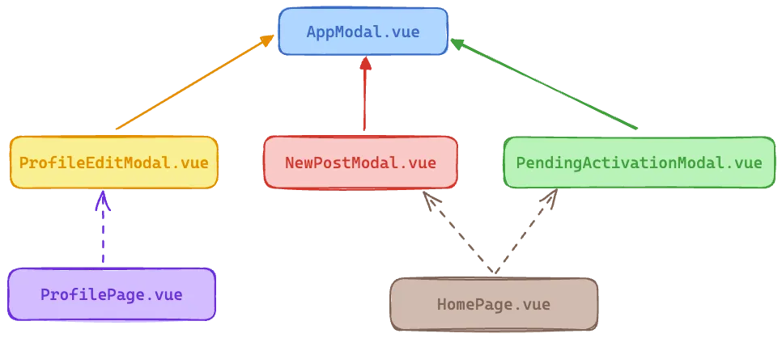

# Reusable Modal

## 기본 모달 구성요소

- AppModal.vue

    코드 중복을 줄이고 애플리케이션 전반에 걸쳐 통일된 모양과 느낌을 유지하는 역할을 하는 기본 구성 요소
- *UseCase*Modal.vue 

    각 사용 사례마다 모달의 내용을 지정하고 모든 작업을 처리하는 전용 구성 요소가 있습니다.

각 페이지는 이러한 구성 요소 중 하나를 가져올 수 있으며 해당 구성 요소의 가시성을 처리해야 합니다.

