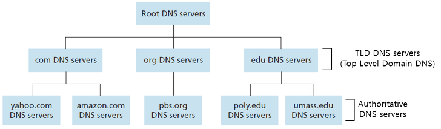
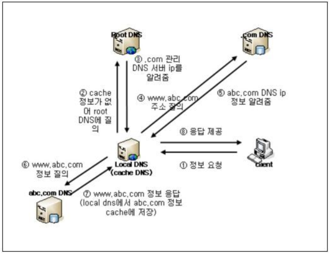

# DNS

    도메인 네임 시스템(Domain Name System)은 도메인 이름을 호스트의 네트워크 주소로 바꾸거나 그 반대의 변환을 수행할 수 있도록 하기 위해 개발되었다.

특정 컴퓨터(또는 네트워크로 연결된 임의의 장치)의 주소를 찾기 위해, 사람이 이해하기 쉬운 도메인 이름을 숫자로 된 식별 번호(IP 주소)로 변환해준다.

즉, [www.example.com](http://www.example.com/)과 같은 주 컴퓨터의 도메인 이름을 192.168.1.0과 같은 IP 주소로 변환하고 라우팅 정보를 제공하는 분산형 데이터베이스 시스템이다.

<br/>

---

<br/>

## 1. DNS 서비스 유형



```md
**1)신뢰할 수 있는 DNS**

**신뢰할 수 있는 DNS** 서비스는 개발자가 퍼블릭 DNS 이름을 관리하는 데 사용하는 업데이트 메커니즘을 제공한다. 이를 통해 DNS 쿼리에 응답하여 도메인 이름을 IP 주소로 변환한다. 그러면 컴퓨터가 서로 통신할 수 있게 된다. 신뢰할 수 있는 DNS는 도메인에 대해 최종 권한이 있으며 **재귀적 DNS** 서버에 IP 주소 정보가 담긴 답을 제공할 책임이 있다. 예를들어 **Amazon Route 53은 신뢰할 수 있는 DNS 시스템이다.**
```

```md
**2)재귀적 DNS**

대개 클라이언트는 신뢰할 수 있는 DNS 서비스에 직접 쿼리를 수행하지 않는다. 대신에 **해석기** 또는 **재귀적 DNS** 서비스라고 알려진 다른 유형의 DNS 서비스에 연결하는 경우가 일반적이다. 재귀적 DNS 서비스는 호텔 컨시어지와 같은 역할을 한다. DNS 레코드를 소유하고 있지 않지만 사용자를 대신해서 DNS 정보를 가져올 수 있는 중간자의 역할을 한다. 재귀적 DNS가 일정 기간 동안 **캐시된** 또는 저장된 DNS 레퍼런스를 가지고 있는 경우, 소스 또는 IP 정보를 제공하여 DNS 쿼리에 답을 한다. 그렇지 않다면, 해당 정보를 찾기 위해 쿼리를 하나 이상의 신뢰할 수 있는 DNS 서버에 전달한다.
```

<br/>

---

<br/>

## 2. DNS 동작 방식

아래 다이어그램은 재귀적 DNS 서비스와 신뢰할 수 있는 DNS 서비스가 서로 연계하여 최종 사용자를 웹 사이트 또는 애플리케이션으로 라우팅하는 방법에 대한 개요를 보여준다.


