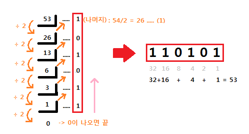
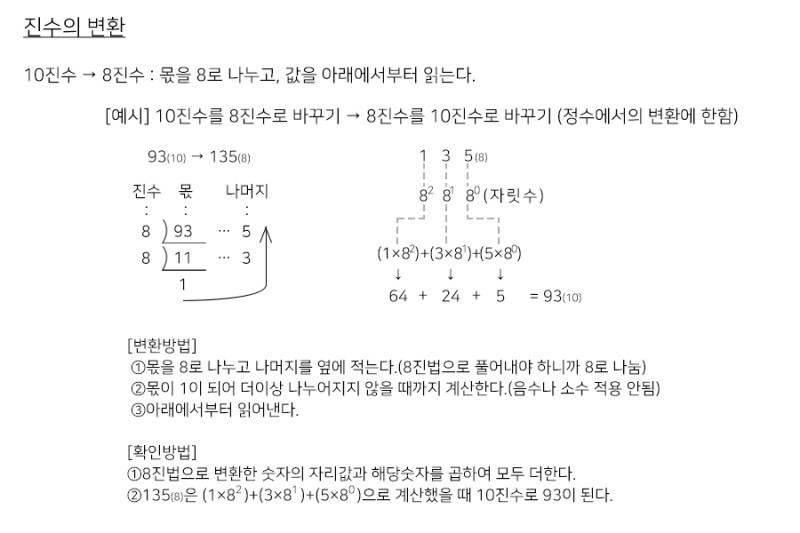
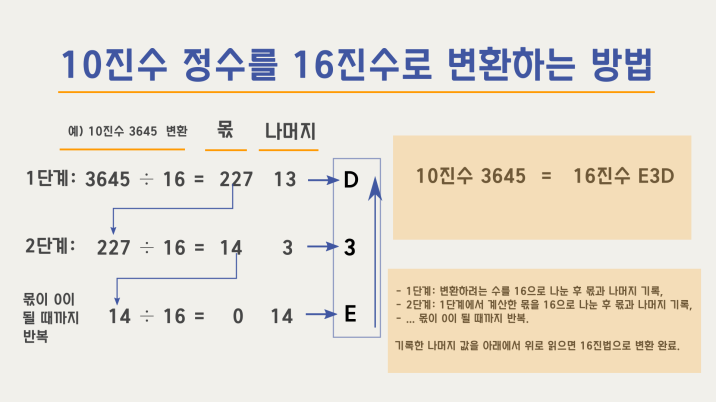
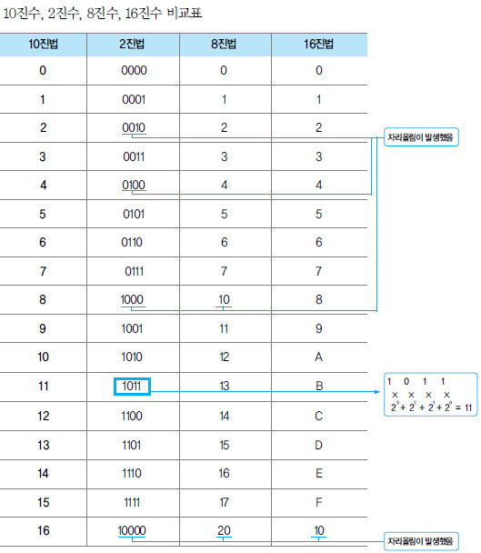

# 진수

 

## **진수(진법)**

진수(진법)란 수를 표기하는 기수법의 하나로 임의의 숫자를 사용하여 수를 표현하는 방법이다.

우리가 일반적으로 사용하는 1부터 9까지의 숫자를 사용하여 수를 나타내는 방법은 10진수 또는 10진법이라고 부른다.

현재 프로그래밍에서 많이 사용되고 있는 진법은 아래와 같다.

  

### **2진수(binary notation)**

수를 나타낼때 0과 1, 두 개의 숫자를 사용한다.

이러한 2진수는 자릿값이 올라감에 따라 그 크기가 2배씩 커지게 된다.

일단 전기 신호가 들어온다, 안 들어온다라는 식으로 쉽게 구현할 수 있기 때문에 전자기기, 특히 컴퓨터에서 사용한다.

  

### **8진수(octal notation) - 현재는 거의 사용하지 않음.**

수를 나타낼때 0에서 7까지 8개의 숫자를 사용한다.

예를 들면, 110101을 2진수로 취급하는 것은 불편하므로 3비트씩 나누어 110과 101, 즉 8진수(Octal)의 65로 나타내고 (65)8이라 쓴다.

8진법을 컴퓨터분야에서 사용하는 이유는 8진수 자릿수 하나가 23을 표현할 수 있어서 2진수를 직관적으로 빠르게 변환 가능하고, 16진수에 비해 사람이 계산하기 간편하기 때문이다.

이는 프로그래밍 할 때 사람이 비트까지 고려해야 했던 초창기 컴퓨터에선 긴요한 부분이었다.

다만, 자릿수 하나가 1바이트에 정확히 대응하지 않기 때문에 이후 주된 숫자 표현법을 16진법에 물려주게 된다.

  

### **10진수(decimal notation)**

10진수는 0부터 9까지의 숫자로 수를 표현하는 방법으로, 우리가 일상 생활에서 수를 나타낼 때 흔히 사용하는 방법이다.

  

### **16진수(hexadecimal notation)**

16진수는 자릿수 하나로 0부터 9까지의 숫자와 A부터 F까지의 문자를 함께 사용하여 0~15까지의 수를 표현하는 방법이다.

20진법도 아니고 10진법도 아닌 어중간한 16진법을 전자 기기, 특히 컴퓨터에서 사용하는 이유는 1바이트(byte)의 크기를 쉽게 표현할 수 있기 때문이다.

자릿수 2개를 사용하면 28을 표현할 수 있는데, 28은 곧 1바이트이다.

간단히 1바이트의 값을 2진법을 사용해서 0101 1111 식으로 표기할 게 아니라 그냥 16진법으로 5F라고 표기해 버리면 많이 축약할 수 있다.

게다가 훈련이 된 상황이라면 16진법의 숫자만 보고도 바로 2진법 수로 변환이 가능하기 때문에 상당히 유용한 표현 방법이다.

표현방법 : 0부터 9까지는 10진수와 동일하며, 10부터 15까지는 다음과 같이 영문자로 나타낸다.

접두어 ox를 이용해 표현할때도 있다. (예 - ox5F)

 

---

 

### **참고자료**

### **진법별 표현 비교**

