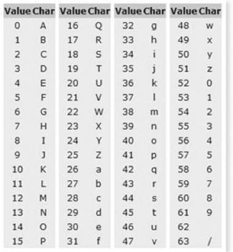
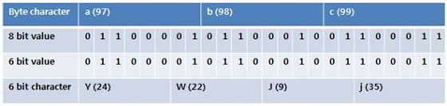
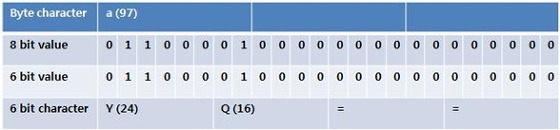
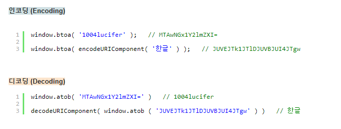

# **Base64 인코딩**

Base64란 Binary Data를 Text로 바꾸는 Encoding의 하나로써 Binary Data를 Character Set에 영향을 받지 않는 공통 ASCII 영역의 문자로만 이루어진 문자열로 바꾸는 Encoding이다. 인코딩된 문자열은 알파벳 대소문자와 숫자, 그리고 "+", "/" 기호 64개로 이루어지며, "="는 끝을 알리는 코드로 쓰인다.

Base64 인코딩을 거친 결과물은 원본보다 대략 4/3(33%) 정도 크기가 늘어나게 된다.

Base64를 글자 그대로 직역하면 64진법이라는 뜻이다. 64진법은 컴퓨터한테 특별한데 그 이유는 64가 2의 제곱수에 기반한 진법 중 화면에 표시되는 ASCII 문자들로 표시할 수 있는 가장 큰 진법이기 때문이다. (ASCII에는 제어문자가 다수 포함되어 있기 때문에 화면에 표시되는 ASCII 문자는 128개가 되지 않는다.)

### 핵심은 **Base64 Encoding은 Binary Data를 Text로 변경하는 Encoding이다.**

변경하는 방식을 간략하게 설명하면 24비트(3바이트) 단위로 8비트의 Binary Data를 6비트 단위로 자른 뒤 해당하는 값에 맵핑된 문자를 아래 Base64 색인표에서 찾아 치환한다. (실제로는 Padding을 더해주는 과정이 추가된다.)

 

---

 

-   Binary Data : 이진파일 이라고 하며 0과1로 이루어진 2진수 데이터만으로 이루어진 파일. (사람이 읽을수 없는 zip, mp3, jpeg..등등)

  

예) 'abc' 라는 문자를 base64로 변환하는 경우 아래와 같은 방식에 의해 변경된다.

  

Base64 인코딩은 24비트(3바이트) 단위인데 인코딩할 문자가 3바이트 단위가 아닐 때는 부족한 바이트 수 만큼 '='(Padding) 문자를 채워준다. (자릿수를 맞추기위한 의미없는 데이터)

예) 'a' 라는 문자를 base64로 변환하는 경우 아래와 같은 방식에 의해 변경된다.

  

javascript Base64 인/디코딩 예제

 

---

 

### **Why Base64??**

Base64 Encoding을 하게되면 **전송해야 될 데이터의 양도 약 33% 정도 늘어난다**. 6bit당 2bit의 Overhead가 발생하기 때문이다.

Encoding전 대비 33%나 데이터의 크기가 증가하고, Encoding과 Decoding에 추가 CPU 연산까지 필요한데 우리는 왜 Base64 Encoding을 하는가?

문자를 전송하기 위해 설계된 Media(Email, HTML)를 이용해 플랫폼 독립적으로 Binary Data(이미지나 오디오)를 전송 할 필요가 있을 때, ASCII로 Encoding하여 전송하게 되면 여러가지 문제가 발생할 수 있다. 대표적인 문제는 아래와 같다.

-   ASCII는 7 bits Encoding인데 나머지 1bit를 처리하는 방식이 시스템 별로 상이하다.
-   일부 제어문자 (예: Line ending - 줄바꿈)의 경우 시스템 별로 다른 코드값을 갖는다.

위와 같은 문제로 **문자열을 변환하지 않고 시스템간에 그대로 전달하기에 안전하지가 않다.**

이러한 이유로 **Base64**는 *Binary Data가 시스템 독립적으로 동일하게 전송 또는 저장되는걸 보장하기 위해 사용한다*.
