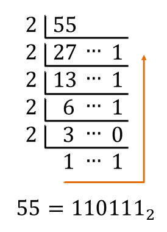
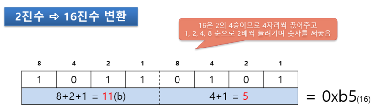
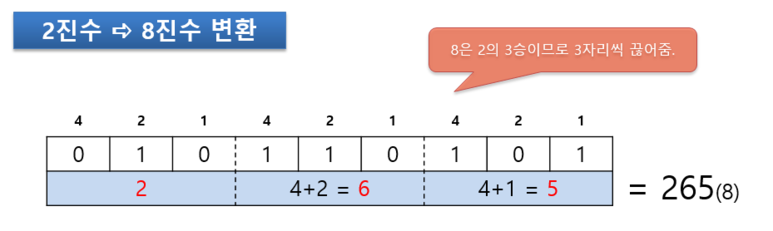
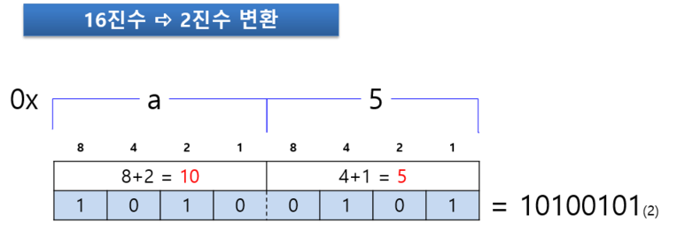
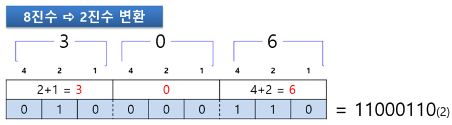

# 진법 변환

10진수를 각 진법으로의 변환하는 방법은 다음과 같다.

1. 10진수를 변환하고자 하는 진법의 기수(2진법이면 2가 기수임)로 나누고, 해당 나머지를 기록한다.

2. 나눈 몫을 또 다시 변환하고자 하는 진법의 기수로 나누고, 해당 나머지를 기록한다.

3. 이렇게 계속해서 나눈 몫을 기수로 나누다가 나눈 몫이 해당 기수보다 작아지면 중단한다.

4. 마지막 몫과 지금까지 기록한 나머지들을 역으로 연결하면 해당 진법의 수가 완성된다.

예제) 10진수 55를 2진수로 변환하시오.

 

---

 

## 참고 자료

