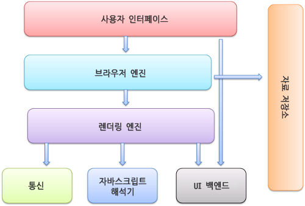

# 브라우저 동작 방법

브라우저 주소 창에 http://naver.com을 입력했을 때 과정

<br/>

## 브라우저 주요 기능

사용자가 선택한 자원을 서버에 요청, 브라우저에 표시

자원은 html 문서, pdf, image 등 다양한 형태

자원의 주소는 URI에 의해 정해짐

브라우저는 html과 css 명세에 따라 html 파일을 해석해서 표시함

이 '명세'는 웹 표준화 기구인 W3C(World wide web Consortium)에서 정해짐

> 예전 브라우저들은 일부만 명세에 따라 구현하고 독자적 방법으로 확장했음
> (결국 심각한 호환성 문제 발생... 그래서 요즘은 대부분 모두 표준 명세를 따름)

브라우저가 가진 인터페이스는 보통 비슷비슷한 요소들이 존재

시간이 지나면서, 사용자에게 필요한 서비스들로 서로 모방하며 갖춰지게 된 것

-   URI 입력하는 주소 표시 줄
-   이전 버튼, 다음 버튼
-   북마크(즐겨찾기)
-   새로 고침 버튼
-   홈 버튼

<br/>

## 브라우저 기본 구조



-   사용자 인터페이스

    주소 표시줄, 이전/다음 버튼, 북마크 등 사용자가 활용하는 서비스들 (요청한 페이지를 보여주는 창을 제외한 나머지 부분)

<br/>

-   브라우저 엔진

사용자 인터페이스와 렌더링 엔진 사이의 동작 제어

<br/>

-   렌더링 엔진

요청한 콘텐츠 표시 (html 요청이 들어오면? → html, css 파싱해서 화면에 표시)

<br/>

-   통신

http 요청과 같은 네트워크 호출에 사용 (플랫폼의 독립적인 인터페이스로 구성되어있음)

<br/>

-   UI 백엔드

플랫폼에서 명시하지 않은 일반적 인터페이스. 콤보 박스 창같은 기본적 장치를 그림

<br/>

-   자바스크립트 해석기

자바스크립트 코드를 해석하고 실행

<br/>

-   자료 저장소

쿠키 등 모든 종류의 자원을 하드 디스크에 저장하는 계층

<br/>

## 렌더링이란?

렌더링 엔진은 요청 받은 내용을 브라우저 화면에 표시해준다.

기본적으로 html, xml 문서와 이미지를 표시할 수 있음

추가로 플러그인이나 브라우저 확장 기능으로 pdf 등 다른 유형도 표시가 가능함

(추가로 확장이 필요한 유형은 바로 뜨지 않고 팝업으로 확장 여부를 묻는 것을 볼 수 있을 것임)

#### 렌더링 엔진 종류

-   크롬, 사파리 : 웹킷(Webkit) 엔진 사용

-   파이어폭스 : 게코(Gecko) 엔진 사용

웹킷(Webkit) : 최초 리눅스 플랫폼에 동작하기 위한 오픈소스 엔진 (애플이 맥과 윈도우에서 사파리 브라우저를 지원하기 위해 수정을 더했음)

### 동작과정


```
먼저 html 문서를 파싱한다.

그리고 콘텐츠 트리 내부에서 태그를 모두 DOM 노드로 변환한다.

그 다음 외부 css 파일과 함께 포함된 스타일 요소를 파싱한다.

이 스타일 정보와 html 표시 규칙은 렌더 트리라고 부르는 또 다른 트리를 생성한다.

이렇게 생성된 렌더 트리는 정해진 순서대로 화면에 표시되는데, 생성 과정이 끝났을 때 배치가 진행되면서 노드가 화면의 정확한 위치에 표시되는 것을 의미한다.

이후에 UI 백엔드에서 렌더 트리의 각 노드를 가로지으며 형상을 만드는 그리기 과정이 진행된다.

이러한 과정이 점진적으로 진행되며, 렌더링 엔진은 좀더 빠르게 사용자에게 제공하기 위해 모든 html을 파싱할 때까지 기다리지 않고 배치와 그리기 과정을 시작한다. (마치 비동기처럼..?)

전송을 받고 기다리는 동시에 받은 내용을 먼저 화면에 보여준다
(우리가 웹페이지에 접속할 때 한꺼번에 뜨지 않고 점점 화면에 나오는 것이 이 때문!!!)
```

<br/>
