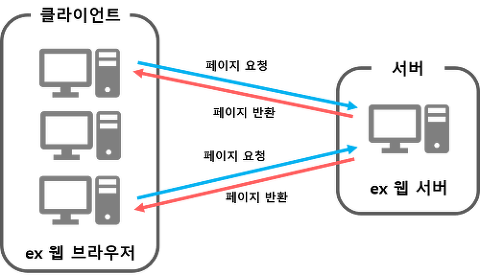
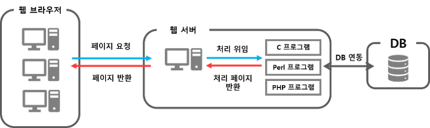
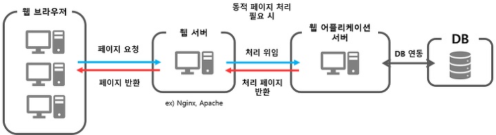

# 1. 인터넷의 구성요소

## 1.1. 인터넷 시스템(Internet System)

우리가 매일 사용하는 인터넷을 구성하고 있는 시스템을 인터넷 시스템(Internet System)이라고 한다.

이러한 인터넷 시스템은 다음과 같이 수많은 서버(server)와 클라이언트(client)들로 구성되어 있다.

 

 

---

 

## 1.2. 서버와 클라이언트

### 1.2.1. 서버(server)

인터넷 서비스를 제공하는 프로그램이나 컴퓨터를 의미한다.

웹 시스템에서는 컴퓨터나 스마트 폰 등 다양한 기기를 사용하여 방문하는 웹 사이트의 정보를 담고 있는 프로그램이나 컴퓨터를 웹 서버(web server)라고 부른다.

- 웹 서버(web server)

사용자가 요청하는 웹 페이지나 프로그램을 실행하여 해당 파일이나 그 결과를 사용자에게 제공하는 역할을 한다.

사용자가 요청하면 언제나 웹 서비스를 제공해 줘야 하므로, 웹 서버는 항상 실행되어 있어야 한다.

 

### 1.2.2 클라이언트(client)

서버가 제공하는 인터넷 서비스를 이용하는 사용자나 사용자가 사용하는 기기

 

---

 

## 1.3. 웹 브라우저(web browser)

웹 서버에서 웹 페이지를 가져오거나 웹 서버로 정보를 보낼 때 사용하는 프로그램.

웹 브라우저는 사용자가 웹 페이지를 요청하면 웹 서버에 저장되어 있는 웹 페이지 정보를 불러와서 사용자의 화면에 출력해준다.

전 세계적으로 다양한 웹 브라우저들이 사용되고 있으며, 대표적인 웹 브라우저로는 인터넷 익스플로러, 구글 크롬, 파이어폭스, 사파리, 오페라 등이 있다.

 

 
 

---

 
 

# 2. 웹 어플리케이션 서버

    등장 배경 : 과거의 웹서버와 클라이언트 모델

 

기본적으로 클라이언트와 서버는 웹 브라우저에서 특정 페이지를 요청하면 웹 서버는 해당 페이지를 반환해주는 역할이다.
초창기 웹이 출현했을 때는 논문 열람 사이트와 같이 정적인 웹 페이지들을 하이퍼링크로 연결하는 것이 전부였기에 위의 구조가 유행했었다.

하지만 점차 사용자가 늘어나자, DB를 통해 여러 데이터를 입력하고 조회할 수 있는 기능과 동적 페이지에 대한 필요성이 대두되었고, 새로운 서버 모델이 필요하게 되었다.

## 2.1 CGI(Common Gateway Interface)

위에서 설명한 동적 페이지를 사용자에게 제공하기 위해 웹 서버 내에 프로그래밍 기능이 들어가는 방식을 CGI라고 한다.
하지만 CGI 방식의 경우 웹 서버에서 각각의 클라이언트 요청에 대해 독립적인 별도의 프로세스를 생성해 요청을 처리하므로, 시스템에 부하가 커져 문제가 발생하게 된다.

 

## 2.2 웹 어플리케이션 서버

    CGI 방식의 문제점을 해결하기 위한 것.

웹 어플리케이션 서버는 웹 서버와 DB 서버 사이에서 미들웨어로서, DB 연동 및 동적 페이지를 생성하기 위한 처리를 한다.

 

요즘은 웹 어플리케이션 서버에서도 웹 서버의 기능을 제공하는 경우가 많다. 그렇다면 이제는 웹 서버가 굳이 필요할까? 라는 의문이 들 수도 있는데, 실제로 웹 서버의 경우 단순 이미지나 html파일 등의 리소스로 이루어진 정적 페이지를 보다 빠르고 안정적으로 사용자에게 제공할 수 있다.

그 외에도, 캐시 기능, 프록시 기능 등을 비롯해 접속 가능한 클라이언트 수 제한 및 처리 프로세스 관리, 요청 및 응답 로그 기록, 안정성 확보를 위한 인증 제어 및 암호화 처리 등의 기능을 제공하기에 지금도 많은 사이트들이 두 서버를 같이 사용한다.

 
 

---

 
 

# 3. 정적 페이지와 동적 페이지

    두 페이지의 차이는 페이지를 요청한 사용자의 정보와 현재 시점에 따라 내용이 변한다는 것이다.

정적 페이지: 서버에 미리 저장되어 있으며, 주로 HTML, CSS, Javascript, 이미지만으로 이루어져 있다. 사용자가 페이지를 요구하면 서버는 해당 정적 페이지를 반환해주는 역할만 한다.

동적 페이지: 사용자가 페이지를 요청할 시, DB로부터 얻은 해당 사용자의 정보나 현재 시점 정보 등을 가공하여 새롭게 생성한 페이지를 말한다.
