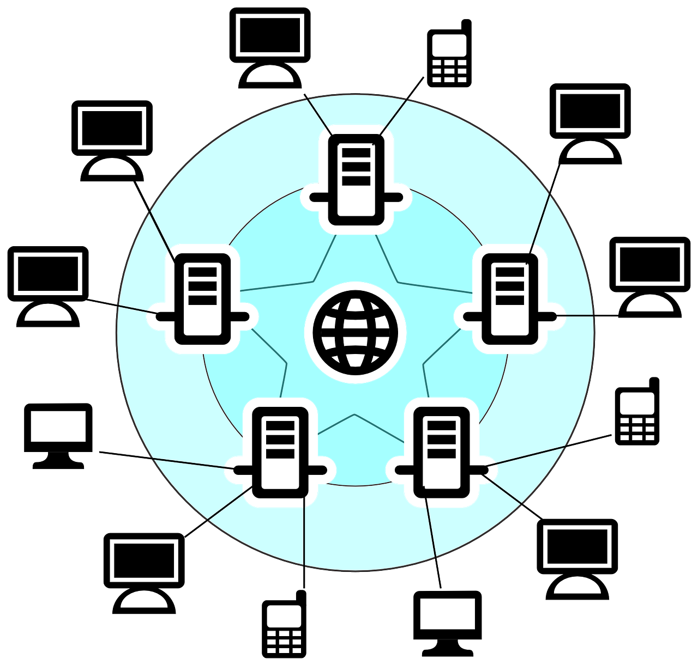
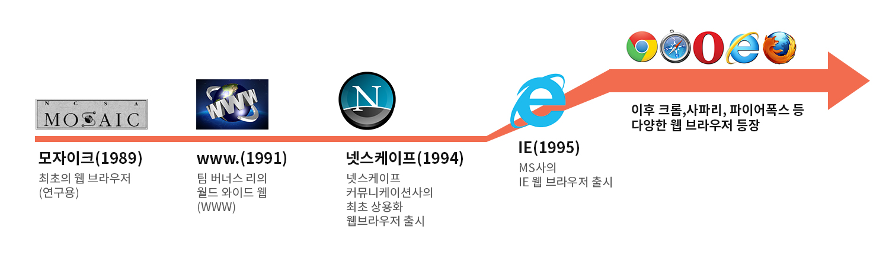

# 1. 인터넷 시스템(Internet System)

우리가 매일 사용하는 인터넷을 구성하고 있는 시스템을 인터넷 시스템(Internet System)이라고 한다.

이러한 인터넷 시스템은 다음과 같이 수많은 서버(server)와 클라이언트(client)들로 구성되어 있다.

 

 

---

 

# 2. 서버와 클라이언트

## 2.1. 서버(server)

인터넷 서비스를 제공하는 프로그램이나 컴퓨터를 의미한다.

웹 시스템에서는 컴퓨터나 스마트 폰 등 다양한 기기를 사용하여 방문하는 웹 사이트의 정보를 담고 있는 프로그램이나 컴퓨터를 웹 서버(web server)라고 부른다.

### 웹 서버(web server)

사용자가 요청하는 웹 페이지나 프로그램을 실행하여 해당 파일이나 그 결과를 사용자에게 제공하는 역할을 한다.

사용자가 요청하면 언제나 웹 서비스를 제공해 줘야 하므로, 웹 서버는 항상 실행되어 있어야 한다.

 

## 2.2 클라이언트(client)

서버가 제공하는 인터넷 서비스를 이용하는 사용자나 사용자가 사용하는 기기

 

---

 

# 3 웹 브라우저(web browser)

웹 서버에서 웹 페이지를 가져오거나 웹 서버로 정보를 보낼 때 사용하는 프로그램.

웹 브라우저는 사용자가 웹 페이지를 요청하면 웹 서버에 저장되어 있는 웹 페이지 정보를 불러와서 사용자의 화면에 출력해준다.

전 세계적으로 다양한 웹 브라우저들이 사용되고 있으며, 대표적인 웹 브라우저로는 인터넷 익스플로러, 구글 크롬, 파이어폭스, 사파리, 오페라 등이 있다.

 

 
