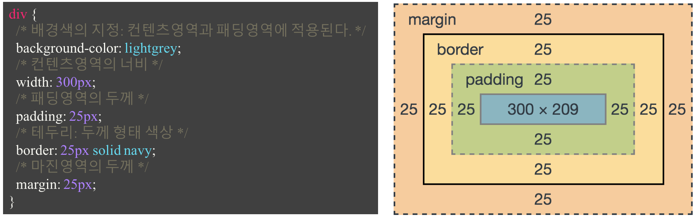

# 박스 모델(box model)

[참고 자료(poiemaweb)](https://poiemaweb.com/css3-box-model)

모든 HTML 요소는 박스(box) 모양으로 구성되며, 이것을 박스 모델(box model)이라고 부릅니다.

박스 모델은 HTML 요소를 패딩(padding), 테두리(border), 마진(margin), 그리고 내용(content)으로 구분합니다.


| 명칭    | 설명                                                                                                                                                                                                    |
| ------- | ------------------------------------------------------------------------------------------------------------------------------------------------------------------------------------------------------- |
| Content | 요소의 텍스트나 이미지 등의 실제 내용이 위치하는 영역이다. width, height 프로퍼티를 갖는다.                                                                                                             |
| Padding | 테두리(Border) 안쪽에 위치하는 요소의 내부 여백 영역이다. padding 프로퍼티 값은 패딩 영역의 두께를 의미하며 기본색은 투명(transparent)이다. 요소에 적용된 배경의 컬러, 이미지는 패딩 영역까지 적용된다. |
| Border  | 테두리 영역으로 border 프로퍼티 값은 테두리의 두께를 의미한다.                                                                                                                                          |
| Margin  | 테두리(Border) 바깥에 위치하는 요소의 외부 여백 영역이다. margin 프로퍼티 값은 마진 영역의 두께를 의미한다. 기본적으로 투명(transparent)하며 배경색을 지정할 수 없다                                    |

```html
<!DOCTYPE html>
<html>
  <head>
    <style>
      div {
        /* 배경색의 지정: 콘텐츠 영역과 패딩 영역에 적용된다. */
        background-color: lightgrey;
        /* 콘텐츠 영역의 너비 */
        width: 300px;
        /* 패딩 영역의 두께 */
        padding: 25px;
        /* 테두리: 두께 형태 색상 */
        border: 25px solid navy;
        /* 마진 영역의 두께 */
        margin: 25px;
      }
    </style>
  </head>
  <body>
    <h2>Box Model</h2>

    <div>
      Lorem ipsum dolor sit amet, consectetur adipiscing elit, sed do eiusmod tempor incididunt ut labore et dolore
      magna aliqua. Ut enim ad minim veniam, quis nostrud exercitation ullamco laboris nisi ut aliquip ex ea commodo
      consequat. Duis aute irure dolor in reprehenderit in voluptate velit esse cillum dolore eu fugiat nulla pariatur.
      Excepteur sint occaecat cupidatat non proident, sunt in culpa qui officia deserunt mollit anim id est laborum.
    </div>
  </body>
</html>
```



<br /><br />

## height와 width 속성의 이해

모든 웹 브라우저에서 정확하게 HTML 요소들을 표현하려면 이러한 박스 모델이 어떻게 동작하는지 정확히 알아야만 합니다.

CSS에서 height와 width 속성을 설정할 때 그 크기가 가르키는 부분은 내용(content) 부분만을 대상으로 합니다.

HTML 요소의 height와 width 속성으로 설정된 높이와 너비에 패딩(padding), 테두리(border), 마진(margin)의 크기는 포함되지 않습니다.

box-sizing

- content-box : 콘텐트 영역을 기준으로 크기를 정합니다.
- border-box : 테두리를 기준으로 크기를 정합니다.
