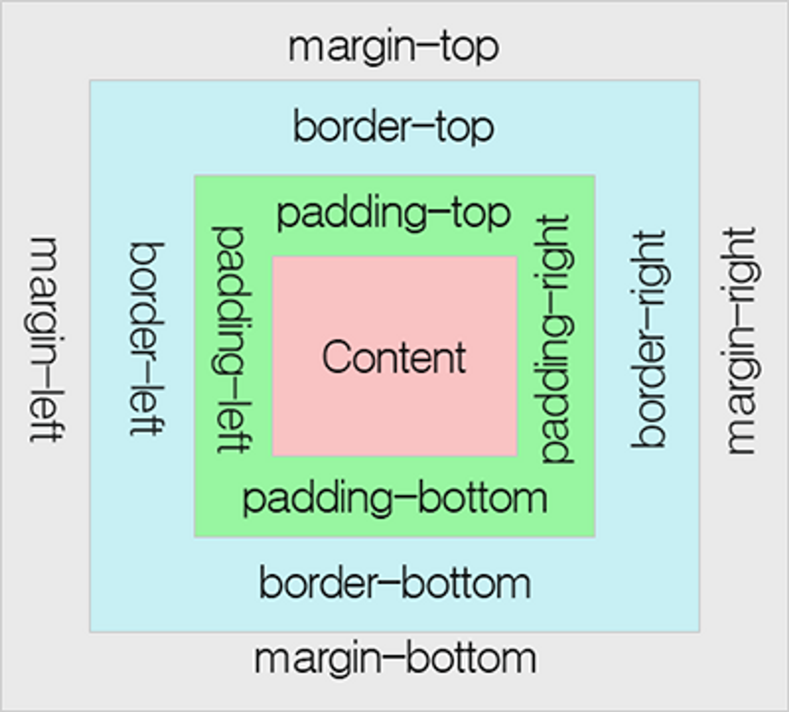

# 박스 모델(box model)

모든 HTML 요소는 박스(box) 모양으로 구성되며, 이것을 박스 모델(box model)이라고 부릅니다.

박스 모델은 HTML 요소를 패딩(padding), 테두리(border), 마진(margin), 그리고 내용(content)으로 구분합니다.

1. 내용(content) : 텍스트나 이미지가 들어있는 박스의 실질적인 내용 부분입니다.

2. 패딩(padding) : 내용과 테두리 사이의 간격입니다. 패딩은 눈에 보이지 않습니다.

3. 테두리(border) : 내용와 패딩 주변을 감싸는 테두리입니다.

4. 마진(margin) : 테두리와 이웃하는 요소 사이의 간격입니다. 마진은 눈에 보이지 않습니다.

  

## height와 width 속성의 이해

모든 웹 브라우저에서 정확하게 HTML 요소들을 표현하려면 이러한 박스 모델이 어떻게 동작하는지 정확히 알아야만 합니다.

CSS에서 height와 width 속성을 설정할 때 그 크기가 가르키는 부분은 내용(content) 부분만을 대상으로 합니다.

HTML 요소의 height와 width 속성으로 설정된 높이와 너비에 패딩(padding), 테두리(border), 마진(margin)의 크기는 포함되지 않습니다.

box-sizing

- content-box : 콘텐트 영역을 기준으로 크기를 정합니다.
- border-box : 테두리를 기준으로 크기를 정합니다.
