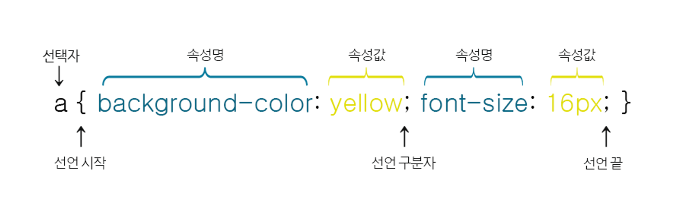

# css

Cascading Style Sheets의 약자

CSS는 HTML 요소들이 각종 미디어에서 어떻게 보이는가를 정의하는 데 사용되는 스타일 시트 언어입니다.

HTML만으로 웹 페이지를 제작할 경우 HTML 요소의 세부 스타일을 일일이 따로 지정해 주어야만 합니다.

이 작업은 매우 많은 시간이 걸리며, 완성한 후에도 스타일의 변경 및 유지 보수가 매우 힘들어집니다.

이러한 문제점을 해소하기 위해 W3C(World Wide Web Consortium)에서 만든 스타일 시트 언어가 바로 CSS입니다.

CSS는 웹 페이지의 스타일을 별도의 파일로 저장할 수 있게 해주므로 사이트의 전체 스타일을 손쉽게 제어할 수 있습니다.d

또한, 웹 사이트의 스타일을 일관성 있게 유지할 수 있게 해주며, 그에 따른 유지 보수 또한 쉬워집니다.

이러한 외부 스타일 시트는 보통 확장자를 .css 파일로 저장합니다.

CSS는 1996년에 최초의 CSS1이 W3C 표준 권고안으로 제정됩니다.

그 이후 1998년에 CSS2가 발표되었으며, 2005년부터는 현재 사용 중인 CSS3가 개발되고 있습니다.

CSS는 현재 모듈(module)별로 개발되고 있으며, 브라우저 공급자가 지원할 모듈을 자유롭게 선택할 수 있도록 하고 있습니다.

  

---

  

## CSS문법

CSS적용방법

HTML 문서에 CSS 스타일을 적용할 때에는 다음과 같이 세 가지 방법을 사용할 수 있습니다.

1. 인라인 스타일(Inline style)
2. 내부 스타일 시트(Internal style sheet)
3. 외부 스타일 시트(External style sheet)

인라인 스타일(Inline style)

인라인 스타일이란 HTML 요소 내부에 style 속성을 사용하여 CSS 스타일을 적용하는 방법입니다.

이러한 인라인 스타일은 해당 요소에만 스타일을 적용할 수 있습니다.

<body>

<h2 style="color:green; text-decoration:underline">

인라인 스타일을 이용하여 스타일을 적용하였습니다.

</h2>

</body>

이 방식은 한 번 설정된 스타일을 변경하기가 매우 어려우며, 스타일 시트를 사용하는 많은 이점을 잃게 됩니다.

따라서 이 방식은 될 수 있으면 꼭 필요한 경우에만 사용해야 합니다.

내부 스타일 시트(Internal style sheet)

내부 스타일 시트를 이용하는 방법은 HTML 문서 내의 <head>태그에 

</head>

외부 스타일 시트(External style sheet)

외부 스타일 시트를 이용하는 방법은 웹 사이트 전체의 스타일을 하나의 파일에서 변경할 수 있도록 해줍니다.

외부에 작성된 이러한 스타일 시트 파일은 .css 확장자를 사용하여 저장됩니다.

스타일을 적용할 웹 페이지의 <head>태그에 <link>태그를 사용하여 외부 스타일 시트를 포함해야만 스타일이 적용됩니다.

<head>

<link rel="stylesheet" href=“/common/css/style.css">

</head>

style.css

body { background-color: lightyellow; }

p { color: red; text-decoration: underline; }

스타일 적용의 우선순위

위에서 설명한 스타일 적용 방법들이 혼합되어 사용될 경우, 최종적으로 적용되는 스타일은 다음 순서에 따라 결정됩니다.

1. 인라인 스타일 (HTML 요소 내부에 위치함)
2. 내부 / 외부 스타일 시트 (HTML 문서의 head 요소 내부에 위치함)
3. 웹 브라우저 기본 스타일

예를 들어 인라인 스타일이 적용된 태그는 내부나 외부 스타일 시트와는 상관없이 무조건 인라인 스타일이 적용됩니다.

또한, 내부 스타일 시트와 외부 스타일 시트는 가장 마지막에 적용된 스타일 시트가 적용됩니다.

<link rel="stylesheet" href=“/common/css/style.css">

...

이 부분은 외부 스타일 시트만이 적용됩니다.

 이 부분은 인라인 스타일과 외부 스타일 시트가 둘 다 적용됩니다. 

따라서 웹 사이트의 스타일 적용은 외부 스타일 시트를 사용하는 것이 유지 보수도 편하며, 가장 안정적입니다.
