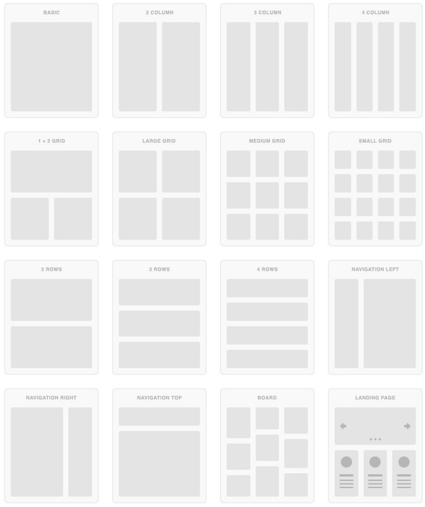

# Layout

-   [참고 자료(poiemaweb)](https://poiemaweb.com/css3-layout)

이전에는 table을 사용하여 layout을 만들기도 하였으나 html과 css의 본연의 취지와도 맞지 않을 뿐더러 반응형 웹 페이지 작성이 곤란하며 코드의 양 또한 많아져 현재는 거의 사용하지 않는다. 모던한 웹 페이지는 style과 layout을 담당하는 CSS를 사용하여 layout을 구성하는 것이 바람직하다.

layout의 핵심은 블록 레벨 요소들을 원하는 위치에 배열하는 것이다.



모바일 사용자가 데스크탑 사용자보다 많은 상황을 감안하여 화면의 크기에 따라 적절히 화면 구성을 변화시키는 반응형 웹 디자인(Responsive Web Design) 또한 모던 웹 사이트의 필수 사항이 되었다.

CSS를 사용하여 layout을 구성할 때에 자주 사용되는 핵심 기술은 **float**이다. 다음은 전형적인 웹사이트의 layout이다.

layout이란 웹사이트를 구성하는 요소들을 배치할 공간을 분할하고 정렬하는 것이다. 공간을 분할할 때는 먼저 행을 구분한 후, 행 내부 요소를 분리하는 것이 일반적이다.

```html
<!-- 2 column layout example -->
<!DOCTYPE html>
<html>
    <body>
        <div id="wrap">
            <header>
                <nav>
                    <ul>
                        <li>...</li>
                        <li>...</li>
                    </ul>
                </nav>
            </header>
            <div id="content-wrap">
                <aside>
                    <ul>
                        <li>...</li>
                        <li>...</li>
                    </ul>
                </aside>
                <section>
                    <article>...</article>
                    <article>...</article>
                </section>
            </div>
            <footer></footer>
        </div>
    </body>
</html>
```

<br /><br />

---

<br /><br />

## Header & Navigation Bar

Navigation Bar는 기본적으로 링크들의 리스트이다. 따라서 ul, li tag를 이용하여 작성하는 것이 일반적이다.

다음은 최소한의 Reset CSS를 추가한 링크들의 리스트이다. 주의할 점은 직관적인 box model을 위해 box-sizing: border-box;을 사용했다는 것이다.

실제 웹사이트를 구축할 시에는 Reset CSS를 좀 더 정교하게 초기화할 필요가 있다.

<br /><br />

---

<br /><br />

## Section & Aside

콘텐츠의 영역을 Section, 콘텐츠에 대한 Navigation item이나 부가 정보 영역을 Aside라 한다. Section 영역은 다시 article 영역으로 구분할 수 있다.

이 두개의 영역은 float 프로퍼티를 사용하여 수평 정렬하는 것이 일반적이다.

header 요소 뒤에 aside, section, article을 포함하는 content-wrap 요소를 정의한다.

<br /><br />

---

<br /><br />

## footer

content-wrap 영역 다음에 footer를 배치한다.

footer도 고정되어 있을 필요가 있지만 본문을 가리는 것은 곤란하다. 따라서 fixed 프로퍼티를 설정해서는 않된다. fixed 프로퍼티는 스크롤이 되어도 언제나 그자리를 고수하기 때문이다.

footer는 absolute 프로퍼티를 설정한다. absolute를 사용하면 다른 요소가 먼저 위치를 점유하고 있어도 뒤로 밀리지 않고 덮어쓰게 된다. (이런 특성을 부유 또는 부유 객체라 한다)

footer의 style 정의는 다음과 같다.
