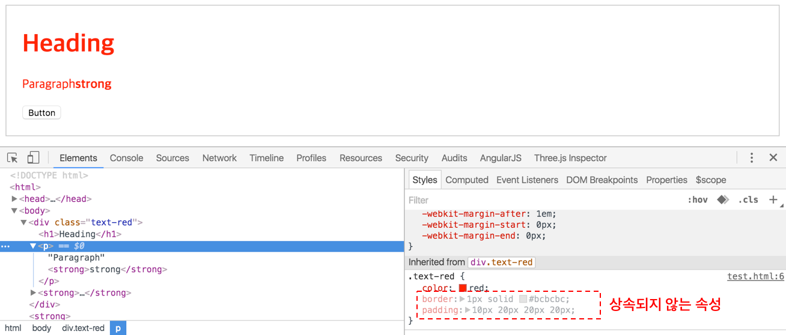

# 상속(Inheritance)

상속이란 상위(부모, 조상) 요소에 적용된 프로퍼티를 하위(자식, 자손) 요소가 물려 받는 것을 의미한다. 상속 기능이 없다면 각 요소의 Rule set에 프로퍼티를 매번 각각 지정해야 한다.

하지만 모든 프로퍼티가 상속되는 것은 아니다. 프로퍼티 중에는 상속이 되는 것과 되지 않는 것이 있다.

| property              | Inherit |
| --------------------- | ------- |
| width/height          | no      |
| margin                | no      |
| padding               | no      |
| border                | no      |
| box-sizing            | no      |
| display               | no      |
| visibility            | yes     |
| opacity               | yes     |
| background            | no      |
| font                  | yes     |
| color                 | yes     |
| line-height           | yes     |
| text-align            | yes     |
| vertical-align        | no      |
| text-decoration       | no      |
| white-space           | yes     |
| position              | no      |
| top/right/bottom/left | no      |
| z-index               | no      |
| overflow              | no      |
| float                 | no      |

color는 상속되는 프로퍼티로서 자식 요소는 물론 자손 요소까지 적용된다. 하지만 button처럼 요소에 따라 상속 받지 않는 경우도 존재한다.

border, padding은 상속되지 않는 요소로 하위 요소에 적용되지 않는다. W3C가 제공하는 Full property table의 Inherited?가 yes인 프로퍼티만 상속된다.



상속되지 않는 경우(상속받지 않는 요소 또는 상속되지 않는 프로퍼티), inherit 키워드를 사용하여 명시적으로 상속받게 할 수 있다.

```css
  <style>
    .text-red {
      color: red;
      border: 1px solid #bcbcbc;
      padding: 10px;
    }
    .text-red button {
      color: inherit;
    }
    .text-red p {
      border: inherit;
      padding: inherit;
    }
  </style>
```
