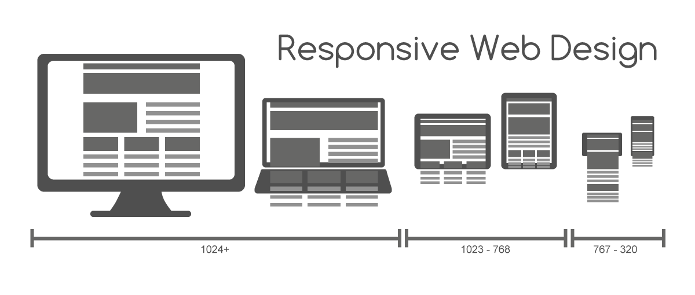
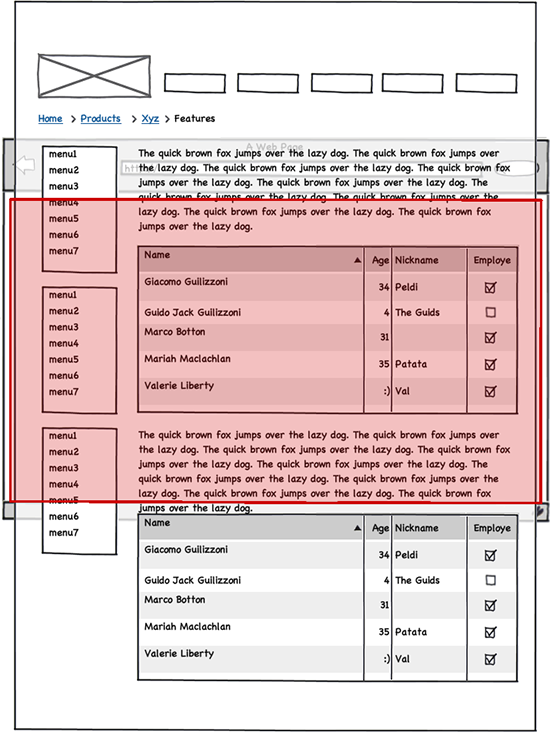

# Responsive Web Design

-   [참고 자료(poiemaweb)](https://poiemaweb.com/css3-responsive-web-design)

사용자가 어떤 디바이스로 웹사이트를 방문할 지 알 수 없다. layout은 방문자의 화면 해상도를 고려하여야 한다. 가로폭이 너무 큰 layout을 작성하면 작은 해상도 모니터로 방문하였을 때 가로 스크롤이 생겨서 사용이 불편할 수도 있다.

또한 스마트폰이나 태블릿 등 모바일 기기는 화면이 작기 때문에 가독성에 더욱 신경써야 한다. 보통 웹사이트가 축소되어 가로 스크롤 없이 콘텐츠를 볼 수 있으나 글자가 너무 작아지기 때문이다. 데스크탑용, 테블릿용, 모바일용 웹사이트를 별도 구축할 수도 있지만 One Source Multi Use의 관점에서 올바른 해결책은 아니다.

이러한 문제를 해결하는 방법 중의 하나가 반응형 웹디자인(Responsive Web Design)이다. 화면 해상도에 따라 가로폭이나 배치를 변경하여 가독성을 높이는 것이다. 즉, 하나의 웹사이트를 구축하여 다양한 디바이스의 화면 해상도에 최적화된 웹사이트를 제공하는 것이다.



또한 최근 모바일 웹페이지는 대부분 애플리케이션의 형태로 진화하고 있어 앱인지 웹인지 구분이 어려울 정도이다. HTML5/CSS3/Javascript만으로 네이티브 앱과 차이를 느낄 수 없는 앱을 만들 수 있다. 다음은 최근 관심을 끌고 있는 Web App Framework이다.

<br /><br />

---

<br /><br />

## viewport meta tag

viewport란 웹페이지의 가시영역을 의미한다. viewport는 디바이스에 따라 차이가 있다. 예를 들어 모바일 브라우저는 주화면이 세로 화면이고 윈도우 resize가 불가하며 화면 터치를 사용하는 등 데스크탑 브라우저와 구성이나 형태가 다르다. 또한 모바일의 화면은 데스크탑 화면보다 훨씬 작으므로 데스크탑용 웹페이지를 그대로 모바일에 출력하면 가독성이 현저히 나빠진다. 따라서 viewport를 이용하여 디바이스의 특성과 디바이스의 화면 크기 등을 고려하여 각종 디바이스 사용자에게 최적화된 웹페이지를 제공할 수 있다.



<br /><br />

---

<br /><br />

## @media

이것은 서로 다른 미디어 타입(print, screen…)에 따라 각각의 styles을 지정하는 것을 가능하게 한다. 다음은 일반 화면(screen)과 인쇄장치 별로 서로 다른 style을 지정하는 예이다.

```html
<meta name="viewport" content="width=device-width, initial-scale=1.0" />
<style>
    @media screen {
        * {
            color: red;
        }
    }
    @media print {
        * {
            color: blue;
        }
    }
</style>
```

@media을 사용하여 미디어 별로 style을 지정하는 것을 Media Query라 한다. 디바이스를 지정하는 것뿐만 아니라 디바이스의 크기나 비율까지 구분할 수 있다.

| 프로퍼티            | Description                                              |
| ------------------- | -------------------------------------------------------- |
| width               | viewport 너비(px)                                        |
| height              | viewport 높이(px)                                        |
| device-width        | 디바이스의 물리적 너비(px)                               |
| device-height       | 디바이스의 물리적 높이(px)                               |
| orientation         | 디바이스 방향 (가로 방향: landscape, 세로방향: portrait) |
| device-aspect-ratio | 디바이스의 물리적 width/height 비율                      |
| color               | 디바이스에서 표현 가능한 최대 색상 비트수                |
| monochrome          | 흑백 디바이스의 픽셀 당 비트수                           |
| resolution          | 디바이스 해상도                                          |
