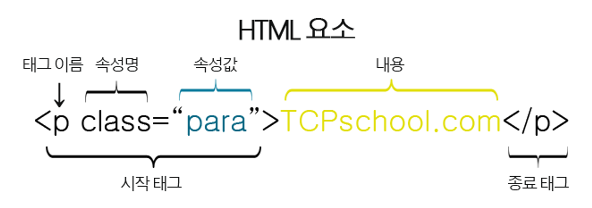

# HTML의 요소

HTML 요소(element)는 여러 속성을 가질 수 있으며, 이러한 속성(attribute)은 해당 요소에 대한 추가적인 정보를 제공합니다.

또한, HTML 요소는 시작 태그로 시작해서 종료 태그로 끝납니다.



속성은 HTML 요소 중에서도 언제나 시작 태그 내에서만 정의되며, 속성 이름과 속성값(value)으로 표현됩니다.

<br /><br />

## 속성 이름은 언제나 소문자로 작성하자!

HTML5 표준에서는 속성 이름에 대소문자를 구분하지 않고 있습니다.

하지만 W3C에서는 속성 이름을 사용할 때 될 수 있으면 소문자로 작성하도록 권장하고 있습니다.

또한, XHTML에서는 속성 이름을 더욱 엄격하게 소문자로만 사용해야 합니다.

<br /><br />

## 속성값은 언제나 따옴표로 감싸자!

HTML5 표준에서는 속성값에 따옴표 사용을 강제하지 않습니다.

하지만 속성값을 따옴표로 감싸지 않으면, 속성값에 띄어쓰기가 있을경우 브라우저가 제대로 인식하지 못할 수 있습니다.

따라서 속성값을 선언할 때는 언제나 따옴표로 감싸는것이 좋습니다.

속성값을 감쌀 때는 보통 큰따옴표("")가 사용되며, 작은따옴표('')도 사용할 수 있습니다.

<br /><br />

## 주석

주석(comment)이란 개발자가 작성한 해당 코드에 대한 이해를 돕는 설명이나 디버깅을 위해 작성한 구문을 의미합니다.

이러한 주석은 다른 HTML 코드와는 달리 웹 브라우저에 의해 표현되지 않습니다.

HTML에서 주석을 표현하는 방법은 다음과 같습니다.

```html
<!-- 주석내용 —>

<!--
여러줄로 주석을
작성하는것도 가능합니다.
->
```

위의 예제처럼 HTML 주석은 절대 웹 페이지에 나타나지 않습니다.

HTML 코드에 삽입된 주석을 읽고 싶다면, 웹 브라우저의 페이지 소스 보기 등을 통해서 확인할 수 있습니다.

<br /><br />

## 엔티티(Entity)

HTML에는 미리 예약된 몇몇 문자가 있으며, 이러한 문자를 HTML 예약어(reserved characters)라고 부릅니다.

이러한 HTML 예약어를 HTML 코드에서 사용하면, 웹 브라우저는 그것을 평소와는 다른 의미로 해석합니다.

따라서 HTML 예약어를 기존에 사용하던 의미 그대로 사용하기 위해 별도로 만든 문자셋을 엔티티(entity)라고 합니다.

엔티티의 형태는 다음과 같습니다.

&엔티티이름;

다음 예제는 HTML 코드 내에서 꺾쇠괄호(<>)를 사용하면 웹 브라우저가 그것을 어떻게 해석하는지 보여줍니다.

<p>&lt;p&gt;태그는 단락을 나타내는 태그입니다.</p>

결과

<p> 태그는 두 번째로 큰 제목을 나타내는 태그입니다.

위의 예제처럼 HTML 코드에서 사용된 꺾쇠괄호(<>)는 HTML 태그의 시작과 끝의 의미로 해석되므로 <p>등의 문자를 사용하기 위해서는 &lt;p&gt;의 사용이 필요합니다.

엔티티(entity)의 이름은 대소문자를 구분합니다.

HTML에서 제공하는 대표적인 엔티티(entity)는 다음과 같습니다.

| 엔티티 문자 | 엔티티 이름 | 16진수 엔티티 숫자 | 설명              |
| ----------- | ----------- | ------------------ | ----------------- |
| ` `         | `&nbsp;`    | `&#160;`           | 줄 바꿈 없는 공백 |
| <           | `&lt; `     | `&#60;`            | 보다 작은         |
| >           | `&gt; `     | `&#62;`            | 보다 큰           |
| &           | `&amp; `    | `&#38;`            | AND 기호          |
| "           | `&quot; `   | `&#34;`            | 큰따옴표          |
| '           | `&apos; `   | `&#39;`            | 작은따옴표        |

HTML에서 사용할 수 있는 모든 엔티티에 대한 더 자세한 정보를 원한다면, W3C 공식 사이트를 방문하여 확인할 수 있습니다.

[w3c 공식 사이트](https://dev.w3.org/html5/html-author/charref)
