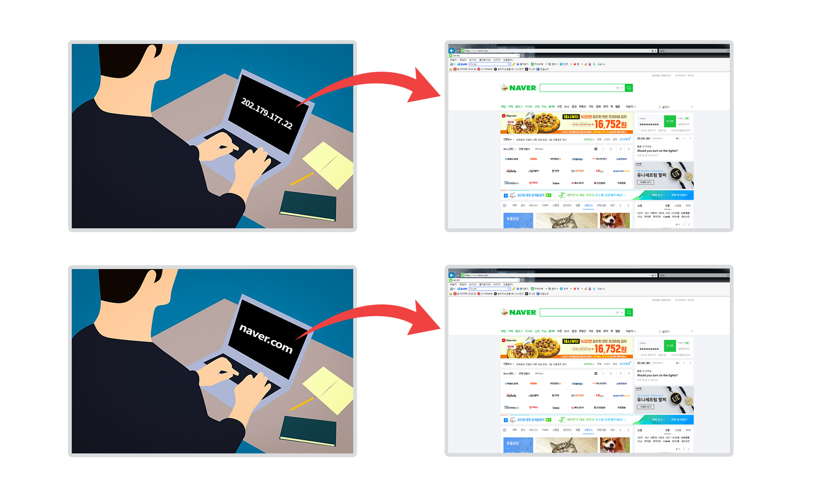

# 인터넷 주소 체계

인터넷 주소는 IP주소만을 의미한다.

인터넷 상에서 특정 컴퓨터나 서버를 찾기 위해서 알아야할 주소

1. IP 주소 (Internet Protocol Address)
2. 도메인 네임 (Domain Name)

 

---

 

## 1. IP 주소 (Internet Protocol Address)

    많은 컴퓨터들이 인터넷 상에서 서로를 인식하기 위해 지정받은 식별용 번호(202.179.177.22 같은 형태)

-   현재 사용되고 있는 IP 주소 체계는 IPv4로 0부터 255까지의 십진수 네 개를 점(.)으로 구분하여 사용

-   32비트의 주소 체계인 IPv4는 이론상 약 43억 개의 IP 주소를 나타낼 수 있지만, 인터넷의 급격한 발달에 따라 IP 주소가 부족해지는 현상 발생

-   이에 대한 해결책으로 고안된 128비트의 주소 체계인 IPv6의 사용이 점점 증가되고 있는 추세(현제는 두 체계가 같이 사용되고 있음)

 

---

 

## 2. 도메인 네임 (Domain Name)

    외우기 어려운 숫자 형태의 IP주소를 사람이 기억하기 쉬운 문자 형태로 표현한 주소(naver.com 처럼 문자+점(.)의 조합)
    네트워크 상에서 각각의 컴퓨터를 식별할 수 있게 해주는 호스트명

### 도메인 네임 시스템(Domain Name System, DNS)

    도메인 네임은 컴퓨터가 해석 불가능하기에 이를 실제 IP주소로 변경해줘야함. 그래서 미리 Domain Name과 거기에 해당하는 IP 주소값을 한 쌍으로 저장하고 있는 데이터 베이스를 DNS라고 부른다.(변환 과정은 네트워크 내부에서 자동으로 수행)

