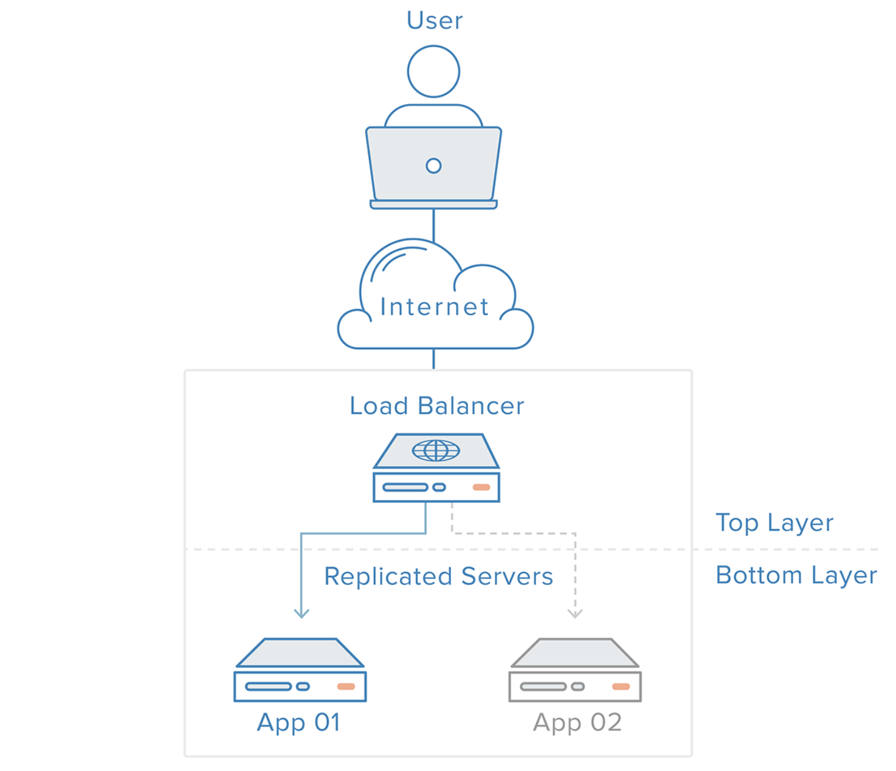
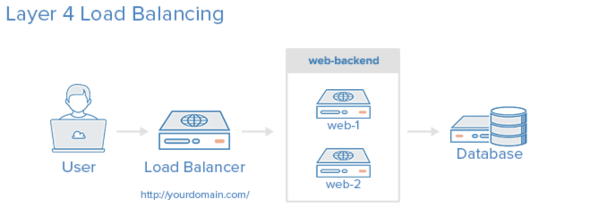
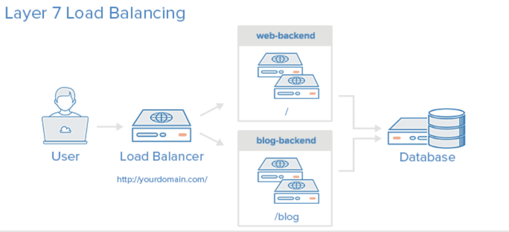

# 로드밸런싱(L4/L7)

Client가 한 두명이 아닌 수천만명의 경우 Server는 모든 사람들의 응답을 해주려고 노력하지만 결국 동작을 멈추게 된다.

### 이를 해결하기 위한 두 가지의 방법

-   Scale-up : Server가 더 빠르게 동작하기 위해 하드웨어 성능을 올리는 방법.
-   Scale-out : 하나의 Server 보다는 여러 대의 Server가 나눠서 일을 하는 방법.

### Scale-out의 장점

-   하드웨어 향상하는 비용보다 서버 한대 추가 비용이 더 적음
-
-   여러 대의 Server 덕분에 무중단 서비스를 제공할 수 있음

 

---

 

## Load Balancer

    여러 대의 Server에게 균등하게 Traffic을 분산시켜주는 역할

## Load Balancing

    하나의 인터넷 서비스가 발생하는 트래픽이 많을 때 여러 대의 서버가 분산처리하여 서버의 로드율 증가, 부하량, 속도저하 등을 고려하여 적절히 분산처리하여 해결해주는 서비스

### 주요 기능

-   NAT(Network Address Translation) : 사설 IP 주소를 공인 IP 주소로 바꾸는 데 사용하는 통신망의 주소 변조기
-   DSR(Dynamic Source Routing protocol) : 로드 밸런서 사용 시 서버에서 클라이언트로 되돌아가는 경우 목적지 주소를 스위치의 IP 주소가 아닌 클라이언트의 IP 주소로 전달해서 네트워크 스위치를 거치지 않고 바로 클라이언트를 찾아가는 개념입니다.

-   Tunneling : 인터넷상에서 눈에 보이지 않는 통로를 만들어 통신할 수 있게 하는 개념. 데이터를 캡슐화해서 연결된 상호 간에만 캡슐화된 패킷을 구별해 캡슐화 해제 가능

 
 

### Architecture

 
 

### load balancing의 종류

-   **L2** : Mac주소를 바탕으로 Load Balancing

-   **L3** : IP주소를 바탕으로 Load Balancing

-   **L4** : Transport Layer(IP와 Port) Level에서 Load Balancing (TCP, UDP)

-   **L7** : Application Layer(사용자의 Request) Level에서 Load Balancing (HTTP, HTTPS, FTP)

 
 

---

 

## HTTP

-   X-Forwarded-For : HTTP 또는 HTTPS 로드 밸런서를 사용할 때 클라이언트의 IP 주소를 식별하는 데 도움을 줌

-   X-Forwarded-Proto : 클라이언트가 로드 밸런서 연결에 사용한 프로토콜(HTTP 또는 HTTPS)을 식별하는 데 도움을 줌

-   X-Forwarded-Port : 클라이언트가 로드 밸런서 연결에 사용한 포트를 식별하는 데 도움을 줌

 

---

 

## Load Balancer가 Server를 선택하는 기준

-   Round Robin : 단순히 Round Robin으로 분산하는 방식

-   Least Connections : 연결 개수가 가장 적은 서버를 선택하는 방식. 트래픽으로 인해 세션이 길어지는 경우 권장하는 방식

-   Source : 사용자의 IP를 Hashing하여 분배하는 방식. 사용자는 항상 같은 서버로 연결되는 것을 보장

 

---

 

## Load Balancer 장애 대비

이중화를 사용

 

**장애가 났을 경우 시나리오**

-   이중화된 Load Balancer들은 서로 Health Check

-   Main Load Balancer가 동작하지 않으면 가상IP(VIP, Virtual IP)는 여분의 Load Balancer로 변경

-   여분의 Load Balancer 운영
